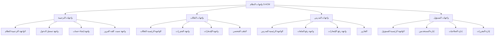

# التحليل العميق لمشروع S-ACM: الذاكرة التاريخية

> **ملف مرجعي:** هذا المستند هو التفريغ الكامل والشامل لتحليل وثيقة مشروع "نظام إدارة المحتوى الأكاديمي الذكي (S-ACM)". وهو بمثابة الذاكرة التاريخية التي تحتوي على كل التفاصيل الدقيقة، الاستنتاجات الهندسية، والملاحظات الأولية.

---

## 1. شرح المشروع: من الفوضى إلى النظام الذكي

### 1.1. المشكلة الأساسية

في ظل التطور التكنولوجي، لا تزال العديد من الجامعات تعتمد على أساليب تقليدية وغير فعالة في إدارة وتوزيع المحتوى الأكاديمي. يعاني الطلاب من تشتت المصادر بين تطبيقات التواصل الاجتماعي، المندوبين، والروابط المنتهية الصلاحية، مما يؤدي إلى تأخير وصول المواد الدراسية وضياعها. من جانب آخر، يواجه المدرسون صعوبة في تنظيم محتواهم وإيصاله بشكل فعال، وتفتقر الإدارة إلى بيانات دقيقة لقياس أداء العملية التعليمية.

### 1.2. الحل المقترح: نظام S-ACM

يقدم مشروع S-ACM حلاً رقمياً متكاملاً عبر إنشاء منصة ويب مركزية تهدف إلى إعادة هندسة التجربة التعليمية. النظام يخدم ثلاث فئات رئيسية (الطلاب، المدرسين، ومسؤولي النظام) ويوفر بيئة عمل موحدة ومنظمة.

- **للطلاب:** وصول فوري وسهل لجميع المواد الدراسية المصنفة حسب المقرر، مع ميزات ذكاء اصطناعي مبتكرة مثل تلخيص المحاضرات الطويلة وطرح أسئلة مباشرة على المستندات للحصول على إجابات دقيقة.
- **للمدرسين:** أدوات فعالة لرفع وتنظيم المحتوى، إرسال إشعارات فورية للطلاب، ومتابعة إحصائيات تفاعلهم مع المواد الدراسية.
- **للمسؤولين:** لوحة تحكم شاملة لإدارة المستخدمين، الصلاحيات، ومراقبة أداء النظام من خلال تقارير ورسوم بيانية.

### 1.3. القيمة المضافة

المشروع لا يحل مشكلة تقنية فحسب، بل هو استثمار في مستقبل التعليم يهدف إلى:
- **تحويل الفوضى إلى نظام.**
- **تحويل التشتت إلى تركيز.**
- **تحويل الغموض إلى رؤية واضحة.**

---

## 2. التفاصيل الدقيقة لكل فصل

### الفصل الأول: المقدمة

- **المشكلة:** تأخير وصول المواد، تشتت المصادر، ضعف التنظيم، غياب الإشعارات الرسمية.
- **الأهداف:** تسهيل الوصول للمحتوى، تمكين المدرسين من إدارة المحتوى، إرسال إشعارات ذكية، ودمج الذكاء الاصطناعي.
- **النطاق:** يركز على إدارة المستخدمين والمحتوى والإشعارات والتقارير، ويستثني الأنظمة المالية أو منتديات النقاش.
- **المنهجية:** تم اختيار **منهجية Agile** مقسمة إلى 5 مراحل (Sprints) لضمان المرونة والتطوير التكراري.
- **الخطة الزمنية:** تمتد من 15 يوليو 2025 إلى 16 فبراير 2026.

### الفصل الثاني: الخلفية النظرية

- **المفاهيم الأساسية:** تم استعراض مفاهيم مثل أنظمة إدارة المحتوى (CMS) وأنظمة إدارة التعلم (LMS)، وتحديد موقع S-ACM كنظام هجين يجمع بين بساطة الأول وقوة الثاني.
- **الدراسات السابقة:** تم تحليل 3 أنظمة رائدة (Google Classroom, Moodle, Edmodo) وتحديد نقاط ضعفها كفرصة لمشروع S-ACM، مثل محدودية التخصيص، تعقيد الواجهة، أو التركيز على التفاعل بدلاً من إدارة المحتوى المنظمة.
- **القرار الهندسي:** بناء نظام مخصص (Custom-built) لتلبية المتطلبات الدقيقة للمشروع، خاصة دمج الذكاء الاصطناعي وتجربة المستخدم المخصصة.

### الفصل الثالث: تحليل النظام

هذا الفصل هو العقل الهندسي للمشروع.

- **الممثلون (Actors):** مدير النظام (Administrator) والمستخدم (User) الذي يمكن أن يكون طالباً أو مدرساً بناءً على دوره.
- **المتطلبات الوظيفية (Functional):** تم تحديد 11 متطلبًا وظيفيًا عالي ومتوسط الأولوية، أبرزها إدارة المستخدمين، رفع وتصنيف المحتوى، نظام الإشعارات، والبحث، بالإضافة إلى ميزات الذكاء الاصطناعي (التلخيص وتوليد الأسئلة).
- **المتطلبات غير الوظيفية (Non-Functional):** تم تحديد 7 متطلبات جودة حاسمة، أهمها:
    - **الأداء:** تحميل الصفحات في أقل من 3 ثوانٍ.
    - **الأمان:** تشفير كلمات المرور، التحقق من الصلاحيات، واستخدام HTTPS.
    - **سهولة الاستخدام:** تصميم متجاوب وبديهي.
    - **الموثوقية:** ضمان إتاحة النظام بنسبة 99%.
- **المخططات:** تم استخدام مخططات UML (Use Case, Class, Sequence, Activity) و ERD لتوضيح هيكل النظام وسلوكه بالتفصيل.

### الفصل الرابع: تصميم النظام

هذا الفصل هو المخطط التنفيذي للمشروع.

- **تصميم قاعدة البيانات:** تم تقديم تصميم مفصل لـ **16 جدولاً**، موزعة على 5 مجموعات وظيفية، مع تحديد دقيق للحقول، أنواع البيانات، والقيود (Constraints). (التفاصيل الكاملة في ملف `Architecture/DATABASE.md`).
- **تصميم الواجهات (UI):** تم تصميم 22 شاشة بالتفصيل، مع الفصل الواضح بين واجهات كل من المسؤول، المدرس، والطالب، ودمج ميزات الذكاء الاصطناعي بسلاسة في تجربة المستخدم.

---

## 3. تفريغ محتوى الصور والمخططات نصياً

### 3.1. مخطط علاقة الكيانات الرئيسي (ERD)

تم تحويل مخطط الصورة إلى كود Mermaid قابل للتعديل والتطوير. (المخطط الكامل موجود في `Architecture/DATABASE.md`).

### 3.2. هيكلية واجهات النظام

### 3.3. تدفق العمليات (Activity Diagrams)

تم استخلاص تدفق العمليات الرئيسية كنصوص وصفية، مثل عملية "تفعيل الحساب" و "إضافة إشعار"، مما يسهل فهم المنطق البرمجي المطلوب.

---

## 4. ملاحظات هندسية وثغرات محتملة

بصفتي كبير المهندسين، لاحظت النقاط التالية أثناء التحليل العميق:

1.  **تحسين مقترح (أداء):** جدول `Lectures_Files` يحتوي على حقل `download_count`. تحديث هذا الحقل مع كل عملية تحميل سيؤدي إلى قفل (Lock) على الصف، مما قد يبطئ الأداء تحت ضغط عالٍ. **الحل المقترح:** استخدام نظام تخزين مؤقت (Caching) مثل Redis لتتبع عدد التحميلات، ثم تحديث قاعدة البيانات بشكل دوري (مثلاً، كل ساعة) عبر مهمة مجدولة (Cron Job).

2.  **ثغرة أمنية (Security):** الوثيقة لم تذكر آلية للتحقق من أنواع الملفات المرفوعة (File Type Validation) على مستوى الخادم. الاعتماد على امتداد الملف فقط لا يكفي. **الإجراء الفوري:** يجب إضافة تحقق من "Magic Numbers" للملفات للتأكد من أن محتواها يطابق امتدادها، لمنع رفع ملفات خبيثة تحت امتداد مزيف (مثل رفع `.exe` باسم `.pdf`).

3.  **تحسين مقترح (هيكلية):** جدول `Notification_Recipients` يستخدم `level_id` و `major_id` كجزء من المفتاح الأساسي. هذا يعني أن الإشعار الواحد لا يمكن أن يستهدف أكثر من مجموعة واحدة (تخصص ومستوى). **الحل المقترح:** فصل المستلمين إلى جدول ربط منفصل يسمح بإرسال إشعار واحد إلى عدة مجموعات مختلفة (Many-to-Many)، مما يزيد من مرونة نظام الإشعارات.

4.  **نقطة غامضة (Clarification Needed):** الوثيقة تذكر "التوافق التام مع نظام التشغيل Windows". هذا قد يشير إلى أن النشر (Deployment) مستهدف لبيئة Windows Server. يجب تأكيد هذا الأمر، حيث أن الممارسات الحديثة تفضل النشر على خوادم Linux لكفاءتها وأمانها. سأفترض حالياً أن بيئة النشر هي Linux (باستخدام Gunicorn و Nginx) ما لم يتم التوجيه بغير ذلك.

5.  **تحسين مقترح (تجربة المستخدم):** ميزة "اسأل المستند" تتطلب تخزين الأسئلة والأجوبة في جدول `AI_Questions`. لتحسين التجربة، يمكن إضافة حقل `is_helpful` (boolean) يسمح للطالب بتقييم جودة الإجابة. هذه البيانات ستكون ذهبية لتقييم أداء نموذج الذكاء الاصطناعي وتحسينه مستقبلاً.
