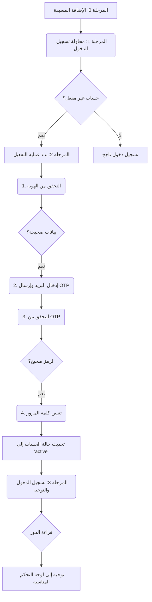

# 🔐 AUTH_FLOW - تدفق المصادقة والتفعيل

> **⚠️ تعليمات:** هذا المستند هو المرجع الرسمي لتدفق عملية المصادقة والتفعيل في نظام S-ACM. وهو يصف بالتفصيل الخطوات التي يمر بها المستخدم من كونه حساباً غير مفعّل إلى أن يصبح مستخدماً نشطاً داخل النظام.

---

## 1. نظرة عامة على التدفق

يعتمد النظام على نموذج **"الإضافة المسبقة مع التفعيل الذاتي" (Pre-provisioning with Self-Activation)**. هذا النموذج يجمع بين الأمان العالي (حيث لا يمكن لأي شخص التسجيل) والمرونة (حيث يقوم المستخدم بتفعيل حسابه بنفسه).

---

## 2. تفاصيل المراحل

### المرحلة 0: الإضافة المسبقة (يقوم بها مسؤول النظام)

1.  **الإجراء:** يقوم مسؤول النظام بإضافة بيانات المستخدمين (الطلاب والمدرسين) إلى جدول `Users` في قاعدة البيانات، إما يدوياً عبر لوحة التحكم أو عبر استيراد دفعة واحدة (Batch Import).
2.  **البيانات المدخلة:**
    *   `academic_id` (إلزامي)
    *   `full_name` (إلزامي)
    *   `id_card_number` (إلزامي، للتحقق من الهوية)
    *   `role_id` (إلزامي)
    *   `major_id` (إلزامي للطلاب)
    *   `level_id` (إلزامي للطلاب)
3.  **الحالة الأولية:**
    *   `account_status` يتم تعيينه إلى `inactive`.
    *   حقلي `email` و `password_hash` يكونان `NULL`.

### المرحلة 1: محاولة تسجيل الدخول الأول

1.  **الإجراء:** المستخدم الذي تم إضافته مسبقاً يحاول تسجيل الدخول لأول مرة باستخدام رقمه الأكاديمي/الوظيفي وأي كلمة مرور.
2.  **منطق النظام (Backend):**
    *   البحث عن `academic_id` في جدول `Users`.
    *   إذا تم العثور على المستخدم، يتم التحقق من حقل `account_status`.
    *   بما أن الحالة هي `inactive`، يمنع النظام عملية تسجيل الدخول.
3.  **واجهة المستخدم (Frontend):**
    *   يتم عرض رسالة واضحة: "حسابك موجود ولكنه غير مفعّل. يرجى الضغط على 'إنشاء حساب' لبدء عملية التفعيل."

### المرحلة 2: عملية التفعيل الذاتي (Self-Activation)

هذه العملية تمر عبر عدة شاشات متسلسلة لضمان الأمان.

#### الخطوة 2.1: التحقق من الهوية

1.  **الإجراء:** المستخدم يملأ نموذج "التحقق من الهوية".
2.  **البيانات المطلوبة:**
    *   الرقم الأكاديمي/الوظيفي (`academic_id`)
    *   رقم البطاقة (`id_card_number`)
3.  **منطق النظام:**
    *   يتم البحث في جدول `Users` عن سجل يطابق **كلاً من** `academic_id` و `id_card_number`.
    *   **في حالة النجاح:** ينتقل المستخدم إلى الخطوة التالية.
    *   **في حالة الفشل:** تعرض الواجهة رسالة خطأ: "البيانات المدخلة غير صحيحة. يرجى مراجعة قسم شؤون الطلاب/الموظفين."

#### الخطوة 2.2: إدخال البريد الإلكتروني وتوليد OTP

1.  **الإجراء:** يُطلب من المستخدم إدخال بريده الإلكتروني.
2.  **منطق النظام:**
    *   يتم التحقق من أن البريد الإلكتروني المدخل غير مستخدم في أي حساب آخر (`UNIQUE` constraint).
    *   يتم توليد رمز تحقق فريد (OTP) مكون من 6 أرقام.
    *   يتم تخزين الرمز في جدول `Verification_Codes` مع `user_id` ووقت انتهاء الصلاحية (e.g., 10 دقائق).
    *   يتم إرسال البريد الإلكتروني الذي يحتوي على الرمز إلى المستخدم.

#### الخطوة 2.3: التحقق من OTP وتعيين كلمة المرور

1.  **الإجراء:** يُطلب من المستخدم إدخال رمز OTP الذي وصله عبر البريد، ثم تعيين كلمة المرور الجديدة.
2.  **منطق النظام:**
    *   التحقق من صحة الرمز `OTP` ومن أنه لم تنتهِ صلاحيته.
    *   التحقق من أن كلمة المرور وتأكيدها متطابقان وتتوافق مع سياسة كلمات المرور (e.g., 8 أحرف على الأقل).
3.  **تحديث قاعدة البيانات (Transaction):** عند نجاح التحقق، يتم تنفيذ العمليات التالية كـ Transaction واحدة لضمان سلامة البيانات:
    *   **تحديث جدول `Users`:**
        *   تحديث حقل `email` بالبريد الإلكتروني الجديد.
        *   تشفير (Hash) كلمة المرور الجديدة وتخزينها في حقل `password_hash`.
        *   تغيير حالة الحساب `account_status` من `inactive` إلى `active`.
    *   **حذف من جدول `Verification_Codes`:** يتم حذف الرمز الذي تم استخدامه لمنع إعادة استخدامه.

### المرحلة 3: تسجيل الدخول والتوجيه

1.  **الإجراء:** بعد نجاح عملية التفعيل، يتم إعادة توجيه المستخدم إلى صفحة تسجيل الدخول مع رسالة نجاح: "تم تفعيل حسابك بنجاح. يمكنك الآن تسجيل الدخول."
2.  **تسجيل الدخول:** يقوم المستخدم بإدخال رقمه الأكاديمي/الوظيفي وكلمة المرور التي قام بتعيينها للتو.
3.  **منطق التوجيه (Role-Based Routing):**
    *   بعد التحقق من صحة بيانات الدخول، يقرأ النظام قيمة `role_id` للمستخدم.
    *   بناءً على قيمة الدور، يتم توجيه المستخدم إلى لوحة التحكم المخصصة له:
        *   `role_id = 1` ➡️ `/admin/dashboard`
        *   `role_id = 2` ➡️ `/instructor/dashboard`
        *   `role_id = 3` ➡️ `/student/dashboard`

---

## 3. ملاحظات أمنية

*   يجب استخدام HTTPS في جميع الاتصالات.
*   يجب تشفير كلمات المرور باستخدام خوارزمية قوية (e.g., Argon2, bcrypt).
*   يجب فرض حد أقصى لعدد محاولات إدخال OTP الفاشلة (e.g., 5 محاولات) لمنع هجمات التخمين (Brute-force).

---

## 4. الإدارة المجمعة للمستخدمين (Bulk User Management)

لتسهيل إدارة عدد كبير من المستخدمين، سيتم تزويد لوحة تحكم المسؤول بميزات الاستيراد والتصدير المجمعة.

### 4.1. استيراد المستخدمين (Import Users)

*   **الوظيفة:** يمكن للمسؤول رفع ملف بصيغة `CSV` أو `Excel` يحتوي على قائمة المستخدمين الجدد.
*   **تنسيق الملف:** يجب أن يحتوي الملف على الأعمدة التالية بالترتيب:
    *   `academic_id`
    *   `full_name`
    *   `id_card_number`
    *   `role` (القيم النصية: `Admin`, `Instructor`, `Student`)
    *   `major` (الاسم النصي للتخصص)
    *   `level` (الاسم النصي للمستوى)
*   **منطق النظام:**
    1.  يقوم النظام بقراءة الملف والتحقق من صحة البيانات في كل صف (e.g., هل الدور موجود؟ هل التخصص موجود؟).
    2.  لكل صف صحيح، يقوم النظام بإنشاء سجل جديد في جدول `Users` مع `account_status = 'inactive'`.
    3.  في نهاية العملية، يعرض النظام تقريراً للمسؤول يوضح عدد السجلات التي تم استيرادها بنجاح وأي أخطاء حدثت في صفوف معينة.

### 4.2. تصدير المستخدمين (Export Users)

*   **الوظيفة:** يمكن للمسؤول الضغط على زر "تصدير المستخدمين" في أي وقت.
*   **منطق النظام:** يقوم النظام بإنشاء وتنزيل ملف `CSV` يحتوي على جميع بيانات المستخدمين المسجلين في جدول `Users` (باستثناء `password_hash`).
