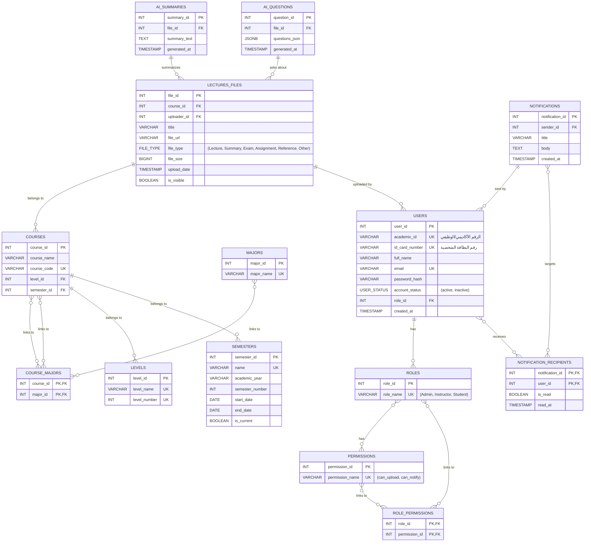

# 🗄️ DATABASE - المخطط الهندسي لقاعدة البيانات

> **⚠️ تعليمات:** هذا المستند هو المرجع الرسمي لهيكل قاعدة بيانات مشروع S-ACM. وهو يترجم التحليل الأولي إلى مخطط تقني دقيق ومُحسَّن. أي تعديل على نماذج Django يجب أن ينعكس هنا أولاً.

---

## 1. مخطط الكيان والعلاقات (Entity Relationship Diagram - ERD)

هذا المخطط يوضح العلاقات المنطقية بين الجداول الرئيسية في النظام. تم تصميمه باستخدام Mermaid لسهولة العرض والتعديل.

---

## 2. تفاصيل الجداول (Schema Details)

فيما يلي التفصيل الكامل للجداول الـ 16 المعتمدة في النظام، مع التحسينات الهندسية المقترحة.

### المجموعة 1: إدارة المستخدمين والأدوار (RBAC)

#### 1.1. جدول المستخدمين (Users)

| العمود (Field) | نوع البيانات (Data Type) | القيود (Constraints) | الوصف (Description) |
| :--- | :--- | :--- | :--- |
| `user_id` | `SERIAL` | `PRIMARY KEY` | المعرف الفريد للمستخدم. |
| `academic_id` | `VARCHAR(50)` | `UNIQUE, NOT NULL` | الرقم الأكاديمي للطالب أو الرقم الوظيفي للموظف. |
| `id_card_number` | `VARCHAR(50)` | `UNIQUE, NOT NULL` | رقم البطاقة الشخصية، يستخدم للتحقق من الهوية عند التفعيل. |
| `full_name` | `VARCHAR(150)` | `NOT NULL` | الاسم الكامل للمستخدم. |
| `email` | `VARCHAR(255)` | `UNIQUE` | البريد الإلكتروني، يصبح `NOT NULL` بعد التفعيل. |
| `password_hash` | `VARCHAR(255)` | - | كلمة المرور بعد تشفيرها (Hashed)، تصبح `NOT NULL` بعد التفعيل. |
| `account_status` | `VARCHAR(20)` | `DEFAULT 'inactive'` | حالة الحساب (inactive, active). |
| `role_id` | `INT` | `FK -> Roles.role_id` | يحدد دور المستخدم في النظام. |
| `major_id` | `INT` | `FK -> Majors.major_id` | يحدد تخصص الطالب (يمكن أن يكون NULL للمدرسين والمدراء). |
| `level_id` | `INT` | `FK -> Levels.level_id` | يحدد مستوى الطالب الحالي. |
| `created_at` | `TIMESTAMP` | `DEFAULT NOW()` | تاريخ ووقت إنشاء الحساب. |

#### 1.2. جدول الأدوار (Roles)

| العمود (Field) | نوع البيانات (Data Type) | القيود (Constraints) | الوصف (Description) |
| :--- | :--- | :--- | :--- |
| `role_id` | `SERIAL` | `PRIMARY KEY` | المعرف الفريد للدور. |
| `role_name` | `VARCHAR(50)` | `UNIQUE, NOT NULL` | اسم الدور (Admin, Instructor, Student). |

#### 1.3. جدول الصلاحيات (Permissions)

| العمود (Field) | نوع البيانات (Data Type) | القيود (Constraints) | الوصف (Description) |
| :--- | :--- | :--- | :--- |
| `permission_id` | `SERIAL` | `PRIMARY KEY` | المعرف الفريد للصلاحية. |
| `permission_name`| `VARCHAR(100)`| `UNIQUE, NOT NULL` | اسم الصلاحية البرمجي (e.g., 'can_upload_file'). |
| `description` | `TEXT` | - | وصف إنساني للصلاحية. |

#### 1.4. جدول ربط الأدوار بالصلاحيات (Role_Permissions)

| العمود (Field) | نوع البيانات (Data Type) | القيود (Constraints) | الوصف (Description) |
| :--- | :--- | :--- | :--- |
| `role_id` | `INT` | `PK, FK -> Roles.role_id` | معرف الدور. |
| `permission_id` | `INT` | `PK, FK -> Permissions.permission_id` | معرف الصلاحية. |

#### 1.5. جدول التخصصات (Majors)

| العمود (Field) | نوع البيانات (Data Type) | القيود (Constraints) | الوصف (Description) |
| :--- | :--- | :--- | :--- |
| `major_id` | `SERIAL` | `PRIMARY KEY` | المعرف الفريد للتخصص. |
| `major_name` | `VARCHAR(100)` | `UNIQUE, NOT NULL` | اسم التخصص. |

#### 1.6. جدول الفصول الدراسية (Semesters)

| العمود (Field) | نوع البيانات (Data Type) | القيود (Constraints) | الوصف (Description) |
| :--- | :--- | :--- | :--- |
| `semester_id` | `SERIAL` | `PRIMARY KEY` | المعرف الفريد للفصل الدراسي. |
| `name` | `VARCHAR(100)` | `UNIQUE, NOT NULL` | اسم الفصل الدراسي (e.g., "الفصل الأول 2025/2026"). |
| `academic_year` | `VARCHAR(20)` | `NOT NULL` | العام الدراسي. |
| `semester_number` | `INT` | `NOT NULL` | رقم الفصل (1 أو 2). |
| `start_date` | `DATE` | `NOT NULL` | تاريخ بداية الفصل. |
| `end_date` | `DATE` | `NOT NULL` | تاريخ نهاية الفصل. |
| `is_current` | `BOOLEAN` | `DEFAULT FALSE` | يحدد ما إذا كان هذا هو الفصل الدراسي النشط حالياً. |

#### 1.7. جدول المستويات (Levels)

| العمود (Field) | نوع البيانات (Data Type) | القيود (Constraints) | الوصف (Description) |
| :--- | :--- | :--- | :--- |
| `level_id` | `SERIAL` | `PRIMARY KEY` | المعرف الفريد للمستوى. |
| `level_name` | `VARCHAR(50)` | `UNIQUE, NOT NULL` | اسم المستوى (e.g., "المستوى الأول"). |
| `level_number` | `INT` | `UNIQUE, NOT NULL` | رقم المستوى (1, 2, 3, 4). |

### المجموعة 2: آليات التحقق والأمان

#### 2.1. جدول رموز التحقق (Verification_Codes)

| العمود (Field) | نوع البيانات (Data Type) | القيود (Constraints) | الوصف (Description) |
| :--- | :--- | :--- | :--- |
| `code_id` | `SERIAL` | `PRIMARY KEY` | المعرف الفريد للرمز. |
| `user_id` | `INT` | `NOT NULL, FK -> Users.user_id` | المستخدم المرتبط بالرمز. |
| `verification_code`| `VARCHAR(10)` | `NOT NULL` | رمز التحقق القصير (OTP). |
| `expires_at` | `TIMESTAMP` | `NOT NULL` | وقت انتهاء صلاحية الرمز. |

#### 2.2. جدول رموز إعادة تعيين كلمة المرور (Password_Reset_Tokens)

| العمود (Field) | نوع البيانات (Data Type) | القيود (Constraints) | الوصف (Description) |
| :--- | :--- | :--- | :--- |
| `token_id` | `SERIAL` | `PRIMARY KEY` | المعرف الفريد للتوكن. |
| `user_id` | `INT` | `NOT NULL, FK -> Users.user_id` | المستخدم المرتبط بالتوكن. |
| `reset_token` | `VARCHAR(255)`| `UNIQUE, NOT NULL` | التوكن السري الطويل. |
| `expires_at` | `TIMESTAMP` | `NOT NULL` | وقت انتهاء صلاحية التوكن. |

### المجموعة 3: إدارة المقررات والمحتوى

#### 3.1. جدول المقررات (Courses)

| العمود (Field) | نوع البيانات (Data Type) | القيود (Constraints) | الوصف (Description) |
| :--- | :--- | :--- | :--- |
| `course_id` | `SERIAL` | `PRIMARY KEY` | المعرف الفريد للمقرر. |
| `course_name` | `VARCHAR(150)`| `NOT NULL` | اسم المقرر. |
| `course_code` | `VARCHAR(20)` | `UNIQUE` | رمز المقرر. |

| `level_id` | `INT` | `NOT NULL, FK -> Levels.level_id` | المستوى الذي يتبعه المقرر. |
| `semester_id` | `INT` | `NOT NULL, FK -> Semesters.semester_id` | الفصل الدراسي الذي يتبعه المقرر. |

#### 3.2. جدول ربط المقررات بالتخصصات (Course_Majors)

| العمود (Field) | نوع البيانات (Data Type) | القيود (Constraints) | الوصف (Description) |
| :--- | :--- | :--- | :--- |
| `course_id` | `INT` | `PK, FK -> Courses.course_id` | معرف المقرر. |
| `major_id` | `INT` | `PK, FK -> Majors.major_id` | معرف التخصص. |

#### 3.3. جدول ربط المدرسين بالمقررات (Instructor_Courses)

| العمود (Field) | نوع البيانات (Data Type) | القيود (Constraints) | الوصف (Description) |
| :--- | :--- | :--- | :--- |
| `user_id` | `INT` | `PK, FK -> Users.user_id` | معرف المدرس. |
| `course_id` | `INT` | `PK, FK -> Courses.course_id` | معرف المقرر. |
| `assigned_date` | `DATE` | `NOT NULL` | تاريخ تعيين المدرس للمقرر. |

#### 3.3. جدول ملفات المحاضرات (Lectures_Files)

| العمود (Field) | نوع البيانات (Data Type) | القيود (Constraints) | الوصف (Description) |
| :--- | :--- | :--- | :--- |
| `file_id` | `SERIAL` | `PRIMARY KEY` | المعرف الفريد للملف. |
| `course_id` | `INT` | `NOT NULL, FK -> Courses.course_id` | المقرر المرتبط بالملف. |
| `uploader_id` | `INT` | `NOT NULL, FK -> Users.user_id` | المستخدم الذي رفع الملف. |
| `title` | `VARCHAR(255)`| `NOT NULL` | عنوان الملف. |
| `content_type` | `VARCHAR(20)` | `NOT NULL` | نوع المحتوى (local_file, external_link). |
| `content_url` | `VARCHAR(512)`| `NOT NULL` | رابط الملف المحلي أو الرابط الخارجي. |
| `file_type` | `VARCHAR(50)` | `NOT NULL` | نوع الملف (Lecture, Summary, Exam, Assignment, Reference, Other). |
| `file_size` | `BIGINT` | - | حجم الملف بالبايت. |
| `upload_date` | `TIMESTAMP` | `DEFAULT NOW()` | تاريخ ووقت الرفع. |
| `is_visible` | `BOOLEAN` | `DEFAULT TRUE` | للتحكم في ظهور الملف للطلاب. |

### المجموعة 4: الإشعارات والإحصائيات

#### 4.1. جدول الإشعارات (Notifications)

| العمود (Field) | نوع البيانات (Data Type) | القيود (Constraints) | الوصف (Description) |
| :--- | :--- | :--- | :--- |
| `notification_id`| `SERIAL` | `PRIMARY KEY` | المعرف الفريد للإشعار. |
| `sender_id` | `INT` | `FK -> Users.user_id` | مرسل الإشعار. |
| `title` | `VARCHAR(255)`| `NOT NULL` | عنوان الإشعار. |
| `body` | `TEXT` | `NOT NULL` | محتوى الإشعار. |
| `created_at` | `TIMESTAMP` | `DEFAULT NOW()` | تاريخ ووقت الإنشاء. |

#### 4.2. جدول مستلمي الإشعارات (Notification_Recipients)

| العمود (Field) | نوع البيانات (Data Type) | القيود (Constraints) | الوصف (Description) |
| :--- | :--- | :--- | :--- |
| `notification_id`| `INT` | `PK, FK -> Notifications.notification_id` | معرف الإشعار. |
| `user_id` | `INT` | `PK, FK -> Users.user_id` | المستخدم المستلم. |
| `is_read` | `BOOLEAN` | `DEFAULT FALSE` | حالة قراءة الإشعار. |
| `read_at` | `TIMESTAMP` | `NULL` | وقت قراءة الإشعار. |

#### 4.3. جدول نشاط المستخدمين (User_Activity)

| العمود (Field) | نوع البيانات (Data Type) | القيود (Constraints) | الوصف (Description) |
| :--- | :--- | :--- | :--- |
| `activity_id` | `BIGSERIAL` | `PRIMARY KEY` | المعرف الفريد للنشاط. |
| `user_id` | `INT` | `NOT NULL, FK -> Users.user_id` | المستخدم الذي قام بالنشاط. |
| `activity_type` | `VARCHAR(50)` | `NOT NULL` | نوع النشاط (e.g., 'login', 'upload', 'download'). |
| `file_id` | `INT` | `FK -> Lectures_Files.file_id` | الملف المرتبط بالنشاط (إن وجد). |
| `activity_time` | `TIMESTAMP` | `DEFAULT NOW()` | تاريخ ووقت النشاط. |

### المجموعة 5: وظائف الذكاء الاصطناعي (AI Caching)

#### 5.1. جدول ملخصات الذكاء الاصطناعي (AI_Summaries)

| العمود (Field) | نوع البيانات (Data Type) | القيود (Constraints) | الوصف (Description) |
| :--- | :--- | :--- | :--- |
| `summary_id` | `SERIAL` | `PRIMARY KEY` | المعرف الفريد للملخص. |
| `file_id` | `INT` | `NOT NULL, FK -> Lectures_Files.file_id` | الملف الذي تم تلخيصه. |
| `summary_text` | `TEXT` | `NOT NULL` | نص الملخص المولد. |
| `generated_at` | `TIMESTAMP` | `DEFAULT NOW()` | وقت التوليد. |

#### 5.2. جدول أسئلة الذكاء الاصطناعي (AI_Questions)

| العمود (Field) | نوع البيانات (Data Type) | القيود (Constraints) | الوصف (Description) |
| :--- | :--- | :--- | :--- |
| `question_id` | `SERIAL` | `PRIMARY KEY` | المعرف الفريد للسؤال. |
| `file_id` | `INT` | `NOT NULL, FK -> Lectures_Files.file_id` | الملف المصدر للأسئلة. |
| `questions_json`| `JSONB` | `NOT NULL` | الأسئلة والأجوبة بصيغة JSON. |
| `generated_at` | `TIMESTAMP` | `DEFAULT NOW()` | وقت التوليد. |

---

## 3. تحسينات هندسية مقترحة (Proposed Improvements)

1.  **فهرسة (Indexing):** يجب إضافة فهارس (`Indexes`) للحقول التي يكثر استخدامها في عمليات البحث والاستعلام (مثل `academic_id` في جدول `Users` و `course_code` في جدول `Courses`) لتسريع أداء قاعدة البيانات بشكل كبير.
2.  **حذف ناعم (Soft Deletes):** بدلاً من الحذف الفعلي للبيانات الهامة (مثل المستخدمين أو المقررات)، يُفضل إضافة حقل `is_deleted` (Boolean) أو `deleted_at` (Timestamp). هذا يسمح باستعادة البيانات عند الحاجة ويحافظ على سلامة العلاقات (Referential Integrity).
3.  **التحقق من الصحة على مستوى قاعدة البيانات (DB-Level Validation):** استخدام قيود `CHECK` في PostgreSQL لفرض قواعد العمل مباشرة في قاعدة البيانات (مثلاً، التأكد من أن `file_size` أكبر من صفر)، مما يضيف طبقة حماية إضافية.
4.  **تجريد المرفقات (Attachments Abstraction):** يمكن دمج `Lectures_Files` مع جداول أخرى محتملة للمرفقات مستقبلاً (مثل صور المستخدمين) في جدول واحد عام للمرفقات (e.g., `Attachments`) باستخدام علاقة متعددة الأشكال (Polymorphic Relation)، مما يزيد من قابلية التوسع.
