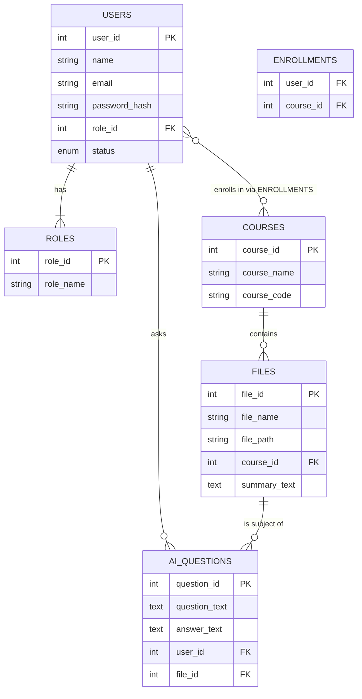

# استخراج البيانات من ملف S-ACM PDF - الجزء الأول

## معلومات الغلاف (صفحة 1)
- **الجامعة:** جامعة العلوم والتكنولوجيا - كلية الحاسبات وتكنولوجيا المعلومات - فرع الحديدة
- **القسم:** قسم تقنية المعلومات
- **اسم المشروع:** نظام إدارة المحتوى الأكاديمي
- **العام الجامعي:** 2025/2026م

### فريق العمل:
1. رياض محمد بكيرة
2. محمد أحمد جعبوس
3. معين حمير العباسي
4. مهند يوسف الزريقي

### الإشراف:
- د/ نوال الرجوي

---

## جدول المحتويات (صفحات 2-5)

### الفصل الأول: المقدمة
- 1.1 المقدمة
- 1.2 المشكلات التي يراد حلها
- 1.3 أهداف المشروع
- 1.4 نطاق المشروع (أعضاء هيئة التدريس، الطلاب)
- 1.5 الخطة الزمنية للمشروع (Temporal Feasibility)
- 1.6 الفرضيات والمعوقات (المخاطر)
- 1.7 الأدوات والتقنيات المستخدمة (Technical Feasibility)
- 1.8 المنهجية المختارة للمشروع (Agile)
- 1.9 تنظيم المشروع (محتويات الفصول)

### الخطة الزمنية (Sprints):
| Sprint | الفصل | تاريخ البداية | تاريخ النهاية | المدة | النواتج المتوقعة |
|--------|-------|---------------|---------------|-------|------------------|
| Sprint 0 | الفصل الأول: المقدمة | 15/7/2025 | 31/7/2025 | 13 يوماً | وثيقة تعريف المشروع، تحديد الأهداف، نطاق العمل، الأدوات والمنهجية |
| Sprint 1 | الفصل الثاني: الخلفية النظرية | 1/8/2025 | 21/8/2025 | 15 يوماً | دراسة مقارنة للأنظمة، تحليل الفروقات، خلفية نظرية حول إدارة المحتوى |
| Sprint 2 | الفصل الثالث: تحليل النظام | 22/8/2025 | 23/10/2025 | 45 يوماً | دراسة الجدوى الاقتصادية، تحديد المتطلبات، المخططات التحليلية (ERD, Use Case) |
| Sprint 3 | الفصل الرابع: تصميم النظام | 01/11/2025 | 21/11/2025 | 14 يوماً | تصميم واجهات المستخدم، تخطيط البنية التقنية، تصميم قاعدة البيانات، النماذج الأولية |
| Sprint 4 | الفصل الخامس: تنفيذ النظام واختباره | 22/11/2025 | 19/1/2026 | 41 يوماً | تطوير النظام، ربط القاعدة، اختبارات وظيفية وغير وظيفية، جمع ملاحظات المستخدمين |
| Sprint 5 | الفصل السادس: النتائج والتوصيات والختامية | 20/1/2026 | 16/2/2026 | 20 يوماً | تحليل النتائج، قياس رضا المستخدمين، صياغة التوصيات، كتابة الخاتمة |

### الفصل الثاني: الخلفية النظرية
- 2.1 مقدمة
- 2.2 المفاهيم الأساسية المرتبطة بالمشروع:
  - 2.2.1 رفع وإتاحة الوصول لمواد المحاضرات (Lecture Material Upload & Accessibility)
  - 2.2.2 إشعارات التذكير الذكية (Smart Reminder Notifications)
  - 2.2.3 تصنيف وتنظيم المحتوى حسب التخصص والمادة (Content Classification and Organization)
  - 2.2.4 التفاعل الأكاديمي بين الطالب والمدرس (Student-Instructor Interaction)
  - 2.2.5 تمكين المدرسين من إعداد الاختبارات والتقييمات القصيرة (Quiz and Assessment Creation for Instructors)
- 2.3 الدراسات السابقة المتعلقة بالمشروع
  - 2.3.1 تحليل الدراسات السابقة
  - 2.3.2 الثغرة البحثية التي يعالجها مشروع S-ACM
  - 2.3.3 المراجع (References)

### الفصل الثالث: تحليل النظام
- 3.1 مقدمة
- 3.2 أدوات جمع البيانات وتحليلها:
  - 3.2.1 المقابلات الشخصية (Interviews)
  - 3.2.2 الاستبيانات (Surveys)
  - 3.2.3 ملاحظة السلوك (Observation)
- 3.3 دراسة الجدوى (Feasibility Study):
  - 3.3.1 الجدوى الاقتصادية (Economic Feasibility)
  - 3.3.2 الجدوى التقنية (Technical Feasibility)
- 3.4 تحديد المتطلبات (Requirements Elicitation):
  - 3.4.1 الممثلون (Actors) وأدوارهم
  - 3.4.2 الوظائف (Use Cases) ووصفها الموجز
  - 3.4.3 المتطلبات الوظيفية (Functional Requirements)
  - 3.4.4 المتطلبات غير الوظيفية (Non-Functional Requirements)
- 3.5 مخططات متطلبات النظام (System Requirements Models):
  - 3.5.1 مخطط علاقة الكيانات (Entity Relationship Diagram - ERD)
  - 3.5.2 مخطط الفئات (Class Diagram)
  - 3.5.3 مخطط حالات الاستخدام (Use Case Diagram)
  - 3.5.4 سيناريوهات حالات الاستخدام (Use Case Scenarios)
  - 3.5.6 مخطط التسلسل (Sequence Diagram)
  - 3.5.7 مخطط الأنشطة (Activity Diagram)

### الفصل الرابع: التصميم والتنفيذ
- 4.1 تصميم الهيكل العام للنظام
- 4.3 تصميم قاعدة البيانات والجداول (Database and Schema Design)
  - 4.3.1 مخطط جميع الجداول (16 جدولاً)

#### مجموعات الجداول:
1. **جداول مجموعة إدارة المستخدمين والأدوار (RBAC):**
   - 1.1 جدول المستخدمون (Users)
   - 1.2 جدول الأدوار (Roles)
   - 1.3 جدول الصلاحيات (Permissions)
   - 1.4 جدول ربط الأدوار بالصلاحيات (Role_Permissions)
   - 1.5 جدول التخصصات (Majors)
   - 1.6 جدول المستويات (Levels)

2. **جداول مجموعة آليات التحقق والأمان:**
   - 2.1 جدول رموز التحقق (Verification_Codes)
   - 2.2 جدول رموز إعادة تعيين كلمة المرور (Password_Reset_Tokens)

3. **جداول إدارة المقررات والمحتوى:**
   - 3.1 جدول المقررات (Courses)
   - 3.3 جدول ملفات المحاضرات (Lectures_Files)

4. **جداول الإشعارات والإحصائيات:**
   - 4.1 جدول الإشعارات (Notifications)
   - 4.2 جدول مستلمو الإشعارات (Notification_Recipients)
   - 4.3 جدول نشاط المستخدمين (User_Activity)

5. **جداول وظائف الذكاء الاصطناعي (AI Caching):**
   - 5.1 جدول ملخصات الذكاء الاصطناعي (AI_Summaries)
   - 5.2 جدول أسئلة الذكاء الاصطناعي (AI_Questions)

### سيناريوهات حالات الاستخدام:
- جدول 3.8: سيناريو تفعيل الحساب (S-ACM_01)
- جدول 3.9: سيناريو إضافة أو رفع محاضرة ملزمة (S-ACM_02)
- جدول 3.10: سيناريو إضافة إشعار (S-ACM_03)
- جدول 3.11: سيناريو إدارة الصلاحيات (S-ACM_04)

### الفصل الخامس: الاختبار والنتائج الأولية

### الفصل السادس: النتائج والتوصيات والخاتمة

---

## قائمة الجداول (List of Tables)
- جدول 1.1: الخطة الزمنية المقترحة للمشروع (منهجية Agile)
- جدول 1.3: الأدوات والتقنيات المستخدمة (Technical Feasibility)
- جدول 2.1: تحليل الدراسات السابقة
- جدول 3.1: التكاليف المتوقعة لمشروع S-ACM
- جدول 3.2: الفوائد المتوقعة لمشروع S-ACM
- جدول 3.3: الممثلون (Actors) وأدوارهم
- جدول 3.4: الوظائف (Use Cases) ووصفها الموجز
- جدول 3.5: المتطلبات الوظيفية (Functional Requirements)
- جدول 3.6: المتطلبات غير الوظيفية (Non-Functional Requirements)
- جدول 3.7: علاقات تحديد العلاقات بين الجداول
- جدول 3.8-3.11: سيناريوهات حالات الاستخدام

## قائمة الأشكال (List of Figures)
- شكل 1.1: الخطة الزمنية المقترحة للمشروع (منهجية Agile)
- شكل 3.2: مخطط جدول ERD
- شكل 3.3: مخطط الفئات (Class Diagram)
- شكل 3.4: مخطط حالات الاستخدام (Use Case Diagram)


---

## واجهات النظام الأساسية (صفحة 6)
- 4.4 واجهات النظام الأساسية (صفحة 47)
  - 4.4.1 الواجهات الترحيبية (صفحة 48)
  - 4.4.2 واجهات الطالب (صفحة 52)
  - 4.4.3 واجهات المدرس (صفحة 58)
  - 4.4.4 واجهات المسؤول Admin (صفحة 65)

## قائمة الجداول الكاملة (صفحة 7)
| رقم الجدول | اسم الجدول | الصفحة |
|------------|-----------|--------|
| جدول 1.1 | الخطة الزمنية المقترحة للمشروع (منهجية Agile) | 3 |
| جدول 1.2 | الفرضيات والمعوقات (المخاطر) والحلول المقترحة | 4 |
| جدول 1.3 | الأدوات والتقنيات المستخدمة (Technical Feasibility) | 5 |
| جدول 2.1 | تحليل الدراسات السابقة | 10 |
| جدول 3.1 | التكاليف المتوقعة لمشروع S-ACM | 12 |
| جدول 3.2 | الفوائد المتوقعة لمشروع S-ACM | 13 |
| جدول 3.3 | الممثلون (Actors) وأدوارهم | 13 |
| جدول 3.4 | الوظائف (Use Cases) ووصفها الموجز | 14 |
| جدول 3.5 | المتطلبات الوظيفية (Functional Requirements) | 15 |
| جدول 3.6 | المتطلبات غير الوظيفية (Non-Functional Requirements) | 16 |
| جدول 3.7 | علاقات: تحديد العلاقات بين الجداول | 19 |
| جدول 3.8 | سيناريو: تفعيل الحساب (S-ACM_01) | 23 |
| جدول 3.9 | سيناريو: إضافة أو رفع محاضرة (ملزمة) (S-ACM_02) | 24 |
| جدول 3.10 | سيناريو: إضافة إشعار (S-ACM_03) | 25 |
| جدول 3.11 | سيناريو: إدارة الصلاحيات (S-ACM_04) | 26 |

## قائمة الأشكال (صفحة 8)
- List of Figures (قائمة فارغة في هذه الصفحة)

## الآية القرآنية (صفحة 9)
> ﴿وَقُلِ اعْمَلُوا فَسَيَرَى اللَّهُ عَمَلَكُمْ وَرَسُولُهُ وَالْمُؤْمِنُونَ﴾
> (سورة التوبة, الآية 105)

## الإهداء (صفحة 10)
"أهدي هذا العمل المتواضع إلى من كان لهم الفضل بعد الله في دعمي وتشجيعي:
- إلى والديّ العزيزين، منبع الحب والعطاء،
- إلى أساتذتي الكرام، الذين غرسوا فيّ بذور المعرفة،
- إلى أصدقائي وزملائي، شركاء الدرب والمواقف،
- وإلى كل من آمن بي ولو بكلمة، أهديكم ثمرة جهدي."
# الفصل الأول: المقدمة - تحليل تفصيلي

## صفحة الشكر والتقدير (صفحة 11)
"أتقدم بجزيل الشكر والامتنان لكل من ساهم في إنجاز هذا المشروع،
خاصةً المشرف الأكاديمي الذي لم يبخل عليّ بتوجيهاته،
ولإدارة القسم التي وفرت بيئة محفزة للبحث والتطوير،
ولكل من وقف بجانبي في لحظات التحدي، أقول: شكراً من القلب."

---

## 1.1 المقدمة (صفحة 13)

### السياق العام للمشكلة:
في ظل التطورات التكنولوجية المتسارعة، لا تزال الكثير من الجامعات تواجه صعوبة في إدارة وتوزيع المواد الدراسية بالشكل المناسب. فغالباً ما يعتمد الطالب على استلام الملفات والملازم عبر مندوبين أو من خلال تطبيقات التواصل الاجتماعي، مما يؤدي إلى تأخير وصول المحتوى، وتشتت في المصادر، وأحياناً فقدان لبعض المواد. كما أن هذه الطريقة التقليدية لا توفر للطالب تجربة تعليمية متكاملة، ولا تتيح للمدرسين تنظيم محتواهم الأكاديمي بفعالية.

### الحل المقترح:
من هنا جاءت فكرة مشروع "نظام إدارة المحتوى الأكاديمي" (S-ACM) كحل رقمي متكامل لمعالجة هذه المشكلة. يقوم النظام على إنشاء منصة إلكترونية موحدة يستطيع أعضاء هيئة التدريس من خلالها رفع وتنظيم جميع أنواع المحتوى التعليمي، مثل: الملازم، العروض التقديمية، روابط مقاطع الفيديو، والواجبات، مع إمكانية تصنيفها حسب التخصص والمقرر الدراسي.

### القيمة المضافة:
وفي المقابل، يتمكن الطالب من الوصول إلى المواد التعليمية بسهولة وسرعة في أي وقت ومن أي مكان، دون الحاجة إلى وسطاء أو قنوات خارجية.

### الميزات الإضافية:
لا يقتصر النظام على توفير المحتوى فحسب، بل يضيف ميزة التنبيهات والإشعارات الفورية، التي تُعلم الطالب بأي تحديثات أو إعلانات مهمة، مثل: إضافة محتوى جديد، أو مواعيد تسليم الواجبات، أو مواعيد الاختبارات. وهذا يجعل التواصل بين المدرسين والطلاب أكثر فاعلية، ويضمن أن الجميع على اطلاع دائم بكل ما يخص المقررات الدراسية.

### الرؤية الشاملة:
إن مشروع "نظام إدارة المحتوى الأكاديمي" يمثل خطوة عملية نحو تحسين التجربة التعليمية الجامعية من خلال تسهيل الوصول إلى المواد، وتنظيمها، وتعزيز التفاعل بين الطلاب والمدرسين. كما أنه يساهم في الانتقال من الطرق التقليدية غير المنظمة إلى بيئة تعليمية رقمية حديثة تواكب متطلبات العصر، وتضع الطالب في قلب العملية التعليمية.

---

## 1.2 المشكلات التي يراد حلها (صفحة 13)

ينبع اختيار هذا المشروع من رصدنا لمجموعة من التحديات والمشكلات القائمة في البيئة الأكاديمية:

| # | المشكلة | التفاصيل |
|---|---------|----------|
| 1 | تأخير وصول المواد الدراسية | اعتماد الطالب على المندوب أو قنوات غير رسمية مثل وسائل التواصل الاجتماعي |
| 2 | تشتت مصادر المحتوى الأكاديمي | الطالب يحصل على المواد من أكثر من مكان، مما يسبب تشتتاً أو نسياناً لبعض الملفات |
| 3 | ضعف التنظيم في تصنيف المواد | صعوبة الوصول إلى محتوى محدد بسهولة |
| 4 | غياب الإشعارات الرسمية | عدم إعلام الطالب بالمستجدات (موعد اختبار أو إضافة محتوى جديد)، مما يؤدي إلى نسيان المواعيد الهامة |
| 5 | الاعتماد المفرط على الطرق التقليدية | توزيع ورقي أو عبر وسطاء لا تتماشى مع متطلبات التعليم الحديث |
| 6 | صعوبة التواصل المباشر | بين المدرسين والطلاب بخصوص المحتوى أو التنبيهات الأكاديمية |
| 7 | عدم وجود بيئة رقمية موحدة | تجمع جميع عناصر المحتوى الأكاديمي في مكان واحد يسهل الوصول إليه |

---

## 1.3 أهداف المشروع (صفحة 14)

يسعى المشروع لتحقيق الأهداف العامة والخاصة التالية:

| # | الهدف | الوصف |
|---|-------|-------|
| 1 | تسهيل وصول الطالب للمحتوى | عبر منصة إلكترونية موحدة بدلاً من الطرق التقليدية (المندوب – وسائل التواصل) |
| 2 | تحسين كفاءة العملية التعليمية | تقليل التشتت وضياع الوقت الناتج عن الاعتماد على قنوات غير رسمية لتوزيع المحتوى |
| 3 | تمكين أعضاء هيئة التدريس | من رفع وتنظيم المواد الدراسية بجميع أشكالها (ملفات، عروض، فيديوهات، واجبات) وتصنيفها حسب المقرر والتخصص |
| 4 | تعزيز التواصل بين الطلاب والمدرسين | من خلال نظام إشعارات وتنبيهات فورية بخصوص الإعلانات، مواعيد الاختبارات، أو إضافة محتوى جديد |
| 5 | الاستعداد للتحول الرقمي | في التعليم بما يواكب متطلبات العصر، وتوفير بنية تحتية قابلة للتطوير والتوسع مستقبلاً |
| 6 | توفير بيئة تعليمية رقمية آمنة ومنظمة | تتيح الوصول للمحتوى في أي وقت ومن أي مكان بسهولة |
| 7 | رفع جودة التعليم الجامعي | من خلال ربط جميع أطراف العملية الأكاديمية في نظام موحد يدعم التفاعل المستمر |

---

## 1.4 نطاق المشروع (صفحة 14)

يهدف مشروع "نظام إدارة المحتوى الأكاديمي" إلى تطوير منصة إلكترونية متكاملة تُمكّن أعضاء هيئة التدريس والطلاب من إدارة وتبادل المواد الدراسية بشكل منظم وسهل الوصول.

### الفئات المستهدفة:

#### 1. أعضاء هيئة التدريس:
- رفع المواد الدراسية بجميع أنواعها (ملازم، عروض تقديمية، فيديوهات، ملفات مساندة)
- تصنيف المحتوى حسب المقرر، التخصص، والمستوى الأكاديمي
- إرسال إشعارات وتنبيهات للطلاب حول المستجدات (إعلان هام، موعد اختبار، تسليم تكليف)
- تلخيص المحاضرات وتوليد الأسئلة باستخدام أدوات الذكاء الاصطناعي

#### 2. الطلاب:
- تمكين الطالب من تصفح وتنزيل المواد من أي مكان وفي أي وقت
- تلخيص المحاضرات وتوليد الأسئلة منها باستخدام أدوات الذكاء الاصطناعي

### ملاحظة هامة:
يقتصر نطاق المشروع على إدارة المحتوى الأكاديمي والتفاعل المرتبط به، ويستثني أنظمة أخرى مثل التسجيل الأكاديمي، أو إدارة الدرجات النهائية، أو الشؤون المالية.

---

## 1.5 الخطة الزمنية للمشروع (Temporal Feasibility) - صفحة 15

تتعلق الجدوى الزمنية بتقييم ما إذا كان يمكن إنجاز المشروع ضمن الإطار الزمني المحدد (عادةً عام أكاديمي لمشاريع التخرج). يعتمد المشروع على منهجية **Agile**، مما يسمح بالمرونة في إدارة الوقت والتسليم التدريجي للميزات.

### جدول 1.1: الخطة الزمنية المقترحة للمشروع (منهجية Agile)

| Sprint | الفصل | تاريخ البداية | تاريخ النهاية | المدة | النواتج المتوقعة |
|--------|-------|---------------|---------------|-------|------------------|
| **Sprint 0** | الفصل الأول: المقدمة | 15/7/2025 | 31/7/2025 | 13 يوماً | وثيقة تعريف المشروع، تحديد الأهداف، نطاق العمل، الأدوات والمنهجية |
| **Sprint 1** | الفصل الثاني: الخلفية النظرية | 1/8/2025 | 21/8/2025 | 15 يوماً | دراسة مقارنة للأنظمة، تحليل الفروقات، خلفية نظرية حول إدارة المحتوى |
| **Sprint 2** | الفصل الثالث: تحليل النظام | 22/8/2025 | 23/10/2025 | 45 يوماً | دراسة الجدوى الاقتصادية، تحديد المتطلبات، المخططات التحليلية (ERD, Use Case) |
| **Sprint 3** | الفصل الرابع: تصميم النظام | 01/11/2025 | 21/11/2025 | 14 يوماً | تصميم واجهات المستخدم، تخطيط البنية التقنية، تصميم قاعدة البيانات، النماذج الأولية |
| **Sprint 4** | الفصل الخامس: تنفيذ النظام واختباره | 22/11/2025 | 19/1/2026 | 41 يوماً | تطوير النظام، ربط القاعدة، اختبارات وظيفية وغير وظيفية، جمع ملاحظات المستخدمين |
| **Sprint 5** | الفصل السادس: النتائج والتوصيات والختامية | 20/1/2026 | 16/2/2026 | 20 يوماً | تحليل النتائج، قياس رضا المستخدمين، صياغة التوصيات، كتابة الخاتمة |

**المدة الإجمالية للمشروع:** 148 يوماً (من 15/7/2025 إلى 16/2/2026)


---

## شكل 1.1: الخطة الزمنية المقترحة (Gantt Chart) - صفحة 16

### تفاصيل المخطط الزمني البصري:
```
2025                    Q3                Q4                Q1        2026
        Jul    Aug    Sep    Oct    Nov    Dec    Jan    Feb
        |------|------|------|------|------|------|------|------|
المقدمة          |13 days| 15 Jul - 31 Jul
الخلفية النظرية         |15 days| 1 Aug - 21 Aug
تحليل نموذج النظام              |45 days| 22 Aug - 23 Oct
التصميم                                    |15 days| 1 Nov - 21 Nov
التنفيذ والاختبار                                  |41 days| 22 Nov - 19 Jan
التوثيق                                                    |20 days| 20 Jan - 16 Feb
```

---

## 1.6 الفرضيات والمعوقات (المخاطر) - صفحة 16

### جدول 1.2: الفرضيات والمعوقات (المخاطر) والحلول المقترحة

| المعوق (المخاطرة) | الوصف | الحل المقترح (الفرضية) |
|------------------|-------|----------------------|
| **صعوبة اختيار لغة البرمجة** | تعدد الخيارات وصعوبة تحديد اللغة الأنسب من حيث الأداء والتوافق مع متطلبات المشروع (خاصة الذكاء الاصطناعي) | إجراء دراسة مقارنة بين اللغات واعتماد حزمة تقنية موحدة (Python/Django) والاستعانة بمشرف فني للدعم |
| **التباعد الجغرافي لأعضاء الفريق** | سكن أعضاء الفريق في مناطق متفرقة، مما يصعب تنسيق الاجتماعات والعمل الجماعي | تخصيص أيام محددة في الأسبوع للاجتماع في مكان واحد، والاعتماد على أدوات إدارة المشاريع للتنسيق عن بعد |
| **صعوبة الحصول على خادم** | محدودية الموارد المجانية وصعوبة نشر النظام على بيئة سحابية مجانية (مثل Heroku أو Firebase) للنسخة التجريبية | العمل على تحميل الموارد مسبقاً، واستخدام خدمات استضافة سحابية مجانية أو منخفضة التكلفة، وتوفير نسخة محلية من المشروع للعمل عليها دون اتصال دائم بالإنترنت |
| **ضعف التنظيم أو التوثيق** | غياب خطة واضحة أو توزيع المهام، مما يؤدي إلى تأخير الإنجاز | اختيار شخص واحد ليكون قائداً للفريق، وتوزيع المهام بشكل واضح بين الأعضاء، والالتزام بالتوثيق المستمر |
| **نقص الخبرة في التعامل مع قواعد البيانات** | عدم إلمام بعض الأعضاء بكيفية تصميم أو إدارة قواعد البيانات بشكل فعال | تخصيص وقت للتعلم الذاتي، والاستعانة بمشرف أكاديمي للتوجيه الفعال عند التعامل مع قواعد البيانات |
| **محدودية مساحة التخزين على الخادم (Server Storage)** | السعة المتاحة لحفظ البيانات محدودة وقد تؤثر على الأداء والخدمات | **اعتماد استراتيجية التخزين الهجين (Hybrid Storage Strategy):** حيث يتم تخزين "الروابط فقط" في قاعدة البيانات، بينما يتم رفع الملفات والفيديوهات على خدمات سحابية خارجية مثل Google Drive, YouTube, AWS لتقليل الحمل على الخادم وضمان سرعة الأداء |

---

## 1.7 الأدوات والتقنيات المستخدمة (Technical Feasibility) - صفحة 17

لضمان الأداء العالي، الأمان، وسهولة التطوير المستقبلي، تم اختيار مجموعة من التقنيات الموثوقة والحديثة لبناء نظام إدارة المحتوى الأكاديمي، مع التركيز على توحيد البيئة البرمجية.

### جدول 1.3: الأدوات والتقنيات المستخدمة (Technical Feasibility)

| المكون | التقنية المقترحة | التبرير المنهجي للاختيار |
|--------|-----------------|-------------------------|
| **اللغة الأساسية/الواجهة الخلفية** | Python (Django Framework) | 1. **التوحيد:** يوحد اللغة البرمجية للمشروع بالكامل (الويب والذكاء الاصطناعي) مما يقلل من التعقيد. 2. **قوة الميزات:** يوفر Django إطار عمل متكامل (ORM، أمان، لوحة تحكم إدارية جاهزة) مناسبة لمشاريع إدارة المحتوى. وسيتم بناء لوحة تحكم مخصصة (Custom Dashboard) بالاعتماد على بياناته لتوفير إحصائيات ورسوم بيانية متقدمة |
| **الذكاء الاصطناعي/المعالجة** | Python مكتبات (AI) - TensorFlow, PyTorch, NLTK | 1. **الكفاءة القصوى:** Python هي اللغة الأم لمكتبات الذكاء الاصطناعي مما يضمن أفضل أداء لوظائف تلخيص المحاضرات وتوليد الأسئلة. 2. **البحث المتقدم:** يمكن دمج Django بسهولة مع محركات بحث قوية مثل Elasticsearch أو Whoosh للبحث داخل محتوى الملفات (ميزة الأرشفة المتقدمة) |
| **قاعدة البيانات** | PostgreSQL | 1. **قوة الأرشفة:** يتفوق PostgreSQL على MySQL في التعامل مع البيانات النصية الكبيرة ويوفر دعماً مدمجاً لميزات البحث المتقدم (Full-Text Search) الضرورية لميزة الأرشفة |
| **الواجهة الأمامية** | Django Templates + Bootstrap 5 + HTMX | 1. **سرعة التطوير:** استخدام محرك القوالب المدمج (DTL) يقلل وقت التطوير بنسبة كبيرة مقارنة بفصل الواجهة عن الخلفية. 2. **التفاعلية الحديثة:** توفر مكتبة HTMX تجربة مستخدم تفاعلية (AJAX) دون الحاجة لكتابة كود JavaScript معقد. 3. **التجاوب:** يضمن Bootstrap 5 عمل النظام على جميع الأجهزة (موبايل/لابتوب) بتصميم جاهز واحترافي |

### الخلاصة التقنية:
إن اختيار حزمة التقنيات (Python/Django/PostgreSQL) هو الخيار الأمثل لمشروع S-ACM، حيث يوازن بين سرعة الإنجاز وتحقيق الوظائف المتقدمة، مع الأخذ في الاعتبار إمكانية استخدام لغات أو تقنيات أخرى إذا اقتضت متطلبات المشروع ذلك مستقبلاً.

---

## 1.8 المنهجية المختارة للمشروع - صفحة 18

تم اختيار المنهجية الرشيقة **(Agile)** لتنفيذ مشروع "نظام إدارة المحتوى الأكاديمي" نظراً لما توفره من مرونة وكفاءة في إدارة عملية تطوير البرمجيات. تتميز هذه المنهجية بالقدرة على التكيف مع التغيرات والطلبات الجديدة أثناء عملية التطوير، مما يتيح للفريق التعامل مع أي تعديل في تصميم النظام أو إضافة ميزات جديدة بسهولة.

### 1.8.1 أسباب اختيار منهجية Agile للمشروع:

| # | السبب | الشرح |
|---|-------|-------|
| 1 | **المرونة في التطوير** | يمكن تعديل النظام أو إضافة وظائف جديدة (مثل: إضافة نظام إشعارات جديد أو رفع أنواع مختلفة من المواد) بناءً على ملاحظات المستخدمين أثناء التنفيذ |
| 2 | **التفاعل المستمر مع المستخدمين** | توفر المنهجية فرصاً للتواصل المباشر مع الطلاب والمدرسين للحصول على تعليقاتهم وتلبية احتياجاتهم |
| 3 | **التسليم التدريجي** | يتم تطوير النظام على مراحل (Sprints)، حيث يتم اختبار كل جزء من النظام (رفع محتوى، إشعارات، عرض محتوى) قبل الانتقال إلى المرحلة التالية، مما يقلل من الأخطاء ويضمن جودة المنتج النهائي |
| 4 | **إدارة أفضل للمخاطر** | يمكن التعامل بسرعة مع أي مشكلة أو عائق يظهر أثناء التطوير، مقارنة بالمنهجيات التقليدية التي تتطلب الانتهاء من جميع المراحل قبل المراجعة |

---

## 1.9 تنظيم المشروع (محتويات الفصول) - صفحات 18-19

يوضح هذا القسم تنظيم الفصول التالية ومحتواها، مع تحديد الهدف من كل فصل:

| الفصل | العنوان | المحتوى |
|-------|---------|---------|
| **الفصل الثاني** | الخلفية النظرية والدراسات السابقة | يستعرض المفاهيم الأساسية المتعلقة بإدارة المحتوى الأكاديمي، وأهمية الأنظمة الرقمية في تحسين العملية التعليمية، ويقدم دراسة مقارنة للأنظمة المشابهة في الجامعات، مع تحليل أوجه التشابه والاختلاف مع النظام المقترح |
| **الفصل الثالث** | تحليل النظام وتصميمه | يشمل دراسة البيئة الحالية لعملية توزيع المحتوى، أدوات جمع البيانات، تحديد المتطلبات الوظيفية وغير الوظيفية، وعرض مخططات التحليل (Use Case, Sequence, Activity, Class, ERD) |
| **الفصل الرابع** | التصميم والتنفيذ | يتضمن تصميم واجهات المستخدم، تخطيط البنية التقنية، تصميم قاعدة البيانات، إجراء اختبارات وظيفية وغير وظيفية، وجمع ملاحظات المستخدمين ونماذج أولية للشاشات |
| **الفصل الخامس** | الاختبار والنتائج الأولية | يتناول عملية تطوير النظام، ربط قاعدة البيانات، إجراء اختبارات وظيفية وغير وظيفية، وجمع ملاحظات المستخدمين |
| **الفصل السادس** | النتائج والتوصيات والخاتمة | يعرض نتائج تطبيق النظام، قياس رضا الطلاب وأعضاء هيئة التدريس، أبرز الفوائد التي حققها المشروع، بالإضافة إلى التوصيات المستقبلية لتطوير النظام (مثل: إضافة نظام الاختبارات الإلكترونية)، ثم خاتمة تلخص أهم مخرجات المشروع وأثره الأكاديمي |
# الفصل الثاني: الخلفية النظرية والدراسات السابقة - تحليل تفصيلي

## 2.1 مقدمة (صفحة 21)

يمثل هذا الفصل الأساس النظري لمشروع نظام إدارة المحتوى الأكاديمي (S-ACM)، حيث يستعرض المفاهيم الأساسية والنظريات ذات الصلة التي تشكل الإطار المعرفي والفلسفي للمشروع. يهدف هذا الاستعراض الشامل إلى بناء فهم عميق للأسس النظرية التي يقوم عليها المشروع، وتحديد موقعه ضمن السياق الأكاديمي والتقني الأوسع. وهذا يضمن أن الحل المقترح مبني على أسس علمية راسخة ويستفيد من الخبرات السابقة في المجال.

### أهمية الخلفية النظرية:
تكتسب الخلفية النظرية أهمية خاصة في مشروع S-ACM نظراً لطبيعته التي تتطلب فهماً عميقاً للجوانب التعليمية والتقنية على حد سواء. فمن الناحية التعليمية، يجب على النظام أن يراعي أحدث نظريات تصميم المناهج وطرق التدريس وتقييم التعلم، لضمان تقديم تجربة تعليمية فعالة وجذابة للطالب. ومن الناحية التقنية، يتطلب المشروع الإلمام بأحدث التقنيات المستخدمة في تطوير أنظمة إدارة التعلم والمحتوى، مثل البنى المعمارية للأنظمة وقواعد البيانات وأساليب تأمين المعلومات.

---

## 2.2 المفاهيم الأساسية المرتبطة بالمشروع

### 2.2.1 رفع وإتاحة الوصول لمواد المحاضرات (Lecture Material Upload & Accessibility)

تُعد هذه الوظيفة من الجوانب الأساسية في نظام إدارة المحتوى الأكاديمي (S-ACM)، حيث تُمكّن أعضاء هيئة التدريس من رفع المواد التعليمية والملازم الدراسية إلى النظام بشكل منظم. يتم تصنيف هذه المواد وفقاً للمستوى الدراسي والتخصص والمقرر، مما يتيح للطالب سهولة الوصول إلى المحتوى المطلوب في أي وقت ومن أي مكان. يهدف هذا المفهوم إلى تبسيط عملية توزيع المحتوى وتحقيق التكامل بين الطالب والمقرر الدراسي، وتقليل الاعتماد على الطرق البدوية أو الورقية التقليدية.

### 2.2.2 إشعارات التذكير الذكية (Smart Reminder Notifications)

تتيح هذه الخاصية للنظام إرسال تنبيهات تلقائية للمستخدمين (سواء كانوا طلاباً أو مدرسين) بشأن المواعيد والأحداث الأكاديمية الهامة، مثل: مواعيد تسليم الواجبات، أو الامتحانات، أو آخر تحديثات المواد. يستخدم النظام تقنيات الزمنية والخدمات السحابية أو المحلية للتنبيه لتنفيذ هذه المهام، مما يساعد الطلاب على تحسين إدارة وقتهم وتقليل فرص النسيان.

### 2.2.3 تصنيف وتنظيم المحتوى حسب التخصص والمادة (Content Classification and Organization)

يُعد التصنيف الأكاديمي أحد الركائز الأساسية لأي نظام ناجح لإدارة المحتوى. يتيح هذا التنظيم للمستخدمين تصفح المواد والملفات بسهولة، استناداً إلى الكلية، التخصص، المستوى الدراسي، والمادة التعليمية. يعمل هذا التنظيم على تحسين تجربة المستخدم وتقليل الجهد والوقت اللازمين للبحث عن الملفات المطلوبة.

### 2.2.4 التفاعل الأكاديمي بين الطالب والمدرس (Student-Instructor Interaction)

يتضمن هذا المفهوم تسهيل قنوات الاتصال بين الطرفين داخل النظام، سواء عبر إرسال رسائل داخلية، أو إشعارات، أو الرد على استفسارات متعلقة بالمحتوى. هذا النوع من التفاعل يعزز جودة التعليم ويشجع الطالب على طرح الأسئلة والاستفسارات المتعلقة بالدروس بطريقة منظمة ومباشرة، دون الحاجة للرجوع إلى وسائل اتصال خارجية.

### 2.2.5 تمكين المدرسين من إعداد الاختبارات والتقييمات القصيرة (Quiz and Assessment Creation for Instructors)

تُعتبر هذه الخاصية من الوظائف الهامة التي يوفرها النظام، حيث تُمكّن المدرسين من إنشاء تقييمات إلكترونية دورية واختبارات قصيرة داخل المنصة. تتضمن هذه الخاصية إعداد الأسئلة بأنواع متعددة (مثل: الاختيار من متعدد، صح وخطأ، الإجابة القصيرة) وتحديد زمن الامتحان، والاطلاع على النتائج تلقائياً. تساعد هذه الخاصية في ربط العملية التعليمية بالتقييم الفعال وتحسين التغذية الراجعة للمدرس حول مستوى فهم الطلاب.

---

## 2.3 الدراسات السابقة المتعلقة بالمشروع (صفحات 22-25)

تُعد مراجعة الدراسات السابقة جزءاً حيوياً من أي بحث علمي أو مشروع تقني، حيث توفر أساساً لفهم السياق الحالي وتحديد المساهمات المحتملة للمشروع الجديد. سيتم في هذا القسم تحليل مجموعة من الدراسات السابقة التي تناولت جوانب مختلفة تتعلق بأنظمة إدارة المحتوى والتعليم الإلكتروني، مع التركيز على تلك التي أُجريت في سياقات أكاديمية مشابهة (العربية واليمنية خاصة).

### أهداف هذه المراجعة:
1. **تحديد نقاط القوة والضعف:** استخلاص الممارسات الجيدة وتجنب الأخطاء التي وقعت فيها الأنظمة السابقة
2. **اكتشاف الحلول المقترحة:** فهم كيفية معالجة التحديات المشتركة في أنظمة إدارة المحتوى الأكاديمي
3. **تحديد الثغرات البحثية:** الكشف عن الجوانب التي لم يتم تناولها بشكل كافٍ، والتي يمكن لمشروع S-ACM سدها
4. **تأكيد الحاجة للمشروع:** إظهار أن هناك حاجة حقيقية لحل مبتكر يلبي المتطلبات الحالية للتعليم الأكاديمي

---

## 2.3.1 تحليل الدراسات السابقة (صفحات 23-24)

### جدول 2.1: تحليل الدراسات السابقة

| # | الدراسة السابقة (المؤلف والسنة) | المزايا (نقاط القوة) | العيوب (الثغرة البحثية الرئيسية) |
|---|-------------------------------|---------------------|--------------------------------|
| 1 | **مشروع تخرج: نظام إدارة محتوى أكاديمي متكامل (2023)** | توفير منصة مركزية لتخزين ورفع مواد المحاضرات الأساسية | يفتقر إلى الوظائف الذكية (التنبيهات التنبؤية)، والتقييم المتكامل، والتفاعل المتقدم |
| 2 | **ورقة مؤتمر: تطوير نظام تقييم إلكتروني متكامل (2024)** | توفير منصة لإنشاء وإدارة وتصحيح الاختبارات والتقييمات الإلكترونية | يركز حصرياً على التقييم، ويفتقر إلى وظائف إدارة المحتوى (رفع وتصنيف المحاضرات) والتنبيهات الذكية |
| 3 | **مشروع تخرج: نظام تنبيهات أكاديمية مخصص (2025)** | توفير نظام تنبيهات تلقائية ومخصصة للمستخدمين بشأن المواعيد الأكاديمية الهامة | يفتقر إلى وظائف إدارة المحتوى (رفع وتصنيف) والتقييم المتكامل |
| 4 | **مشروع تخرج: نظام إدارة محتوى تفاعلي للمقررات (2022)** | يركز على إدارة محتوى المقررات مع إمكانية تضمين عناصر تفاعلية (مثل الفيديوهات التفاعلية) | يفتقر إلى وظائف التقييم الشاملة، والتنبيهات الذكية، والتفاعل المباشر بين الطالب والمدرس |
| 5 | **دراسة: دور إشعارات الدفع في تعزيز مشاركة الطلاب في التعليم الإلكتروني (Mumcu, 2025)** | إثبات الدور الفعال لإشعارات الدفع في زيادة مشاركة الطلاب | لم تتناول كيفية دمج هذه الإشعارات ضمن نظام LCMS متكامل يدعم تصنيف المحتوى |
| 6 | **دراسة: تعزيز تجربة المستخدم في أنظمة التعليم الإلكتروني (Mostefai, 2025)** | تركز على تصميم أنظمة التعليم الإلكتروني بناءً على تجربة المستخدم | لم تتناول الوظائف الأكاديمية المتخصصة بشكل كافٍ (مثل: إعداد الاختبارات، التصنيف الأكاديمي) |

---

## 2.3.2 الثغرة البحثية التي يعالجها مشروع S-ACM (صفحة 25)

من خلال مراجعة المشاريع والدراسات السابقة، يتضح وجود ثغرة واضحة في الأنظمة الحالية، خاصة في البيئة الأكاديمية المحلية والعربية، والتي يسعى مشروع S-ACM لسدها على النحو التالي:

### الثغرات المحددة:

| # | الثغرة | التفاصيل |
|---|--------|----------|
| 1 | **التكامل الوظيفي** | لا يوجد نظام سابق يجمع بين الوظائف الخمس الأساسية لمشروع S-ACM (إدارة المحتوى، التنبيهات الذكية، التفاعل الأكاديمي، التصنيف، إنشاء الاختبارات) في منصة واحدة متكاملة |
| 2 | **التركيز على الذكاء والتخصيص** | معظم الأنظمة التي تناولت التنبيهات تفصلها عن سياق المحتوى الأكاديمي. بينما يهدف S-ACM إلى ربط التنبيهات الذكية بالمحتوى المصنف، مما يزيد من فاعلية التفاعل الأكاديمي |
| 3 | **الشمولية الأكاديمية** | ركزت المشاريع التطبيقية السابقة على جانب واحد فقط (إما المحتوى أو التقييم أو التنبيهات)، بينما يقدم S-ACM حلاً شاملاً يخدم جميع جوانب العملية التعليمية للطالب والمدرس |

### الحل المقترح:
يسعى مشروع S-ACM إلى سد هذه الثغرة من خلال تقديم نظام LCMS أكاديمي متكامل يركز بشكل خاص على دقة تصنيف المحتوى ودمج نظام إشعارات ذكي ومخصص يخدم كلاً من الطالب والمدرس في البيئة الأكاديمية.

---

## 2.3.3 المراجع (References) - صفحة 25

1. **مشروع تخرج (2023):** نظام إدارة محتوى أكاديمي متكامل - [رابط الدراسة]
2. **ورقة مؤتمر (2024):** تطوير نظام تقييم إلكتروني متكامل - [رابط الدراسة]
3. **مشروع تخرج (2025):** نظام تنبيهات أكاديمية مخصص - [رابط الدراسة]
4. **مشروع تخرج (2022):** نظام إدارة محتوى تفاعلي للمقررات - [رابط الدراسة]
5. **Mumcu, B. B. (2025).** *The role of push notifications in shaping students' engagement in e-learning.* Educational Technology Research and Development. [رابط الدراسة]
6. **Mostefai, B. (2025).** *Enhancing user experience in e-learning systems: A new approach to design and development.* Procedia Computer Science. [رابط الدراسة]
# الفصل الثالث: تحليل النظام - تحليل تفصيلي

## 3.1 مقدمة (صفحة 27)

يُعد هذا الفصل حجر الزاوية في عملية تطوير نظام إدارة المحتوى الأكاديمي (S-ACM)، حيث ينتقل المشروع من مرحلة التخطيط النظري إلى التحليل العملي والمنهجي والتصميم. يركز هذا الجزء بشكل أساسي على تحليل وفهم المتطلبات الوظيفية وغير الوظيفية للنظام المقترح، بناءً على البيانات التي تم جمعها من أصحاب المصلحة. سيتناول الفصل دراسة معمقة للبيئة الحالية التي يعمل فيها النظام، وتحديد التحديات والمشكلات التي يواجهها المستخدمون (الطلاب وأعضاء هيئة التدريس) بشكل يومي، وذلك بدقة عالية.

### منهجية التحليل:
سيتم استعراض أدوات جمع البيانات المستخدمة لضمان الحصول على معلومات شاملة ودقيقة، بالإضافة إلى إجراء دراسة جدوى مفصلة لتقييم الجوانب الاقتصادية والزمنية والتقنية للمشروع. بعد ذلك، سيتم تحديد المتطلبات التفصيلية، والتي ستكون بمثابة الأساس لتصميم المخططات التصويرية التي توضح هيكل النظام وسلوكه، وتفاعلاته. سيتم استخدام لغة النمذجة الموحدة (UML) لإنشاء هذه المخططات، بما في ذلك مخططات حالات الاستخدام، مخططات الأنشطة، مخططات التسلسل، ومخططات الفئات، بالإضافة إلى مخطط علاقة الكيانات (ERD) لتصميم قاعدة البيانات.

### الهدف النهائي:
الهدف النهائي لهذا الفصل هو تقديم تحليل شامل وتصميم متكامل يضمن أن النظام المقترح يلبي جميع الاحتياجات المحددة، ويكون قابلاً للتنفيذ بنجاح، مع الأخذ في الاعتبار طبيعة نظام S-ACM الذي يعتمد على صلاحيات ديناميكية ووظائف متقدمة للذكاء الاصطناعي.

---

## 3.2 أدوات جمع البيانات وتحليلها (صفحات 27-28)

لضمان فهم شامل ودقيق لمتطلبات نظام إدارة المحتوى الأكاديمي، تم استخدام نهج متعدد الأدوات لجمع البيانات من مختلف أصحاب المصلحة، مما يعزز من دقة وموثوقية عملية التحليل.

### 3.2.1 المقابلات الشخصية (Interviews)

تم إجراء مقابلات شبه منظمة مع عينة من أعضاء هيئة التدريس (5) والطلاب (10) من تخصصات مختلفة. هدفت المقابلات إلى فهم عميق لطرقهم الحالية في تبادل المواد الدراسية، والتحديات التي يواجهونها، وتوقعاتهم من النظام المقترح.

#### النتائج الرئيسية من المقابلات:
- ساعدت هذه المقابلات في الحصول على رؤى نوعية غنية حول المشكلات الحقيقية للمستخدمين، والتي قد لا يمكن التقاطها من خلال الاستبيانات وحدها
- على سبيل المثال، عبر أحد أعضاء هيئة التدريس عن قلقه بشأن حقوق الملكية الفكرية للمواد التي يشاركها عبر وسائل التواصل الاجتماعي، بينما اشتكى الطلاب من صعوبة تتبع الإصدارات المحدثة من الملازم

### 3.2.2 الاستبيانات (Surveys)

تم تصميم استبيان إلكتروني وتوزيعه على عينة أوسع من الطلاب (100) وأعضاء هيئة التدريس (20). هدف الاستبيان إلى جمع بيانات كمية حول مدى انتشار المشكلات المذكورة في الفصل الأول، وتفضيلاتهم لأنواع المحتوى، واستخدامهم لوسائل الاتصال المختلفة للأغراض الأكاديمية.

#### النتائج الإحصائية الهامة:
| النتيجة | النسبة |
|---------|--------|
| الطلاب الذين يحصلون على المواد من مصادر متعددة | 85% |
| أعضاء هيئة التدريس الذين يرغبون في وجود منصة مركزية | 70% |
| الطلاب الذين يجدون صعوبة في تنظيم المواد | 85% |

عززت هذه البيانات الكمية الحاجة للمشروع لضمان وصول المواد لجميع الطلاب.

### 3.2.3 ملاحظة السلوك (Observation)

تمت ملاحظة كيفية تبادل المواد الدراسية حالياً في البيئة الجامعية على مدار أسبوعين. شملت الملاحظة مراقبة مجموعات WhatsApp و Telegram الخاصة بالمواد الدراسية، ومراقبة كيفية تعامل المندوبين مع توزيع المواد.

#### الملاحظات الرئيسية:
- تأخر وصول المواد
- فقدان الملفات في المحادثات الطويلة
- صعوبة الوصول إلى المواد القديمة

قدمت هذه الملاحظات فهماً عملياً للعمليات الحالية ونقاط الضعف فيها.

---

## 3.3 دراسة الجدوى (Feasibility Study) - صفحات 28-29

تُعد دراسة الجدوى خطوة حاسمة لتقييم مدى قابلية المشروع للتطبيق ونجاحه من منظورات متعددة.

### 3.3.1 الجدوى الاقتصادية (Economic Feasibility)

يتضمن هذا التحليل تقدير التكاليف المتوقعة للمشروع ومقارنتها بالفوائد المحتملة (تحليل التكلفة والمنفعة).

#### جدول 3.1: التكاليف المتوقعة لمشروع S-ACM

| البند الرئيسي | التفاصيل | ملاحظات |
|--------------|----------|---------|
| **تكاليف التطوير** | تمثل جهد ووقت الطلاب الأربعة المشاركين في تطوير المشروع | لا يترتب عليها تكاليف مالية مباشرة (رواتب)، ويمكن اعتبارها تكلفة ضمنية للمشروع |
| **تكاليف التشغيل** | استضافة النظام (VPS، خدمات سحابية) | يمكن تقليل هذه التكاليف باستخدام خدمات سحابية مجانية أو منخفضة التكلفة في البداية، مع إمكانية التوسع لاحقاً |
| **تكاليف التدريب** | تدريب المستخدمين (الطلاب، أعضاء هيئة التدريس) على استخدام النظام | يتم دمج التدريب في عملية تطوير المشروع كجزء من مهام الفريق أو استشارة المشرف الأكاديمي |
| **تكاليف البرمجيات والتراخيص** | استخدام برمجيات مفتوحة المصدر أو متاحة للطلاب (مثل Python, Django, PostgreSQL) بيئات التطوير، قواعد البيانات | المشروع يعتمد على تقنيات مفتوحة المصدر وهي غالباً مجانية أو ذات تكلفة منخفضة |

#### جدول 3.2: الفوائد المتوقعة لمشروع S-ACM

| الفوائد | التفاصيل | ملاحظات |
|---------|----------|---------|
| **توفير التكاليف** | تقليل الحاجة إلى طباعة الورق والملازم، مما يساهم في توفير كبير في تكاليف الطباعة للجامعة والطلاب على المدى الطويل | توفير التكاليف المباشرة وغير المباشرة |
| **زيادة الكفاءة والإنتاجية** | توفير جهد ووقت الطلاب وأعضاء هيئة التدريس، وتقليل الوقت المستغرق في البحث عن المواد وتوزيعها والتواصل بشأنها | التركيز على المهام الأكاديمية الأساسية |
| **تحسين السمعة** | تعزيز مكانة الجامعة كمؤسسة أكاديمية تواكب التطورات التكنولوجية وتدعم التحول الرقمي | دعم التحول الرقمي في التعليم |
| **تقليل المخاطر** | ضمان وصول المواد التعليمية بشكل دائم ومنظم، وتقليل المشاكل الناجمة عن فقدان المواد أو عدم وصول المعلومات الهامة للجميع | ضمان وصول المواد للجميع |

### 3.3.2 الجدوى التقنية (Technical Feasibility)

#### التقنيات المختارة:
تم اختيار تقنيات موثوقة وشائعة (Python, Django, PostgreSQL, React/Vue.js) والتي لديها مجتمعات دعم قوية ومصادر تعلم وفيرة. هذا يقلل من المخاطر التقنية ويسهل عملية التطوير.

#### خبرات الفريق:
يمتلك فريق العمل المهارات الأساسية اللازمة لتطوير النظام باستخدام التقنيات المختارة. وسيتم تخصيص وقت للتعلم الذاتي وسد أي فجوات في الخبرة، مع الاستعانة بمشرف المشروع للتوجيه.

#### البنية التحتية:
يمكن نشر النظام بسهولة على خدمات الاستضافة المشتركة أو الخوادم الافتراضية الخاصة (VPS)، مما يجعله قابلاً للتطبيق دون الحاجة إلى بنية تحتية معقدة أو باهظة الثمن.

---

## 3.4 تحديد المتطلبات (Requirements Elicitation) - صفحات 29-30

### 3.4.1 الممثلون (Actors) وأدوارهم

#### جدول 3.3: الممثلون (Actors) وأدوارهم

| الممثل (Actor) | الوصف (Description) |
|----------------|---------------------|
| **مدير النظام (Administrator)** | هو المسؤول عن الإدارة الشاملة للنظام، بما في ذلك إدارة المستخدمين، تحديد الصلاحيات، إدارة الهيكل الأكاديمي (المقررات، التخصصات)، وتوليد تقارير الأداء العامة للنظام. (يمتلك أعلى مستوى من الصلاحيات) |
| **المستخدم (User)** | يمثل أي مستخدم مسجل في النظام (مثل الطالب أو المدرس). تتحدد المهام المتاحة له (مثل رفع المواد أو تحميلها) بناءً على دوره المحدد وصلاحياته المعينة من قبل مدير النظام. (يمتلك صلاحيات محددة حسب الدور) |

### 3.4.2 الوظائف (Use Cases) ووصفها الموجز

#### جدول 3.4: الوظائف (Use Cases) ووصفها الموجز

| الوظيفة (Use Case) | الحزمة (Package) | الوصف الموجز (Brief Description) |
|--------------------|------------------|----------------------------------|
| **تسجيل الدخول** | وظائف عامة | تمكين المستخدم المسجل من الوصول الآمن إلى النظام |
| **إدارة الملف الشخصي** | وظائف عامة | السماح للمستخدمين بتحديث بياناتهم الشخصية وكلمة المرور |
| **إدارة المستخدمين** | إدارة النظام | السماح لمدير النظام بإضافة، تعديل، وحذف حسابات المستخدمين وتحديد أدوارهم |
| **إدارة الصلاحيات** | إدارة النظام | تمكين مدير النظام من تحديد الصلاحيات الممنوحة لكل دور (طالب، مدرس، أدمن) |
| **رفع المواد الدراسية** | إدارة المحتوى التعليمي | تمكين المدرسين من رفع أنواع مختلفة من الملفات (PDF, PPTX, MP4) وتصنيفها |
| **تصنيف المواد الدراسية** | إدارة المحتوى التعليمي | ربط المواد المرفوعة بالتخصص، المستوى، والمقرر الدراسي |
| **تصفح المواد الدراسية** | إدارة المحتوى التعليمي | تمكين الطلاب من تصفح المواد التعليمية حسب التخصص والمقرر |
| **البحث عن المواد** | إدارة المحتوى التعليمي | توفير وظيفة بحث متقدمة للبحث في عناوين ومحتوى الملفات باستخدام معايير بحث مختلفة |
| **تحميل المواد الدراسية** | إدارة المحتوى التعليمي | تنزيل ملفات المحتوى التعليمي على الجهاز المحلي للطالب |
| **تعديل / حذف مواد** | إدارة المحتوى التعليمي | تحديث أو إزالة المواد الدراسية التي قام المدرس برفعها |
| **إنشاء تقارير نشاط** | إدارة المحتوى التعليمي | توليد تقارير حول تفاعل المستخدمين مع المواد الدراسية (تحميل، مشاهدة) |
| **إرسال إشعارات** | التواصل والإشعارات | إرسال تنبيهات وإعلانات فورية للمستخدمين المستهدفين |
| **تلقي إشعارات** | التواصل والإشعارات | استلام وعرض الإشعارات المرسلة من النظام أو الممثلين الآخرين |
| **توليد ملخصات بالذكاء الاصطناعي** | وظائف الذكاء الاصطناعي | إنشاء ملخصات تلقائية للمواد الدراسية الطويلة |
| **توليد أسئلة بالذكاء الاصطناعي** | وظائف الذكاء الاصطناعي | إنشاء أسئلة اختبار أو مراجعة بناءً على محتوى مادة دراسية |
| **إنشاء اختبارات قصيرة** | وظائف الذكاء الاصطناعي | تجميع الأسئلة لإنشاء اختبارات قصيرة للطلاب |


---

## 3.4.3 المتطلبات الوظيفية (Functional Requirements) - صفحة 31

تصف المتطلبات الوظيفية الوظائف والسلوكيات التي يجب أن يؤديها النظام. تم تصنيفها حسب الأولوية (عالية، متوسطة، منخفضة).

### جدول 3.5: المتطلبات الوظيفية (Functional Requirements)

| المعرف | المتطلب | الوصف | الأولوية |
|--------|---------|-------|----------|
| **FR-01** | تسجيل الدخول | يجب أن يتمكن المستخدمون (طلاب، مدرسون، مدير النظام) من تسجيل الدخول إلى النظام باستخدام الرقم الأكاديمي وكلمة مرور | عالية |
| **FR-02** | إدارة المستخدمين | يجب أن يتمكن مدير النظام من إضافة، تعديل، حذف حسابات المستخدمين، وتحديد أدوارهم وصلاحياتهم بشكل ديناميكي | عالية |
| **FR-03** | رفع المواد | يجب أن يتمكن المدرسون من رفع أنواع مختلفة من المواد الدراسية (PDF, DOCX, PPTX, MP4, JPG) | عالية |
| **FR-04** | تصنيف المواد | يجب أن يتمكن المدرسون من تصنيف المواد حسب التخصص، والمستوى الأكاديمي، والمقرر | عالية |
| **FR-05** | تصفح وتحميل المواد | يجب أن يتمكن الطلاب من تصفح المواد الدراسية وتحميلها على أجهزتهم | عالية |
| **FR-06** | إرسال الإشعارات | يجب أن يتمكن المدرسون من إرسال إشعارات للطلاب المسجلين في مقرراتهم | عالية |
| **FR-07** | البحث عن المواد | يجب أن يوفر النظام وظيفة بحث للطلاب للعثور على المواد باستخدام كلمات مفتاحية | متوسطة |
| **FR-08** | التعليق على المواد | يجب أن يتمكن الطلاب من إضافة أسئلة أو تعليقات على المواد الدراسية | منخفضة |
| **FR-09** | تقييم المواد | يجب أن يتمكن الطلاب من تقييم المواد الدراسية (مثل: نظام النجوم) | منخفضة |
| **FR-10** | توليد الملخصات (AI) | يجب أن يتمكن المدرسون من توليد ملخصات للملفات المرفوعة باستخدام الذكاء الاصطناعي | متوسطة |
| **FR-11** | توليد الأسئلة (AI) | يجب أن يتمكن المدرسون من توليد أسئلة من ملفات المحاضرات باستخدام الذكاء الاصطناعي | متوسطة |

---

## 3.4.4 المتطلبات غير الوظيفية (Non-Functional Requirements) - صفحة 32

تصف المتطلبات غير الوظيفية كيفية أداء النظام لوظائفه، وتركز على جودة النظام وخصائصه.

### جدول 3.6: المتطلبات غير الوظيفية (Non-Functional Requirements)

| المعرف | المتطلب | الوصف | الأولوية |
|--------|---------|-------|----------|
| **NFR-01** | الأداء (Performance) | يجب أن يتم تحميل الصفحات الرئيسية في أقل من 3 ثوانٍ، وتحميل ملف بحجم 10 ميجابايت في أقل من 30 ثانية على اتصال متوسط السرعة | عالية |
| **NFR-02** | الأمان (Security) | يجب تشفير كلمات المرور في قاعدة البيانات، والتحقق من صلاحيات المستخدم للوصول إلى أي وظيفة، واستخدام بروتوكول HTTPS | عالية |
| **NFR-03** | سهولة الاستخدام (Usability) | يجب أن تكون واجهة المستخدم بديهية وسهلة التعلم، ويجب أن يتمكن المستخدم الجديد من استخدام الوظائف الأساسية خلال أقل من 10 دقائق، مع تصميم متجاوب (Responsive) لجميع الأجهزة | عالية |
| **NFR-04** | الموثوقية (Reliability) | يجب أن يكون النظام متاحاً بنسبة 99% من الوقت، مع آلية لعرض رسائل واضحة للمستخدم والتعامل مع الأخطاء | عالية |
| **NFR-05** | قابلية التوسع (Scalability) | يجب أن يكون النظام قادراً على التعامل مع زيادة في عدد المستخدمين بنسبة 50% خلال العام الأول دون تدهور في الأداء | متوسطة |
| **NFR-06** | قابلية الصيانة (Maintainability) | يجب أن يكون الكود منظماً وموثقاً (commented)، ويتبع معايير الترميز الخاصة بإطار عمل Django لتسهيل الصيانة والتعديل في المستقبل | متوسطة |
| **NFR-07** | حدود الاستخدام (Rate Limiting) | يجب أن يطبق النظام حداً أقصى لطلبات الذكاء الاصطناعي (مثل 10 طلبات تلخيص في الساعة للطالب) لحماية موارد الخادم من الاستنزاف | متوسطة |

---

## 3.5 مخططات متطلبات النظام (System Requirements Models) - صفحات 32-40

تُعد المخططات التصويرية أدوات أساسية في تحليل وتصميم النظام، حيث توفر تمثيلاً مرئياً لهيكل النظام وسلوكه. سيتم استخدام المخططات التالية لتوضيح تفاعلات النظام ومتطلباته.

### 3.5.1 مخطط علاقة الكيانات (Entity Relationship Diagram - ERD) - صفحة 34

#### تفاصيل مخطط ERD المستخرجة من الشكل 3.2:

يتكون مخطط قاعدة البيانات من **16 جدولاً** مترابطاً، موزعة على 5 مجموعات وظيفية:

##### مجموعة 1: إدارة المستخدمين والأدوار (RBAC)

| الجدول | الحقول | المفاتيح |
|--------|--------|----------|
| **Users** (المستخدمون) | user_id, academic_id, full_name, email, password_hash, account_status, role_id, major_id, Row | PK: user_id, UK: academic_id, email, FK: role_id, major_id |
| **Roles** (الأدوار) | role_id, role_name | PK: role_id, UK: role_name |
| **Permission** (الصلاحيات) | permission_id, permission_name | PK: permission_id |
| **Role_Permissions** (ربط الأدوار بالصلاحيات) | role_id, permission_id | PK,FK: role_id, permission_id |
| **Majors** (التخصصات) | major_id, major_name | PK: major_id, UK: major_name |
| **Levels** (المستويات) | level_id, level_name | PK: level_id, UK: level_name |

##### مجموعة 2: آليات التحقق والأمان

| الجدول | الحقول | المفاتيح |
|--------|--------|----------|
| **Verification_Codes** (رموز التحقق) | code_id, user_id, verification_code, expires_at | PK: code_id, FK: user_id |
| **Password_Reset_Tokens** (رموز إعادة تعيين كلمة المرور) | token_id, user_id, reset_token, expires_at | PK: token_id, FK: user_id, UK: reset_token |

##### مجموعة 3: إدارة المقررات والمحتوى

| الجدول | الحقول | المفاتيح |
|--------|--------|----------|
| **Courses** (المقررات) | course_id, course_name, major_name, level_id | PK: course_id, FK: major_name, level_id |
| **Instructor_Courses** (ربط المدرسين بالمقررات) | user_id, course_id, assigned_date | PK,FK: user_id, course_id |
| **Lectures_Files** (ملفات المحاضرات) | file_id, course_id, uploader_id, title, file_url, upload_date | PK: file_id, FK: course_id, uploader_id |

##### مجموعة 4: الإشعارات والإحصائيات

| الجدول | الحقول | المفاتيح |
|--------|--------|----------|
| **Notification** (الإشعارات) | notification_id, sender_id, title, body, created_at | PK: notification_id, FK: sender_id |
| **Notification_Recipients** (مستلمو الإشعارات) | notification_id, level_id, major_id | PK,FK: notification_id, level_id, major_id |
| **User_Activity** (نشاط المستخدمين) | activity_id, user_id, file_id, activity_type, activity_time | PK: activity_id, FK: user_id, file_id |

##### مجموعة 5: وظائف الذكاء الاصطناعي (AI Caching)

| الجدول | الحقول | المفاتيح |
|--------|--------|----------|
| **AI_Summaries** (ملخصات الذكاء الاصطناعي) | summary_id, file_id, summary_text, generated_at | PK: summary_id, FK: file_id |
| **AI_Questions** (أسئلة الذكاء الاصطناعي) | question_id, file_id, questions_json, generated_at | PK: question_id, FK: file_id |

---

### جدول 3.7: علاقات تحديد العلاقات بين الجداول - صفحة 35

| الرقم | الجدول المصدر (الطرف 1) | الجدول الهدف (الطرف M) | نوع العلاقة | الشرح |
|-------|------------------------|----------------------|-------------|-------|
| 1 | Roles (الأدوار) | Users (المستخدمون) | 1:M | الدور الواحد يرتبط بعدة مستخدمين |
| 2 | Majors (التخصصات) | Users (المستخدمون) | 1:M | التخصص الواحد يرتبط بعدة مستخدمين |
| 3 | Levels (المستويات) | Users (المستخدمون) | 1:M | المستوى الواحد يرتبط بعدة مستخدمين |
| 4 | Users (المستخدمون) | Verification_Codes (رموز التحقق) | 1:M | المستخدم الواحد يمتلك عدة رموز تحقق |
| 5 | Users (المستخدمون) | Password_Reset_Tokens (رموز إعادة التعيين) | 1:M | المستخدم الواحد يمتلك عدة رموز إعادة تعيين |
| 6 | Majors (التخصصات) | Courses (المقررات) | 1:M | التخصص الواحد يحتوي على عدة مقررات |
| 7 | Levels (المستويات) | Courses (المقررات) | 1:M | المستوى الواحد يحتوي على عدة مقررات |
| 8 | Courses (المقررات) | Lectures_Files (ملفات المحاضرات) | 1:M | المقرر الواحد يحتوي على عدة ملفات |
| 9 | Users (المستخدمون) | Lectures_Files (ملفات المحاضرات) | 1:M | المستخدم الواحد (المحمل) يرفع عدة ملفات |
| 10 | Users (المستخدمون) | Notifications (الإشعارات) | 1:M | المستخدم الواحد يرسل عدة إشعارات |
| 11 | Users (المستخدمون) | User_Activity (أنشطة المستخدمين) | 1:M | المستخدم الواحد يقوم بعدة أنشطة |
| 12 | Lectures_Files (ملفات المحاضرات) | User_Activity (أنشطة المستخدمين) | 1:M | الملف الواحد يرتبط بعدة أنشطة (مشاهدات/تحميلات) |


---

### تكملة جدول العلاقات (صفحة 36)

| الرقم | الجدول المصدر (الطرف 1) | الجدول الهدف (الطرف M) | نوع العلاقة | الشرح |
|-------|------------------------|----------------------|-------------|-------|
| 13 | Lectures_Files (ملفات المحاضرات) | AI_Summaries (ملخصات الذكاء الاصطناعي) | 1:M | الملف الواحد ينتج عنه عدة ملخصات |
| 14 | Lectures_Files (ملفات المحاضرات) | AI_Questions (أسئلة الذكاء الاصطناعي) | 1:M | الملف الواحد ينتج عنه عدة مجموعات أسئلة |
| 15 | Roles (الأدوار) | Role_Permissions (ربط الأدوار) | M:M | الأدوار والأذونات علاقة متعدد لمتعدد (عبر جدول ربط) |
| 16 | Permissions (الأذونات) | Role_Permissions (ربط الأدوار) | M:M | (نفس الشرح أعلاه) |
| 17 | Users (المستخدمون) | Instructor_Courses (ربط المدرسين بالمقررات) | M:M | المستخدمون والمقررات علاقة متعدد لمتعدد (عبر جدول ربط) |
| 18 | Courses (المقررات) | Instructor_Courses (ربط المدرسين بالمقررات) | M:M | (نفس الشرح أعلاه) |
| 19 | Notifications (الإشعارات) | Notification_Recipients (مستلمو الإشعارات) | M:M | الإشعارات والتخصصات/المستويات علاقة متعدد لمتعدد (عبر جدول ربط) |
| 20 | Levels (المستويات) | Notification_Recipients (مستلمو الإشعارات) | M:M | (نفس الشرح أعلاه) |
| 21 | Majors (التخصصات) | Notification_Recipients (مستلمو الإشعارات) | M:M | (نفس الشرح أعلاه) |

---

### 3.5.2 مخطط الفئات (Class Diagram) - صفحة 37

#### تفاصيل مخطط الفئات المستخرجة من الشكل 3.3:

##### الفئة الأساسية: Base_User
```
Base_User
├── Attributes:
│   + user_id: int (pk)
│   + academic_id: varchar(50) (uk)
│   + full_name: varchar(50)
│   + email: varchar(255) (uk)
│   + password_hash: varchar(255)
│   + account_status: enum["active", "inactive", "suspended"]
├── Methods:
│   + login(): bool
│   + logout(): void
│   + change_password(new_password): bool
│   + update_profile(profile_data): bool
│   + check_permission(permission_name): bool
```

##### فئة User (ترث من Base_User)
```
User
├── Additional Attributes:
│   + role_id: int (FK)
│   + major_id: int (FK)
│   + level_id: int (FK)
├── Relationships:
│   → Role (1:1)
│   → Major (1:1)
│   → Level (1:1)
```

##### فئة Role (الأدوار)
```
Role
├── Attributes:
│   + role_id: INT <PK>
│   + role_name: VARCHAR(50) <UK>
├── Methods:
│   + getRoleName(): string
│   + getRolePermissions(): List<Permission>
```

##### فئة Permission (الصلاحيات)
```
Permission
├── Attributes:
│   + permission_id: INT <PK>
│   + permission_name: VARCHAR(100) <UK>
├── Methods:
│   + checkPermission(): bool
```

##### فئة RolePermission (ربط الأدوار بالصلاحيات)
```
RolePermission
├── Attributes:
│   + role_id: INT <PK,FK>
│   + permission_id: INT <PK,FK>
├── Methods:
│   + assignPermission(role_id, permission_id): bool
│   + revokePermission(role_id, permission_id): bool
```

##### فئة Major (التخصصات)
```
Major
├── Attributes:
│   + major_id: INT <PK>
│   + major_name: VARCHAR(100) <UK>
├── Methods:
│   + getMajorCourses(): List<Course>
│   + getMajorStudents(): List<User>
```

##### فئة Level (المستويات)
```
Level
├── Attributes:
│   + level_id: INT <PK>
│   + level_name: VARCHAR(50) <UK>
├── Methods:
│   + getLevelCourses(): List<Course>
│   + getLevelStudents(): List<User>
```

##### فئة Course (المقررات)
```
Course
├── Attributes:
│   + course_id: INT <PK>
│   + course_name: VARCHAR(255)
│   + major_id: INT <FK>
│   + level_id: INT <FK>
├── Methods:
│   + getCourseFiles(): List<LectureFile>
│   + getCourseInstructors(): List<User>
```

##### فئة InstructorCourse (ربط المدرسين بالمقررات)
```
InstructorCourse
├── Attributes:
│   + user_id: INT <PK,FK>
│   + course_id: INT <PK,FK>
│   + assigned_date: DATETIME
├── Methods:
│   + assignInstructor(user_id, course_id): bool
│   + removeInstructor(user_id, course_id): bool
```

##### فئة LectureFile (ملفات المحاضرات)
```
LectureFile
├── Attributes:
│   + file_id: INT <PK>
│   + course_id: INT <FK>
│   + uploader_id: INT <FK>
│   + title: VARCHAR(255)
│   + file_url: VARCHAR(500)
│   + file_type: VARCHAR(50)
│   + upload_date: DATETIME
├── Methods:
│   + downloadFile(): File
│   + deleteFile(): bool
│   + getUploader(): User
```

##### فئة Notification (الإشعارات)
```
Notification
├── Attributes:
│   + notification_id: INT <PK>
│   + sender_id: INT <FK>
│   + title: VARCHAR(255)
│   + body: TEXT
│   + created_at: DATETIME
├── Methods:
│   + sendNotification(recipients_list): bool
│   + markAsRead(user_id): bool
```

##### فئة NotificationRecipient (مستلمو الإشعارات)
```
NotificationRecipient
├── Attributes:
│   + notification_id: INT <PK,FK>
│   + major_id: INT <PK,FK>
│   + level_id: INT <PK,FK>
├── Methods:
│   + getTargetAudience(): List<User>
```

##### فئة VerificationCode (رموز التحقق)
```
VerificationCode
├── Attributes:
│   + code_id: INT <PK>
│   + user_id: INT <FK>
│   + verification_code: VARCHAR
│   + expires_at: DATETIME
├── Methods:
│   + isExpired(): bool
│   + validateCode(code): bool
```

##### فئة PasswordResetToken (رموز إعادة تعيين كلمة المرور)
```
PasswordResetToken
├── Attributes:
│   + token_id: INT <PK>
│   + user_id: INT <FK>
│   + reset_token: VARCHAR(255) <UK>
│   + expires_at: DATETIME
├── Methods:
│   + isTokenValid(): bool
│   + useToken(new_password): bool
```

##### فئة AIQuestion (أسئلة الذكاء الاصطناعي)
```
AIQuestion
├── Attributes:
│   + question_id: INT <PK>
│   + file_id: INT <FK>
│   + questions_json: JSON
│   + generated_at: DATETIME
├── Methods:
│   + getQuestions(): JSON
│   + generateQuestions(file_id): JSON
```

##### فئة AISummary (ملخصات الذكاء الاصطناعي)
```
AISummary
├── Attributes:
│   + summary_id: INT <PK>
│   + file_id: INT <FK>
│   + summary_text: TEXT
│   + generated_at: DATETIME
├── Methods:
│   + getSummary(): string
│   + generateSummary(file_id): string
```

##### فئة UserActivity (نشاط المستخدمين)
```
UserActivity
├── Attributes:
│   + activity_id: INT <PK>
│   + user_id: INT <FK>
│   + file_id: INT <FK> <Nullable>
│   + activity_type: VARCHAR(100)
│   + activity_time: DATETIME
├── Methods:
│   + recordActivity(user_id, type, file_id): bool
│   + generateReport(type, date_range): Report
```

---

### 3.5.3 مخطط حالات الاستخدام (Use Case Diagram) - صفحة 38

#### تفاصيل مخطط Use Case المستخرجة من الشكل 3.4:

##### الممثلون (Actors):
1. **مستخدم النظام** - يشمل جميع المستخدمين (طالب، مدرس، رئيس قسم، مندوب، إلخ). يتم تحديد الوظائف المتاحة بناءً على الدور والصلاحيات الداخلية الممنوحة.
2. **مدير النظام** - يمتلك أعلى صلاحيات في النظام.

##### حزم حالات الاستخدام (Use Case Packages):

**1. الوظائف العامة:**
- تسجيل الدخول ← <<include>> → التحقق
- إدارة الملف الشخصي ← <<include>> → تسجيل الدخول

**2. إدارة النظام الأساسية (Admin Only):**
- إدارة حسابات المستخدمين
- تحديد الأدوار والصلاحيات
- إدارة التخصصات والمستويات
- إدارة المقررات الدراسية
- إنشاء تقارير النظام

**3. إدارة المحتوى التعليمي:**
- رفع المواد الدراسية ← <<include>> → تصنيف المواد الدراسية
- تصفح المواد الدراسية ← <<include>> → تحميل المواد الدراسية
- البحث عن المواد الدراسية
- تعديل / حذف مواد
- إنشاء تقارير نشاط

**4. التواصل والإشعارات:**
- إرسال إشعارات
- تلقي إشعارات

**5. وظائف الذكاء الاصطناعي:**
- توليد ملخصات بالذكاء الاصطناعي
- توليد أسئلة بالذكاء الاصطناعي
- إنشاء اختبارات قصيرة

---

### 3.5.4 سيناريوهات حالات الاستخدام (Use Case Scenarios) - صفحات 39-40

#### 1. سيناريو: تفعيل الحساب (S-ACM_01) - جدول 3.8

| العنصر | الوصف |
|--------|-------|
| **اسم حالة الاستخدام** | تفعيل الحساب |
| **رقم حالة الاستخدام** | S-ACM_01 |
| **النظام** | إدارة المحتوى الأكاديمي |
| **الجهات الفاعلة/أصحاب المصلحة** | 1. المستخدم (طالب/دكتور) |
| **هدف حالة الاستخدام** | تمكين المستخدم من الوصول إلى النظام |
| **الجهة الفاعلة الأساسية** | المستخدم (طالب/دكتور) |
| **الشروط المسبقة** | 1. تم إنشاء حساب المستخدم في جدول Users<br>2. تم إرسال رمز تفعيل (OTP) إلى بريد المستخدم وتخزينه في جدول Verification_Codes |

**التدفق الأساسي (Basic Flow):**
1. يقوم المستخدم بفتح صفحة التسجيل في النظام وإدخال بياناته الأساسية (الاسم، البريد الإلكتروني، كلمة المرور...)
2. يتحقق النظام من صحة البيانات المدخلة ويتأكد من أن البريد الإلكتروني غير مستخدم سابقاً
3. بعد نجاح عملية التسجيل، يقوم النظام بإنشاء رمز تحقق (OTP) مكوّن من أرقام أو أحرف فريدة
4. يخزن النظام الرمز في جدول Verification_Codes مع وقت انتهاء صلاحيته ويرسل نسخة منه إلى البريد الإلكتروني للمستخدم
5. ينتقل المستخدم إلى صفحة تفعيل الحساب ويدخل رمز التحقق المرسل إليه
6. يتحقق النظام من الرمز وصلاحيته، فإذا كان صحيحاً يقوم بتغيير حالة الحساب في جدول Users من Inactive إلى Active
7. وبعدها يدخل كلمة السر وتأكيد كلمة السر وبذلك يتم تفعيل الحساب بنجاح

**التدفقات البديلة (Alternative Flows):**
1. رمز تفعيل غير صالح/منتهي: يعرض النظام رسالة خطأ ويسمح بطلب رمز جديد
2. بيانات تفعيل للدخول غير صحيحة: يعرض النظام رسالة خطأ ويسمح بإعادة إدخال البيانات الصحيحة

---

#### 2. سيناريو: إضافة أو رفع محاضرة (ملزمة) (S-ACM_02) - جدول 3.9

| العنصر | الوصف |
|--------|-------|
| **اسم حالة الاستخدام** | إضافة محاضرة (ملزمة) |
| **رقم حالة الاستخدام** | S-ACM_02 |
| **النظام** | إدارة المحتوى الأكاديمي |
| **الجهات الفاعلة/أصحاب المصلحة** | 1. دكتور<br>2. من لديه صلاحية رفع محاضرة |
| **هدف حالة الاستخدام** | تمكين الدكتور من رفع ملف محاضرة (ملزمة) إلى مقرر دراسي محدد |
| **الجهة الفاعلة الأساسية** | 1. دكتور<br>2. من لديه صلاحية رفع محاضرة |
| **الشروط المسبقة** | 1. الدكتور مسجل الدخول إلى النظام وحالة الحسابة مفعلة<br>2. الدكتور لديه صلاحية يستطيع رفع ملف<br>3. المقرر الدراسي المستهدف موجود في جدول Courses |

**التدفق الأساسي (Basic Flow):**
1. الدكتور يسجل الدخول ويتوجه لصفحة المقررات
2. يختار المقرر ويضغط على زر إضافة ملزمة
3. تظهر نافذة لرفع الملف
4. الدكتور يدخل عنوان الملزمة ونوع الملف ويختار الملف
5. النظام يحمل الملف ويحصل على file_url
6. النظام ينشئ سجلاً جديداً في جدول Lectures_Files
7. النظام ينشئ سجل نشاط Upload في جدول User_Activity
8. النظام يعرض رسالة تأكيد بنجاح إضافة الملزمة

**التدفقات البديلة (Alternative Flows):**
1. صلاحية غير كافية أو حالة الحساب ليست مفعلة: يعرض النظام رسالة خطأ ويمنع المتابعة
2. فشل التحميل: يعرض النظام رسالة خطأ ويطلب إعادة المحاولة


---

#### 3. سيناريو: إضافة إشعار (S-ACM_03) - جدول 3.10 (صفحة 41)

| العنصر | الوصف |
|--------|-------|
| **اسم حالة الاستخدام** | إضافة أو رفع إشعارات |
| **رقم حالة الاستخدام** | S-ACM_03 |
| **النظام** | إدارة المحتوى الأكاديمي |
| **الجهات الفاعلة/أصحاب المصلحة** | مستخدم مصرح له (أدمين/دكتور) |
| **هدف حالة الاستخدام** | تمكين المستخدمين المصرح لهم من إنشاء وإرسال إشعارات لمجموعات مستهدفة من المستخدمين |
| **الجهة الفاعلة الأساسية** | مستخدم مصرح له (أدمين/دكتور) |
| **الشروط المسبقة** | 1. المستخدم المصرح له مسجل الدخول إلى النظام<br>2. المستخدم لديه الصلاحية اللازمة لإرسال الإشعارات |

**التدفق الأساسي (Basic Flow):**
1. المستخدم يسجل الدخول ويتوجه لصفحة إدارة الإشعارات
2. يضغط على زر إنشاء إشعار جديد
3. يدخل عنوان الإشعار ومحتواه
4. يحدد الجمهور المستهدف (المستوى و/أو التخصص)
5. النظام ينشئ سجلاً جديداً في قاعدة البيانات
6. النظام ينشئ سجلات في جدول Notification_Recipients لربط الإشعار مع التخصص والمستوى الطلاب
7. النظام يعرض رسالة تأكيد بنجاح إرسال الإشعار

**التدفقات البديلة (Alternative Flows):**
1. صلاحية غير كافية: يعرض النظام رسالة خطأ ويمنع المتابعة
2. فشل تحديد التخصص أو المستوى: يعرض النظام رسالة خطأ ويطلب تحديد التخصص أو المستوى

---

#### 4. سيناريو: إدارة الصلاحيات (S-ACM_04) - جدول 3.11 (صفحة 42)

| العنصر | الوصف |
|--------|-------|
| **اسم حالة الاستخدام** | إدارة الصلاحيات |
| **رقم حالة الاستخدام** | S-ACM_04 |
| **النظام** | إدارة المحتوى الأكاديمي |
| **الجهات الفاعلة/أصحاب المصلحة** | مدير النظام (Admin) |
| **هدف حالة الاستخدام** | تمكين مدير النظام من التحكم في الصلاحيات الممنوحة لكل دور (Role) مثل السماح برفع الملفات أو إرسال الإشعارات أو تعديل البيانات |
| **الجهة الفاعلة الأساسية** | مدير النظام (Admin) |
| **الشروط المسبقة** | 1. مدير النظام مسجل ومفعل في النظام<br>2. وجود أدوار (Roles) معرفة مسبقاً في قاعدة البيانات<br>3. وجود صلاحيات (Permissions) يمكن ربطها بالأدوار |

**التدفق الأساسي (Basic Flow):**
1. يقوم المدير بتسجيل الدخول إلى النظام
2. يفتح صفحة إدارة الصلاحيات من لوحة التحكم
3. يختار الدور المطلوب (مثل: طالب – مندوب – دكتور)
4. يعرض النظام قائمة الصلاحيات المرتبطة بهذا الدور من جدول Role_Permissions
5. يضيف المدير صلاحية جديدة أو يزيل صلاحية موجودة (مثل: can_upload_file، can_send_notification)
6. يقوم النظام بتحديث الجدول Role_Permissions بالعلاقات الجديدة بين الأدوار والصلاحيات
7. يسجل النظام العملية في جدول User_Activity بنوع النشاط "Permission Update"
8. تُطبق التغييرات فوراً على جميع المستخدمين المرتبطين بهذا الدور

**التدفقات البديلة (Alternative Flows):**
1. إذا حاول المدير منح صلاحية غير موجودة في جدول Permissions، يعرض النظام رسالة خطأ
2. إذا فشل حفظ التغييرات في قاعدة البيانات، يعرض النظام تنبيهاً ويطلب إعادة المحاولة
3. إذا لم يكن المستخدم الحالي مديراً، يمنعه النظام من الوصول إلى صفحة إدارة الصلاحيات

---

### 3.5.6 مخطط التسلسل (Sequence Diagram) - صفحات 43-45

#### مخطط تسلسلي لعملية تفعيل الحساب (صفحة 43 - الجزء العلوي)

**الكيانات المشاركة:**
- المستخدم
- واجهة المستخدم (UI)
- النظام (System)
- قاعدة البيانات (DB)
- خدمة البريد الإلكتروني (EmailService)

**تسلسل الخطوات:**
1. يفتح صفحة التسجيل ويدخل بياناته الأساسية
2. يرسل بيانات التسجيل
3. يتحقق من صحة البيانات وأن البريد الإلكتروني غير مستخدم
4. يؤكد صحة البيانات ويؤكد البريد الإلكتروني
5. ينشئ رمز تحقق (OTP) فريد
6. يحفظ معلومات المستخدم (حالة "غير مفعل") ورمز الـ OTP ووقت انتهاء الصلاحية
7. يؤكد حفظ البيانات
8. يرسل رمز الـ OTP إلى البريد الإلكتروني للمستخدم
9. يؤكد إرسال البريد
10. يوجه المستخدم إلى صفحة تفعيل الحساب
11. يدخل رمز التحقق (OTP) في صفحة التفعيل
12. يرسل رمز الـ OTP للتحقق
13. يتحقق من صحة وصلاحية رمز الـ OTP
14. يؤكد صحة الرمز وصلاحيته

**[alt] رمز تفعيل غير صالح/منتهي:**
- يعرض رسالة خطأ ويسمح بطلب رمز جديد

**[alt] رمز تفعيل صحيح:**
15. يغير حالة الحساب في جدول Users من Inactive إلى Active
16. يؤكد تحديث الحساب
17. يطلب من المستخدم إدخال كلمة السر وتأكيدها (إذا لم يتم إدخالها مسبقاً أو تأكيد التفعيل)
18. يدخل كلمة السر وتأكيدها
19. يرسل كلمة السر لتحديثها
20. يحدث كلمة السر في جدول Users
21. يؤكد تحديث كلمة السر
22. يعرض رسالة تأكيد بنجاح تفعيل الحساب

---

#### مخطط تسلسلي لعملية إضافة محاضرة (ملزمة) (صفحة 43 - الجزء السفلي)

**الكيانات المشاركة:**
- الدكتور/المستخدم المصرح له
- واجهة المستخدم (UI)
- النظام (System)
- قاعدة البيانات (DB)
- خدمة تخزين الملفات

**تسلسل الخطوات:**
1. يسجل الدخول إلى النظام (شرط مسبق)
2. يتحقق من صلاحيات الدكتور (شرط مسبق)
3. يؤكد أن الدكتور لديه صلاحية رفع ملف
4. يتوجه لصفحة المقررات الدراسية
5. يختار المقرر الدراسي ويضغط على زر "إضافة ملزمة"
6. تظهر نافذة لرفع الملف
7. يدخل عنوان الملزمة ونوع الملف، ويختار الملف لرفعه
8. يرسل بيانات الملزمة والملف المختار
9. يحمل الملف ويستقبل file_url
10. يعيد الـ file_url بعد التحميل الناجح
11. ينشئ سجلاً جديداً في جدول Lectures_Files (يتضمن الـ file_url، العنوان، نوع الملف، والمقرر)
12. يؤكد إنشاء السجل
13. ينشئ سجل نشاط "Upload" في جدول User_Activity
14. يؤكد إنشاء سجل النشاط
15. يعرض رسالة تأكيد بنجاح إضافة الملزمة
16. يشاهد رسالة التأكيد

**[alt] صلاحية غير كافية أو فشل التحميل:**
- يعرض رسالة خطأ ويمنع المتابعة أو يطلب إعادة المحاولة

---

#### مخطط تسلسلي لعملية إدارة الصلاحيات (صفحة 44)

**الكيانات المشاركة:**
- مدير النظام (Admin)
- واجهة المستخدم (UI)
- النظام (System)
- قاعدة البيانات (DB)

**تسلسل الخطوات:**
1. يسجل الدخول إلى النظام
2. يتحقق من أن المستخدم هو أدمن
3. يؤكد أن المستخدم أدمن
4. يتوجه إلى صفحة إدارة الصلاحيات
5. يطلب قائمة الأدوار
6. يسترجع قائمة الأدوار من جدول (Roles)
7. يعيد قائمة الأدوار
8. يختار الدور (مثل: طالب – مندوب – دكتور)
9. يطلب الصلاحيات المرتبطة بالدور
10. يسترجع الصلاحيات المرتبطة بالدور من جدول Role_Permissions
11. يعيد قائمة الصلاحيات المرتبطة بالدور
12. يعرض الصلاحيات المرتبطة بالدور
13. يعدل الصلاحيات (إضافة/إزالة)
14. يرسل التعديلات (الصلاحيات الجديدة أو المزالة)
15. يحدث جدول Role_Permissions بالصلاحيات الجديدة
16. يؤكد تحديث الصلاحيات
17. إذا كانت الصلاحية غير موجودة في جدول Permissions، يؤكد عدم وجود الصلاحية
18. يحدث جدول Role_Permissions بحذف الصلاحيات المزالة
19. يؤكد حذف الصلاحيات
20. يسجل العملية في جدول User_Activity بنوع النشاط "Permission Update"
21. يؤكد تسجيل العملية
22. يعرض رسالة تأكيد بنجاح تحديث الصلاحيات
23. يشاهد رسالة التأكيد

**[alt] فشل حفظ التغييرات أو المستخدم ليس أدمن:**
- يعرض النظام رسالة خطأ ويطلب إعادة المحاولة أو يمنع الوصول

---

#### مخطط تسلسلي لعملية إضافة إشعار (صفحة 45)

**الكيانات المشاركة:**
- المستخدم (مصرح له/دكتور)
- واجهة المستخدم (UI)
- النظام (System)
- قاعدة البيانات (DB)

**تسلسل الخطوات:**
1. يسجل الدخول إلى النظام
2. يتحقق من صلاحيات المستخدم لإرسال الإشعارات
3. يؤكد صلاحية المستخدم لإرسال الإشعارات
4. يتوجه إلى صفحة إدارة الإشعارات
5. يضغط على زر "إنشاء إشعار جديد"
6. يحدد الجمهور المستهدف (التخصص و/أو المستوى)
7. يدخل عنوان الإشعار ومحتواه
8. يرسل بيانات الإشعار والجمهور المستهدف
9. ينشئ سجلاً جديداً في جدول Notifications
10. يؤكد إنشاء الإشعار مع الـ notification_id
11. ينشئ سجلات في جدول Notification_Recipients لربط الإشعار مع التخصص والمستوى
12. يؤكد إنشاء سجلات المستلمين
13. يعرض رسالة تأكيد بنجاح إرسال الإشعار
14. يشاهد رسالة التأكيد

**[alt] فشل حفظ الإشعار أو صلاحية غير كافية:**
- يعرض النظام رسالة خطأ ويطلب إعادة المحاولة أو يمنع المتابعة


---

### 3.5.7 مخطط الأنشطة (Activity Diagram) - صفحات 46-48

#### مخطط النشاط لعملية تفعيل حساب (صفحة 46)

**تدفق العملية:**

```
[●] البداية
    ↓
[المستخدم يفتح صفحة التسجيل ويدخل بياناته الأساسية]
    ↓
[النظام يتحقق من صحة البيانات]
    ↓
<البيانات صحيحة والبريد الإلكتروني غير مستخدم؟>
    │
    ├── [لا] → [عرض رسالة خطأ "البيانات غير صحيحة أو البريد الإلكتروني مستخدم"]
    │              ↓
    │         [السماح للمستخدم بإعادة إدخال البيانات]
    │              ↓
    │            [●] النهاية
    │
    └── [نعم] → [(OTP) النظام ينشئ رمز تحقق]
                    ↓
               [النظام يخزن الرمز في قاعدة البيانات ويرسله إلى بريد المستخدم]
                    ↓
               [المستخدم يتلقى البريد ويتوجه لصفحة تفعيل الحساب]
                    ↓
               [المستخدم يدخل رمز التحقق]
                    ↓
               [النظام يتحقق من صحة الرمز وصلاحيته]
                    ↓
               <الرمز صحيح وصالح؟>
                    │
                    ├── [لا] → [عرض رسالة خطأ "رمز التحقق غير صحيح أو منتهي الصلاحية"]
                    │              ↓
                    │         [السماح للمستخدم بطلب رمز جديد]
                    │              ↓
                    │            [●] النهاية
                    │
                    └── [نعم] → ["Active" النظام يغير حالة الحساب إلى]
                                    ↓
                               [المستخدم يدخل كلمة المرور ويؤكدها]
                                    ↓
                               [النظام يحدث كلمة المرور]
                                    ↓
                               [عرض رسالة "تم تفعيل الحساب بنجاح"]
                                    ↓
                                  [●] النهاية
```

---

#### مخطط النشاط لعملية إضافة إشعار (صفحة 47)

**تدفق العملية:**

```
[●] البداية
    ↓
[المستخدم (مدير/دكتور) يسجل الدخول إلى النظام]
    ↓
[النظام يتحقق من صلاحيات المستخدم لإرسال الإشعارات]
    ↓
[المستخدم يتوجه لصفحة إدارة الإشعارات]
    ↓
[المستخدم يضغط على "إنشاء إشعار جديد"]
    ↓
[المستخدم يدخل عنوان الإشعار ومحتواه]
    ↓
[المستخدم يحدد الجمهور المستهدف (المستوى و/أو التخصص)]
    ↓
[النظام يرسل بيانات الإشعار والجمهور المستهدف]
    ↓
[النظام ينشئ سجل جديد للإشعار في جدول Notifications]
    ↓
<هل تم تحديد الجمهور بنجاح؟>
    │
    ├── [لا] → [النظام يعرض رسالة خطأ "فشل تحديد الجمهور"]
    │              ↓
    │            [●] النهاية
    │
    └── [نعم] → [النظام ينشئ سجلات في جدول Notification_Recipients لربط الإشعار بالجمهور]
                    ↓
               [النظام يعرض رسالة تأكيد بنجاح إرسال الإشعار]
                    ↓
                  [●] النهاية
```

---

#### مخطط النشاط لعملية إدارة الصلاحيات (صفحة 48)

**تدفق العملية:**

```
[●] البداية
    ↓
[مدير النظام يسجل الدخول إلى النظام]
    ↓
[النظام يتحقق من أن المستخدم هو مدير النظام (شرط مسبق)]
    ↓
[مدير النظام يفتح صفحة إدارة الصلاحيات]
    ↓
[النظام يجلب ويعرض قائمة الأدوار المتاحة]
    ↓
[مدير النظام يختار الدور المطلوب]
    ↓
[النظام يسترجع ويعرض قائمة الصلاحيات المرتبطة بالدور]
    ↓
[مدير النظام يضيف أو يزيل صلاحية موجودة]
    ↓
<هل التعديل يتضمن صلاحية جديدة غير موجودة؟>
    │
    ├── [نعم] → [النظام يعرض رسالة خطأ "الصلاحية غير موجودة"]
    │              ↓
    │            [●] النهاية
    │
    └── [لا] → [النظام يحدث جدول Role_Permissions بالعلاقات الجديدة]
                    ↓
               [النظام يسجل العملية في جدول User_Activity بنوع "Permission Update"]
                    ↓
               [النظام يطبق التغييرات فوراً على المستخدمين المرتبطين بالدور]
                    ↓
               <هل تم حفظ التغييرات بنجاح؟>
                    │
                    ├── [لا] → [النظام يعرض رسالة خطأ "فشل الحفظ"]
                    │              ↓
                    │            [●] النهاية
                    │
                    └── [نعم] → [النظام يعرض رسالة تأكيد بنجاح تحديث الصلاحيات]
                                    ↓
                                  [●] النهاية
```

---

## ملاحظة هامة - صفحة 49

يتضمن المستند إشارة إلى الفصول التالية التي سيتم إضافة محتواها لاحقاً:

- **الفصل الرابع:** التصميم والتنفيذ (سيتم إضافة المحتوى لاحقاً)
- **الفصل الخامس:** الاختبار والنتائج الأولية (سيتم إضافة المحتوى لاحقاً)
- **الفصل السادس:** النتائج والتوصيات والخاتمة (سيتم إضافة المحتوى لاحقاً)

---

# الفصل الرابع: تصميم النظام (صفحة 50)

**ملاحظة:** صفحة الغلاف للفصل الرابع تشير إلى أن هذا الفصل يتناول "تصميم النظام" وسيتم استكمال تفاصيله في الصفحات التالية.
# الفصل الرابع: تصميم النظام (System Design)

## مقدمة - صفحة 51

يتناول هذا الفصل مرحلة تصميم النظام (System Design) لمشروع "نظام إدارة المحتوى الأكاديمي الذكي (S-ACM)"، والذي يمثل الانتقال من مرحلة تحليل المتطلبات (الفصل الثالث) إلى مرحلة التنفيذ والبرمجة (الفصل الخامس). يهدف التصميم إلى تحديد الهيكل العام للنظام، وتفاصيل المكونات الداخلية، وكيفية تفاعلها مع بعضها البعض ومع المستخدمين، وذلك لضمان تلبية جميع المتطلبات الوظيفية وغير الوظيفية التي تم تحديدها مسبقاً.

**العناصر التصميمية الأساسية في هذا الفصل:**
1. تصميم الهيكل العام للمشروع
2. تصميم قاعدة البيانات والجداول (Database and Schema Design)
3. تصميم واجهات المستخدم (User Interface Design) لكل من واجهات الإخراج والإدخال

---

## 4.1 تصميم الهيكل العام للنظام - صفحة 51

### شكل (4.1) الهيكل العام للنظام

يوضح المخطط الهيكلي للنظام التفاعل بين ثلاثة أنواع من المستخدمين (Actors) والواجهات المختلفة والوظائف المتاحة:

#### الممثلون (Actors) وصلاحياتهم:

##### 1. الطالب (Student)
| الواجهة | الوظائف المتاحة |
|---------|-----------------|
| الصفحة الرئيسية | نقطة الدخول الأساسية |
| التقارير | عرض تقرير المستخدم |
| الملف الشخصي | بيانات المستخدم |
| الإشعارات | تلقي الإشعارات |
| المحتوى الأكاديمي | تحميل المقرر، عرض المقرر، تلخيص/توليد أسئلة ملف بـ AI |

##### 2. عضو التدريس (Instructor)
| الواجهة | الوظائف المتاحة |
|---------|-----------------|
| الصفحة الرئيسية | نقطة الدخول الأساسية |
| التقارير | عرض تقرير المستخدم |
| الملف الشخصي | بيانات المستخدم |
| الإشعارات | إرسال إشعار |
| المحتوى الأكاديمي | إضافة/حذف مقرر، عرض المقرر، تلخيص/توليد أسئلة ملف بـ AI |

##### 3. (المدير) مسؤول النظام (Admin)
| الواجهة | الوظائف المتاحة |
|---------|-----------------|
| الصفحة الرئيسية | نقطة الدخول الأساسية |
| إدارة الصلاحيات | إضافة/سحب صلاحية |
| إدارة المستخدمين | توقيف/تفعيل مستخدم |
| التقارير | عرض التقارير المستخدمين |
| إعدادات النظام والملف الشخصي | إعدادات النظام العامة |

---

## 4.3 تصميم قاعدة البيانات والجداول (Database and Schema Design) - صفحة 52

### 4.3.1 مخطط جميع الجداول (16 جدولاً) - شكل (4.2)

تم تقسيم جداول النظام إلى **5 مجموعات وظيفية**:

```
                    ┌─────────────────────────────┐
                    │   جداول نظام (S-ACM)        │
                    └─────────────────────────────┘
                                 │
       ┌─────────────┬───────────┼───────────┬─────────────┐
       ▼             ▼           ▼           ▼             ▼
┌─────────────┐ ┌─────────────┐ ┌─────────────┐ ┌─────────────┐ ┌─────────────┐
│ جداول الذكاء │ │جداول الإشعارات│ │جداول المقررات│ │جداول التحقق │ │جداول المستخدمين│
│ الاصطناعي   │ │ والإحصائيات │ │ والمحتوى   │ │ والأمان    │ │ والأدوار    │
└─────────────┘ └─────────────┘ └─────────────┘ └─────────────┘ └─────────────┘
       │             │           │           │             │
       ▼             ▼           ▼           ▼             ▼
 AI_Questions   Notifications   Courses   Verification_   Users
       │             │           │         Codes          │
       ▼             ▼           ▼           │             ▼
 AI_Summaries   Notification_  Instructor_  ▼             Roles
                Recipients     Course    Password_Reset_   │
                     │           │         Tokens          ▼
                     ▼           ▼                      Permissions
               User_Activity  Lectures_                    │
                              Files                        ▼
                                                    Role_Permissions
                                                           │
                                                           ▼
                                                        Majors
                                                           │
                                                           ▼
                                                        Levels
```

---

## 1. جداول مجموعة إدارة المستخدمين والأدوار (RBAC) - صفحات 53-55

### 1.1 الجدول: المستخدمون (Users) - جدول (4.1)

| الرقم | العمود | نوع البيانات | حجم الحقل | القيود | الوصف |
|-------|--------|--------------|-----------|--------|-------|
| 1 | user_id | SERIAL | - | PRIMARY KEY | المعرف الفريد للمستخدم (الرقم التسلسلي) |
| 2 | academic_id | VARCHAR | 20 | UNIQUE, NOT NULL | الرقم الأكاديمي/الوظيفي (اسم المستخدم للدخول) |
| 3 | full_name | VARCHAR | 150 | NOT NULL | الاسم الكامل للمستخدم |
| 4 | email | VARCHAR | 100 | UNIQUE, NOT NULL | البريد الإلكتروني |
| 5 | password_hash | VARCHAR | 100 | NOT NULL | كلمة المرور المشفرة (تشفير bcrypt) |
| 6 | account_status | VARCHAR | 20 | NOT NULL, DEFAULT 'Inactive' | حالة الحساب (Active, Inactive, Suspended) |
| 7 | role_id | INT | - | NOT NULL, FK -> Roles.role_id | الدور الذي يحدد صلاحيات المستخدم |
| 8 | major_id | INT | - | FK -> Majors.major_id | التخصص الذي ينتمي إليه المستخدم (يمكن أن يكون NULL للمديرين) |
| 9 | level_id | INT | - | FK -> Levels.level_id | المستوى الدراسي الذي ينتمي إليه المستخدم (يمكن أن يكون NULL للمديرين) |
| 10 | created_at | TIMESTAMP | - | NOT NULL, DEFAULT NOW() | تاريخ إنشاء الحساب |
| 11 | updated_at | TIMESTAMP | - | - | تاريخ آخر تحديث لبيانات المستخدم |
| 12 | profile_image | VARCHAR | 255 | Nullable | مسار الصورة الشخصية يتم استخدام صورة افتراضية في الكود إذا كانت القيمة (Null) |
| 13 | is_deleted | BOOLEAN | - | Default FALSE | يستخدم للحذف الناعم (Soft Delete) لاسترجاع البيانات عند الحاجة |

**ملاحظة تقنية هامة:** سيتم تنفيذ هذا الجدول برمجياً عن طريق وراثة نموذج المستخدم الأساسي في جانغو (AbstractUser)، لدمج خصائص الأمان الافتراضية مع البيانات الأكاديمية.

---

### 1.2 جدول الأدوار (Roles) - جدول (4.2)

| الرقم | العمود | نوع البيانات | حجم الحقل | القيود | الوصف |
|-------|--------|--------------|-----------|--------|-------|
| 1 | role_id | SERIAL | - | PRIMARY KEY | معرف الدور (الرقم التسلسلي) |
| 2 | role_name | VARCHAR | 50 | UNIQUE, NOT NULL | اسم الدور (مثال: 'Admin', 'Instructor', 'Student') |
| 3 | description | TEXT | - | - | وصف تفصيلي للدور |
| 4 | created_at | TIMESTAMP | - | NOT NULL, DEFAULT NOW() | تاريخ إنشاء الدور |

---

### 1.3 جدول الصلاحيات (Permissions) - جدول (4.3)

| الرقم | العمود | نوع البيانات | حجم الحقل | القيود | الوصف |
|-------|--------|--------------|-----------|--------|-------|
| 1 | permission_id | SERIAL | - | PRIMARY KEY | معرف الصلاحية (الرقم التسلسلي) |
| 2 | permission_name | VARCHAR | 100 | UNIQUE, NOT NULL | اسم الصلاحية (مثال: 'can_upload_file') |
| 3 | description | TEXT | - | - | وصف الصلاحية |
| 4 | category | VARCHAR | 50 | - | تصنيف الصلاحية (مثال: 'Content', 'Management', 'Administration') |

---

### 1.4 جدول ربط الأدوار بالصلاحيات (Role_Permissions) - جدول (4.4)

| الرقم | العمود | نوع البيانات | حجم الحقل | القيود | الوصف |
|-------|--------|--------------|-----------|--------|-------|
| 1 | role_id | INT | - | PRIMARY KEY, FK -> Roles.role_id | معرف الدور |
| 2 | permission_id | INT | - | PRIMARY KEY, FK -> Permissions.permission_id | معرف الصلاحية |

**ملاحظة:** هذا جدول ربط (Junction Table) لتحقيق علاقة متعدد لمتعدد (M:M) بين الأدوار والصلاحيات.

---

### 1.5 جدول التخصصات (Majors) - جدول (4.5)

| الرقم | العمود | نوع البيانات | حجم الحقل | القيود | الوصف |
|-------|--------|--------------|-----------|--------|-------|
| 1 | major_id | SERIAL | - | PRIMARY KEY | معرف التخصص (الرقم التسلسلي) |
| 2 | major_name | VARCHAR | 100 | UNIQUE, NOT NULL | اسم التخصص |
| 3 | major_code | VARCHAR | 20 | UNIQUE | رمز التخصص |
| 4 | description | TEXT | - | - | وصف التخصص |

---

### 1.6 جدول المستويات (Levels) - جدول (4.6)

| الرقم | العمود | نوع البيانات | حجم الحقل | القيود | الوصف |
|-------|--------|--------------|-----------|--------|-------|
| 1 | level_id | SERIAL | - | PRIMARY KEY | معرف المستوى (الرقم التسلسلي) |
| 2 | level_name | VARCHAR | 50 | UNIQUE, NOT NULL | اسم المستوى (مثال: "المستوى الأول") |
| 3 | level_number | INTEGER | - | UNIQUE, NOT NULL | رقم المستوى (1، 2، 3، إلخ) |
| 4 | description | TEXT | - | - | وصف المستوى |

---

## 2. جداول مجموعة آليات التحقق والأمان - صفحة 55

### 2.1 جدول رموز التحقق (Verification_Codes) - جدول (4.7)

| الرقم | العمود | نوع البيانات | حجم الحقل | القيود | الوصف |
|-------|--------|--------------|-----------|--------|-------|
| 1 | code_id | SERIAL | - | PRIMARY KEY | معرف الرمز (الرقم التسلسلي) |
| 2 | user_id | INT | - | NOT NULL, FK -> Users.user_id | المستخدم المرتبط بالرمز |
| 3 | verification_code | VARCHAR | 10 | NOT NULL | رمز التحقق القصير (OTP) |
| 4 | code_type | VARCHAR | 20 | NOT NULL | نوع الرمز (مثال: email_verification) |
| 5 | expires_at | TIMESTAMP | - | NOT NULL | وقت انتهاء صلاحية الرمز |
| 6 | is_used | BOOLEAN | - | DEFAULT FALSE | هل تم استخدام الرمز |
| 7 | created_at | TIMESTAMP | - | NOT NULL, DEFAULT NOW() | تاريخ إنشاء الرمز |


---

### 2.2 جدول رموز إعادة تعيين كلمة المرور (Password_Reset_Tokens) - جدول (4.8) - صفحة 56

| الرقم | العمود | نوع البيانات | حجم الحقل | القيود | الوصف |
|-------|--------|--------------|-----------|--------|-------|
| 1 | token_id | SERIAL | - | PRIMARY KEY | معرف الرمز (الرقم التسلسلي) |
| 2 | user_id | INT | - | NOT NULL, FK -> Users.user_id | المستخدم المرتبط بالرمز |
| 3 | reset_token | VARCHAR | 255 | UNIQUE, NOT NULL | الرمز السري الطويل لإعادة التعيين |
| 4 | expires_at | TIMESTAMP | - | NOT NULL | وقت انتهاء صلاحية الرمز |
| 5 | is_used | BOOLEAN | - | DEFAULT FALSE | هل تم استخدام الرمز |
| 6 | created_at | TIMESTAMP | - | NOT NULL, DEFAULT NOW() | تاريخ إنشاء الرمز |

---

## 3. جداول إدارة المقررات والمحتوى - صفحات 56-58

### 3.1 جدول المقررات (Courses) - جدول (4.9)

| الرقم | العمود | نوع البيانات | حجم الحقل | القيود | الوصف |
|-------|--------|--------------|-----------|--------|-------|
| 1 | course_id | SERIAL | - | PRIMARY KEY | معرف المقرر (الرقم التسلسلي) |
| 2 | course_name | VARCHAR | 150 | NOT NULL | اسم المقرر |
| 3 | course_code | VARCHAR | 20 | UNIQUE | رمز المقرر |
| 4 | major_id | INT | - | NOT NULL, FK -> Majors.major_id | التخصص الذي يتبع له المقرر |
| 5 | level_id | INT | - | NOT NULL, FK -> Levels.level_id | المستوى الذي يتبع له المقرر |
| 6 | description | TEXT | - | - | وصف المقرر |
| 7 | credit_hours | INTEGER | - | - | عدد الساعات المعتمدة للمقرر |

---

### 3.2 جدول ربط المدرسين بالمقررات (Instructor_Courses) - جدول (4.10) - صفحة 57

| الرقم | العمود | نوع البيانات | حجم الحقل | القيود | الوصف |
|-------|--------|--------------|-----------|--------|-------|
| 1 | user_id | INT | - | PRIMARY KEY, FK -> Users.user_id | معرف المدرس |
| 2 | course_id | INT | - | PRIMARY KEY, FK -> Courses.course_id | معرف المقرر |
| 3 | assigned_date | DATE | - | NOT NULL | تاريخ تعيين المدرس للمقرر |
| 4 | semester | VARCHAR | 20 | - | الفصل الدراسي للتعيين |
| 5 | academic_year | VARCHAR | 10 | - | العام الأكاديمي للتعيين |

---

### 3.3 جدول ملفات المحاضرات (Lectures_Files) - جدول (4.11) - صفحات 57-58

| الرقم | العمود | نوع البيانات | حجم الحقل | القيود | الوصف |
|-------|--------|--------------|-----------|--------|-------|
| 1 | file_id | SERIAL | - | PRIMARY KEY | المعرف الفريد للملف (الرقم التسلسلي) |
| 2 | course_id | INT | - | NOT NULL, FK -> Courses.course_id | المقرر المرتبط بالملف |
| 3 | uploader_id | INT | - | NOT NULL, FK -> Users.user_id | المستخدم الذي رفع الملف |
| 4 | title | VARCHAR | 255 | NOT NULL | عنوان الملف |
| 5 | file_url | VARCHAR | 512 | NOT NULL | رابط الملف المخزن (S3/AWS S أو مسار محلي) |
| 6 | file_type | VARCHAR | 50 | NOT NULL | نوع الملف (Lecture, Summary, Exam, Lab, Assignment) |
| 7 | file_size | BIGINT | - | - | حجم الملف بالبايت |
| 8 | file_extension | VARCHAR | 10 | - | امتداد الملف (pdf, pptx, docx, mp4) |
| 9 | description | TEXT | - | - | وصف إضافي للملف |
| 10 | upload_date | TIMESTAMP | - | NOT NULL, DEFAULT NOW() | تاريخ ووقت رفع الملف |
| 11 | is_visible | BOOLEAN | - | DEFAULT TRUE | هل الملف مرئي للطلاب |
| 12 | download_count | INTEGER | - | DEFAULT 0 | عدد مرات التحميل |
| 13 | is_active | BOOLEAN | - | Default TRUE | يحدد ما إذا كان الملف متاحاً (True) أو محذوفاً/مؤرشفاً (False) |
| 14 | is_visible | BOOLEAN | - | Default TRUE | للتحكم في ظهور الملف للطلاب (نشر/إخفاء) |

---

## 4. جداول الإشعارات والإحصائيات - صفحات 58-59

### 4.1 جدول الإشعارات (Notifications) - جدول (4.12)

| الرقم | العمود | نوع البيانات | حجم الحقل | القيود | الوصف |
|-------|--------|--------------|-----------|--------|-------|
| 1 | notification_id | SERIAL | - | PRIMARY KEY | معرف الإشعار (الرقم التسلسلي) |
| 2 | sender_id | INT | - | FK -> Users.user_id | المستخدم الذي أرسل الإشعار |
| 3 | title | VARCHAR | 255 | NOT NULL | عنوان الإشعار |
| 4 | body | TEXT | - | NOT NULL | محتوى الإشعار |
| 5 | notification_type | VARCHAR | 50 | - | نوع الإشعار (مثال: 'New Lecture', 'Assignment', 'Due') |
| 6 | priority | VARCHAR | 20 | DEFAULT 'Normal' | أولوية الإشعار (High, Normal, Low) |
| 7 | created_at | TIMESTAMP | - | NOT NULL, DEFAULT NOW() | تاريخ ووقت إنشاء الإشعار |
| 8 | expires_at | TIMESTAMP | - | - | تاريخ انتهاء صلاحية الإشعار |

---

### 4.2 جدول مستلمو الإشعارات (Notification_Recipients) - جدول (4.13) - صفحة 59

| الرقم | العمود | نوع البيانات | حجم الحقل | القيود | الوصف |
|-------|--------|--------------|-----------|--------|-------|
| 1 | notification_id | INT | - | PRIMARY KEY, FK -> Notifications.notification_id | معرف الإشعار |
| 2 | level_id | INT | - | PRIMARY KEY, FK -> Levels.level_id | المستوى المستهدف للإشعار (لإرسال جماعي) |
| 3 | major_id | INT | - | PRIMARY KEY, FK -> Majors.major_id | التخصص المستهدف للإشعار (لإرسال جماعي) |
| 4 | user_id | INT | - | FK -> Users.user_id | المستخدم المستهدف (لإرسال فردي، يمكن أن يكون NULL) |
| 5 | is_read | BOOLEAN | - | DEFAULT FALSE | حالة قراءة الإشعار من قبل المستخدم |
| 6 | read_at | TIMESTAMP | - | - | تاريخ قراءة الإشعار |

---

### 4.3 جدول نشاط المستخدمين (User_Activity) - جدول (4.14)

| الرقم | العمود | نوع البيانات | حجم الحقل | القيود | الوصف |
|-------|--------|--------------|-----------|--------|-------|
| 1 | activity_id | BIGSERIAL | - | PRIMARY KEY | معرف النشاط (الرقم التسلسلي) |
| 2 | user_id | INT | - | NOT NULL, FK -> Users.user_id | المستخدم الذي قام بالنشاط |
| 3 | activity_type | VARCHAR | 50 | NOT NULL | نوع النشاط (تحميل، عرض، تسجيل دخول، إلخ) |
| 4 | file_id | INT | - | FK -> Lectures_Files.file_id | الملف المرتبط بالنشاط (إن وجد) |
| 5 | description | TEXT | - | - | وصف تفصيلي للنشاط |
| 6 | activity_time | TIMESTAMP | - | NOT NULL, DEFAULT NOW() | تاريخ ووقت النشاط |

---

## 5. جداول وظائف الذكاء الاصطناعي (AI Caching) - صفحات 60-61

### 5.1 جدول ملخصات الذكاء الاصطناعي (AI_Summaries) - جدول (4.15)

| الرقم | العمود | نوع البيانات | حجم الحقل | القيود | الوصف |
|-------|--------|--------------|-----------|--------|-------|
| 1 | summary_id | SERIAL | - | PRIMARY KEY | معرف الملخص (الرقم التسلسلي) |
| 2 | file_id | INT | - | NOT NULL, FK -> Lectures_Files.file_id | الملف المصدر الذي تم تلخيصه |
| 3 | summary_text | TEXT | - | NOT NULL | نص الملخص المولد |
| 4 | summary_length | VARCHAR | 20 | - | طول الملخص (short, medium, long) |
| 5 | language | VARCHAR | 10 | DEFAULT 'ar' | لغة الملخص |
| 6 | generated_at | TIMESTAMP | - | NOT NULL, DEFAULT NOW() | وقت التوليد |
| 7 | ai_model_used | VARCHAR | 50 | - | نموذج الذكاء الاصطناعي المستخدم في التوليد |
| 8 | confidence_score | DECIMAL | 3,2 | - | درجة ثقة الملخص (0.00 - 1.00) |


---

### 5.2 جدول أسئلة الذكاء الاصطناعي (AI_Questions) - جدول (4.16) - صفحة 61

| الرقم | العمود | نوع البيانات | حجم الحقل | القيود | الوصف |
|-------|--------|--------------|-----------|--------|-------|
| 1 | question_id | SERIAL | - | PRIMARY KEY | معرف مجموعة الأسئلة (الرقم التسلسلي) |
| 2 | file_id | INT | - | NOT NULL, FK -> Lectures_Files.file_id | الملف المصدر الذي تم توليد الأسئلة منه |
| 3 | questions_json | JSONB | - | NOT NULL | الأسئلة بصيغة JSONB (للتخزين المرن) |
| 4 | question_type | VARCHAR | 50 | - | نوع الأسئلة (MCQ, TrueFalse, Essay) |
| 5 | difficulty_level | VARCHAR | 20 | - | مستوى الصعوبة (Easy, Medium, Hard) |
| 6 | total_questions | INTEGER | - | - | العدد الكلي للأسئلة في المجموعة |
| 7 | generated_at | TIMESTAMP | - | NOT NULL, DEFAULT NOW() | وقت التوليد |
| 8 | ai_model_used | VARCHAR | 50 | - | نموذج الذكاء الاصطناعي المستخدم في التوليد |

---

## 4.4 واجهات النظام الأساسية - صفحات 62-85

### شكل (4.2) هيكلية واجهات النظام - صفحة 62

```
                    ┌─────────────────────────────┐
                    │   واجهات النظام (S-ACM)     │
                    └─────────────────────────────┘
                                 │
       ┌─────────────┬───────────┼───────────┬─────────────┐
       ▼             ▼           ▼           ▼             ▼
┌─────────────┐ ┌─────────────┐ ┌─────────────┐ ┌─────────────┐
│واجهات المسؤول│ │واجهات المدرس│ │واجهات الطالب│ │واجهات الترحيبية│
└─────────────┘ └─────────────┘ └─────────────┘ └─────────────┘
       │             │           │                   │
       ▼             ▼           ▼                   ▼
┌─────────────┐ ┌─────────────┐ ┌─────────────┐ ┌─────────────┐
│الواجهة الرئيسية│ │الواجهة الرئيسية│ │الواجهة الرئيسية│ │الواجهة الترحيبية│
│إدارة الصلاحيات│ │واجهة المقررات│ │واجهة المقررات│ │   للنظام    │
│إدارة المستخدمين│ │رفع الإشعارات│ │واجهة الإشعارات│ │واجهة تسجيل │
│إدارة المقررات │ │من داخل المقررات│ │واجهة التقارير│ │   الدخول    │
│واجهة التقارير │ │واجهة الإشعارات│ │واجهة الملف  │ │واجهات تفعيل│
│واجهة الإعدادات│ │واجهة الملف  │ │   الشخصي   │ │   الحساب   │
└─────────────┘ │   الشخصي   │ │واجهة الإعدادات│ └─────────────┘
               │واجهة التقارير│ └─────────────┘
               │واجهة الإعدادات│
               └─────────────┘
```

---

### 4.4.1 الواجهات الترحيبية - صفحات 63-65

#### 1. الواجهة الترحيبية للنظام - شاشة (4.1) - صفحة 63

**عناصر الواجهة:**

| العنصر | الموقع | الوصف |
|--------|--------|-------|
| **شريط التنقل العلوي** | أعلى الصفحة | يحتوي على: الرئيسية، الميزات، كيف يعمل، آراء المستخدمين، تسجيل دخول، تفعيل حساب |
| **العنوان الرئيسي** | وسط الصفحة | "نظام إدارة المحتوى الأكاديمي الذكي" |
| **الوصف** | أسفل العنوان | "منصة متكاملة تربط بين الطلاب والمحاضرين والمشرفين لتوفير تجربة تعليمية ذكية ومنظمة" |
| **أزرار الإجراء** | أسفل الوصف | "ابدأ الآن" و "اكتشف المزيد" |
| **أيقونة النجاح** | يسار المحتوى | علامة صح خضراء في دائرة |
| **التصميم** | - | ألوان متدرجة (أخضر فاتح، أزرق فاتح، بنفسجي فاتح) |

---

#### 2. واجهة تسجيل الدخول - شاشة (4.2) - صفحة 64

**عناصر الواجهة:**

| العنصر | النوع | الوصف |
|--------|-------|-------|
| **عنوان النموذج** | نص | "تسجيل الدخول" |
| **حقل الرقم الأكاديمي/الوظيفي** | Input Text | حقل إدخال للرقم الأكاديمي أو الوظيفي |
| **حقل كلمة المرور** | Input Password | حقل إدخال مخفي لكلمة المرور |
| **خيار عرض كلمة المرور** | Checkbox | مربع اختيار "عرض" لإظهار كلمة المرور |
| **رابط نسيت كلمة المرور** | Link | "نسيت كلمة المرور؟" |
| **زر تسجيل الدخول** | Button | زر أساسي للدخول |
| **رابط تفعيل الحساب** | Link | "ليس لديك حساب؟ تفعيل حساب" |
| **التصميم** | - | إطار أزرق فاتح مع زوايا مستديرة |

---

#### 3. واجهات تفعيل الحساب - شاشة (4.3) - صفحة 65

**تتكون من 4 شاشات متسلسلة:**

##### شاشة 1: تفعيل الحساب (إدخال البيانات الأولية)
| العنصر | النوع | الوصف |
|--------|-------|-------|
| **عنوان النموذج** | نص | "تفعيل الحساب" |
| **حقل الرقم الوظيفي/الأكاديمي** | Input Text | إدخال الرقم الأكاديمي |
| **حقل رقم البطاقة** | Input Text | إدخال رقم البطاقة للتحقق |
| **حقل البريد الإلكتروني** | Input Email | "ادخل بريد الالكتروني لارسال رمز التحقق" |
| **أزرار التحكم** | Buttons | "موافق" و "العودة" |

##### شاشة 2: كود التحقق (إدخال OTP)
| العنصر | النوع | الوصف |
|--------|-------|-------|
| **عنوان النموذج** | نص | "كود التحقق" |
| **رسالة توضيحية** | نص | "تم إرسال كود التحقق عبر الايميل الخاص بك. يرجى إدخال كود التحقق.." |
| **حقل كود التحقق** | Input Text | حقل لإدخال الكود (*** ***) |
| **أزرار التحكم** | Buttons | "استمرار" و "العودة" |

##### شاشة 3: تعيين كلمة المرور
| العنصر | النوع | الوصف |
|--------|-------|-------|
| **عنوان النموذج** | نص | "تعيين كلمة المرور" |
| **حقل كلمة المرور الجديدة** | Input Password | "ادخل كلمة المرور الجديدة" |
| **حقل تأكيد كلمة المرور** | Input Password | "تأكيد كلمة المرور" |
| **أزرار التحكم** | Buttons | "موافق" و "العودة" |

##### شاشة 4: رسالة النجاح
| العنصر | النوع | الوصف |
|--------|-------|-------|
| **أيقونة النجاح** | Icon | علامة صح خضراء |
| **العنوان** | نص | "تم بنجاح!" |
| **الرسالة** | نص | "تم تعيين كلمة المرور بنجاح!" |
| **زر العودة** | Button | "العودة لتسجيل الدخول" |


---

#### 4. واجهة نسيت كلمة المرور - صفحة 66

**تتكون من 3 شاشات:**

##### شاشة 1: إدخال البريد الإلكتروني
| العنصر | النوع | الوصف |
|--------|-------|-------|
| **العنوان** | نص | "إذا نسيت كلمة المرور" |
| **التعليمات** | نص | "ادخل البريد الالكتروني الذي تم التسجيل فيه لاستعادة كلمة المرور" |
| **حقل البريد الإلكتروني** | Input Email | حقل إدخال البريد |
| **أزرار التحكم** | Buttons | "التحقق" و "العودة" |

##### شاشة 2: رسالة النجاح
| العنصر | النوع | الوصف |
|--------|-------|-------|
| **أيقونة النجاح** | Icon | علامة صح خضراء |
| **العنوان** | نص | "تم التحقق بنجاح!" |
| **ملاحظة تقنية** | نص | "هنا يتم ارسال رابط وفيه توكن لتحقق. عندما يتم الضغط عليه يتم التحقق فورا تلقائيا ونقله الى الشاشه التاليه مع الملاحظه ان مدة انتها الرابط دقيقه" |

##### شاشة 3: تعيين كلمة المرور الجديدة
- نفس تصميم شاشة تعيين كلمة المرور في عملية تفعيل الحساب

---

### 4.4.2 واجهات الطالب - صفحات 67-70

#### 1. الواجهة الرئيسية للطالب - شاشة (4.4) - صفحة 67

**عناصر الواجهة:**

| القسم | العناصر | الوصف |
|-------|---------|-------|
| **الشريط العلوي** | شريط البحث، أيقونة الإشعارات (مع عداد)، صورة المستخدم واسمه | "بحث عن مقرر او ملف"، عداد الإشعارات (5)، "محمد احمد - طالب-مستوى ثالث" |
| **القائمة الجانبية** | الرئيسية، مقرراتي، الملفات، الإشعارات، الجدول الدراسي، الدرجات، الملف الشخصي، التقارير، الإعدادات، تسجيل خروج | قائمة تنقل رأسية |
| **رسالة الترحيب** | عنوان ترحيبي | "مرحبا، محمد احمد - لوحة التحكم / الرئيسية" |
| **بطاقات الإحصائيات** | 3 بطاقات | "8 المقررات المسجلة"، "30 الملفات المحملة"، "5 إشعارات جديدة" |
| **بطاقات المقررات** | 3 بطاقات | "هندسة البرمجيات"، "قواعد البيانات"، "الذكاء الاصطناعي" - مع اسم المدرس وعدد الملفات |
| **قسم النشاط الأخير** | جدول | يعرض آخر الأنشطة (رفع ملف، إشعار جديد، إلخ) مع التوقيت |

**مثال على النشاط الأخير:**
| التوقيت | النشاط |
|---------|--------|
| منذ ساعتين | تم رفع ملف جديد - محاضرة رقم 12 - هندسة البرمجيات |
| منذ 4 ساعات | إشعار جديد - تذكير: موعد تسليم تكليف قواعد البيانات غدا |
| منذ 4 ساعات | إشعار جديد - تذكير: غدا موعد امتحان الكورز لمادة هندسة |
| منذ 2 يوم | تم رفع ملف جديد - محاضرة رقم 14 - الذكاء الاصطناعي |

---

#### 2. واجهة المقررات الدراسية - شاشة (4.5) - صفحة 68

**عناصر الواجهة:**

| القسم | العناصر | الوصف |
|-------|---------|-------|
| **العنوان** | نص | "مقرراتي الدراسية" |
| **شريط البحث** | Input | "البحث عن الملفات" |
| **بطاقة المقرر** | Card | اسم المقرر: "هندسة البرمجيات"، المدرس: "د/ نوال الرجوي"، الفصل الدراسي: "الفصل الاول"، عدد الملفات: "5 ملفات"، التخصص: "تقنية معلومات"، عدد الطلاب: "45 طالب" |
| **تبويبات المحتوى** | Tabs | "الملفات"، "معلومات المقرر"، "الإعلانات" |
| **جدول الملفات** | Table | أعمدة: اسم الملف، النوع، التاريخ، الحجم، الإجراءات |

**مثال على جدول الملفات:**
| اسم الملف | النوع | التاريخ | الحجم | الإجراءات |
|-----------|-------|---------|-------|-----------|
| محاضرة رقم 1 - مقدمة | PDF | 2024-11-1 | 2 MB | تحميل، عرض، تلخيص AI، أسئلة؟ |
| محاضرة رقم 2 - المخططات | PDF | 2024-11-7 | 2.3 MB | تحميل، عرض، تلخيص AI، أسئلة؟ |
| واجب علي | DOCX | 2024-11-8 | 1.5 MB | تحميل، عرض، تلخيص AI، أسئلة؟ |
| محاضرة رقم 3 - الجودة | PDF | 2024-11-14 | 3 MB | تحميل، عرض، تلخيص AI، أسئلة؟ |

**ملاحظة تقنية:** يقوم النظام تلقائياً بالتعرف على نوع الملف (file_type) المخزن في قاعدة البيانات، ويعرض أيقونة مميزة بجانب كل ملف (مثل أيقونة PDF للمستندات) لتسهيل التصفح على الطالب.

---

#### 3. واجهة التقارير - شاشة (4.6) - صفحة 69

**عناصر الواجهة:**

| القسم | العناصر | الوصف |
|-------|---------|-------|
| **العنوان** | نص | "التقارير - لوحة التحكم / التقارير" |
| **فلترة البيانات** | Filters | التاريخ من، إلى، المقرر الدراسي، التخصص، تطبيق الفلتر، تصدير PDF |
| **ملخص الأداء (KPIs)** | 3 بطاقات | "إجمالي الملفات: 150"، "التحميلات: 1250"، "استخدام الذكاء الاصطناعي: 85 مره" |
| **الرسم البياني للنشاط الشهري** | Chart | مساحة للرسم البياني |
| **سجل نشاط المستخدمين** | Table | أعمدة: المستخدم، نوع المستخدم، نوع النشاط، التفاصيل/الملف، التوقيت |

**مثال على سجل النشاط:**
| المستخدم | نوع المستخدم | نوع النشاط | التفاصيل/الملف | التوقيت |
|----------|--------------|------------|----------------|---------|
| محمد احمد | طالب | تحميل ملف | قواعد بيانات 5.pdf | 10:15 AM |
| نوال الرجوي | مدرس | رفع ملف | هندسة برمجيات 10.pdf | 09:30 AM |
| رياض بكيرة | طالب | تلخيص AI | امن المعلومات.docx | 08:15 AM |
| مهند | طالب | تسجيل دخول | - | 08:00 AM |

---

#### 4. واجهة الملف الشخصي - شاشة (4.7) - صفحة 70

**عناصر الواجهة:**

| القسم | العناصر | الوصف |
|-------|---------|-------|
| **العنوان** | نص | "الملف الشخصي - لوحة التحكم / الملف الشخصي" |
| **صورة المستخدم** | Image | صورة دائرية للمستخدم |
| **الاسم والدور** | نص | "رياض محمد بكيرة - طالب - تقنية معلومات" |
| **المعدل التراكمي** | نص | "3.45" |
| **المعلومات الشخصية** | Fields | الاسم الكامل، الرقم الأكاديمي، البريد الإلكتروني، رقم الهاتف، رقم البطاقة |
| **المعلومات الأكاديمية** | Fields | التخصص، المستوى الدراسي، الساعات المتبقية، سنة التخرج المتوقعة |
| **العنوان** | Field | اليمن-الحديدة-الحوك |

**مثال على البيانات:**
| الحقل | القيمة |
|-------|--------|
| الاسم الكامل | رياض محمد بكيرة |
| الرقم الأكاديمي | 202230303 |
| البريد الإلكتروني | Riad343@gmail.com |
| التخصص | تقنية معلومات |
| المستوى الدراسي | الرابع |
| الساعات المتبقية | 12 |
| سنة التخرج المتوقعة | 2026 |
| رقم البطاقة | 51537353356 |


---

#### 5. واجهة الإشعارات - شاشة (4.8) - صفحة 71

**عناصر الواجهة:**

| القسم | العناصر | الوصف |
|-------|---------|-------|
| **العنوان** | نص | "الإشعارات" |
| **سجل الإشعارات المرسلة** | قائمة | عرض الإشعارات مع تصنيفها حسب الأهمية |

**أمثلة على الإشعارات:**
| الأهمية | العنوان | المحتوى | المرسل |
|---------|---------|---------|--------|
| عالية | موعد الاختبار النهائي لمقدمة في البرمجة | موعد الإختبار النهائي سيكون يوم السبت الموافق 16 يسمبر 2025 من الساعة 10:00 صباحا في قاعه رقم 7 | المرسل: محمد يامتموس، المقرر: مقدمة في البرمجة |
| عالية | تنبيه!: موعد تسليم التكليف العملي | يرجى تسليم تكليف العملي كاملا للمحاضره الثانيه يوم السبت القادم | المرسل: أونس اليمن، المقرر: قواعد البيانات |
| عالية | تم نشر نتائج الإختبار العملي التصفي | تم نشر نتائج الإختبار العملي يمكنك الإطلاع على درجاتك من خلال البوابه الإلكترونية | المرسل: حسن الخضر، المقرر: مقدمة في تطوير الويب |
| عالية | تم رفع مستند المحاضرة: مقرر مقدمة في البرمجة | تم تحديث ملفات المقرر بعد رفع المحاضره الرابعة | المرسل: محمد يامتموس، المقرر: مقدمة في البرمجة |

---

#### 6. واجهة الإعدادات - شاشة (4.9) - صفحة 72

**عناصر الواجهة:**

| القسم | العناصر | الوصف |
|-------|---------|-------|
| **التصنيفات** | Accordion | عام، الأمان و كلمة المرور، التنبيهات، إدارة النظام (Admin)، إدارة الصلاحيات، إدارة التخصصات |
| **إعدادات الملف الشخصي** | Form | تغيير الصورة، الاسم الكامل، البريد الإلكتروني، الرقم الأكاديمي/الوظيفي |
| **الأمان** | Form | كلمة المرور الحالية، كلمة المرور الجديدة، تأكيد كلمة المرور |
| **تفضيلات الإشعارات** | Checkboxes | استلام الإشعار عند رفع محاضرة لمقرر جديد، استلام التنبيهات عبر البريد الالكتروني، تفعيل الوضع الليلي (Dark Mode) |
| **أزرار التحكم** | Buttons | "حفظ الإعدادات" و "إلغاء" |

**مثال على البيانات:**
| الحقل | القيمة |
|-------|--------|
| الاسم الكامل | أحمد محمد صالح علي |
| البريد الإلكتروني | student@university.edu |
| الرقم الأكاديمي/الوظيفي | 20210001 |

---

### 4.4.3 واجهات المدرس - صفحات 73-75

#### 1. الواجهة الرئيسية للمدرس - شاشة (4.10) - صفحة 73

**عناصر الواجهة:**

| القسم | العناصر | الوصف |
|-------|---------|-------|
| **رسالة الترحيب** | نص | "مرحبا، د.احمد محمد - لوحة التحكم / الرئيسية" |
| **بطاقات الإحصائيات** | 4 بطاقات | المقررات: 5، إجمالي الطلاب: 98، الملفات المرفوعه: 48، الإشعارات المرسله: 133 |
| **إجراءات سريعة** | 4 أزرار | رفع ملف (إضافة ملفات ومحاضرات جديدة)، إرسال إشعار (مراسلة مو طلابك)، عرض التقرير (إحصائيات الطلاب والنشاط)، الإعدادات (تعديل بيانات الملف الشخصي) |
| **إحصائيات سريعة** | 4 بطاقات | معدل الحضور: 92%، الواجبات المسلمة: 78، الطلاب المتأخرين: 15، متوسط الدرجات: 8.5/10 |
| **المقررات النشطة** | قائمة | عرض المقررات مع عدد الطلاب وآخر تحديث |

**مثال على المقررات النشطة:**
| المقرر | عدد الطلاب | آخر تحديث | الإجراءات |
|--------|-----------|-----------|-----------|
| مقدمة في علوم الحاسوب | 45 طالب | آخر تحديث أمس | عرض، تحميل |
| مقدمة في علوم الحاسوب | 45 طالب | آخر تحديث أمس | عرض، تحميل |
| مقدمة في علوم الحاسوب | 45 طالب | آخر تحديث أمس | عرض، تحميل |

---

#### 2. واجهة رفع ملفات المقررات - شاشة (4.11) - صفحة 74

**عناصر الواجهة:**

| القسم | العناصر | الوصف |
|-------|---------|-------|
| **العنوان** | نص | "رفع الملفات المقررات - لوحة التحكم" |
| **معلومات المقرر** | Card | اسم المقرر: "أساسيات الحاسوب"، المدرس: "د/ حسن الخضر"، الفصل الدراسي: "الفصل الأول"، عدد الملفات: "5 ملفات"، القسم: "تقنية معلومات" |
| **تبويبات** | Tabs | "الملفات"، "الإشعارات" |
| **زر إضافة محاضرة** | Button | "إضافة محاضرة" |
| **قائمة الإشعارات** | List | عرض الإشعارات المرتبطة بالمقرر |

**أمثلة على الإشعارات:**
| النوع | العنوان | المحتوى | التوقيت |
|-------|---------|---------|---------|
| + إضافة | إعلان مهم: موعد الاختبار النهائي م | الاختبار النهائي يوم الجمعه 5 يسمبر 2025 | منذ يومين |
| عالية | تنبيه: موعد تسليم التكليف | يرجى تسليم التكليف العملي الثاني قبل يوم الخميس 12 يسمبر 2025 | منذ ثلاثة أيام |
| تاريخية | تم نشر نتائج الاختبار الأول | تم نشر نتائج الاختبار الأول يمكنك الإطلاع على نتيجتك من خلال البوابه الإلكترونية | منذ أسبوع |
| عالية | - | - | - |

---

#### 3. واجهة رفع الإشعارات من داخل المقررات - شاشة (4.12) - صفحة 75

**عناصر الواجهة:**

| القسم | العناصر | الوصف |
|-------|---------|-------|
| **العنوان** | نص | "رفع الملفات - لوحة التحكم" |
| **معلومات المقرر** | Card | اسم المقرر: "أساسيات الحاسوب"، المدرس: "د/ حسن الخضر"، الفصل الدراسي: "الفصل الأول" |
| **تبويبات** | Tabs | "الملفات"، "الإشعارات" |
| **نموذج إضافة إشعار** | Form | عنوان الإشعار، محتوى الإشعار، ادخل النص |
| **إعدادات الإشعار** | Fields | نوع الإشعار (Dropdown)، أولوية الإشعار (عالية/متوسطة/منخفضة)، تاريخ نشر الإشعار، تاريخ انتهاء الإشعار |
| **أزرار التحكم** | Buttons | "إضافة" |

**قائمة الإشعارات الموجودة:**
| النوع | العنوان | المحتوى | التوقيت |
|-------|---------|---------|---------|
| + إضافة | إعلان مهم: م | الاختبار النهائي م | منذ يومين |
| عالية | تنبيه: موعد ت | يرجى تسليم التكليف | منذ ثلاثة أيام |
| تاريخية | تم نشر نتائج ا | تم نشر نتائج ا | منذ أسبوع |
| عالية | - | - | - |


---

#### 4. واجهة رفع الإشعارات - شاشة (4.13) - صفحة 76

**نفس تصميم الواجهة الرئيسية للمدرس مع التركيز على:**
- إمكانية إرسال إشعارات للطلاب
- عرض الإحصائيات السريعة
- قائمة المقررات النشطة

---

#### 5. واجهة الملف الشخصي للمدرس - شاشة (4.14) - صفحة 77

**نفس تصميم واجهة رفع الملفات مع عرض:**
- معلومات المقرر
- قائمة الإشعارات المرتبطة بالمقرر
- إمكانية إضافة محاضرات جديدة

---

#### 6. واجهة التقارير للمدرس - شاشة (4.15) - صفحة 78

**نفس تصميم الواجهة الرئيسية للمدرس مع:**
- إحصائيات تفصيلية عن المقررات
- معدل الحضور والواجبات المسلمة
- قائمة المقررات النشطة

---

#### 7. واجهة الإعدادات للمدرس - شاشة (4.16) - صفحة 79

**نفس تصميم واجهة رفع الإشعارات من داخل المقررات**

---

### 4.4.4 واجهات المسؤول (Admin) - صفحات 80-85

#### 1. الواجهة الرئيسية للمسؤول - شاشة (4.17) - صفحة 80

**عناصر الواجهة:**

| القسم | العناصر | الوصف |
|-------|---------|-------|
| **العنوان** | نص | "لوحة التحكم" |
| **شريط البحث** | Input | "البحث عن مستخدم او ملف" |
| **معلومات المستخدم** | Card | "م/ محمد احمد - رئيس - قسم تقنيات المعلومات" |
| **القائمة الجانبية** | Menu | قائمة Admin: لوحة التحكم، إدارة المستخدمين، إدارة الصلاحيات، التقارير، الإعدادات، الملف الشخصي، تسجيل خروج |
| **لوحة تحكم الإدارة** | Section | إحصائيات النظام |
| **بطاقات الإحصائيات** | 4 بطاقات | إجمالي المستخدمون: 840، المقررات الدراسية: 40، ملفات المحتوى: 130، إشعارات جديدة: 80 |
| **إجراءات سريعة** | 5 أزرار | نمو المستخدمون، حجم البيانات المرفوعة، نشاط استخدام الذكاء الاصطناعي، صحة النظام، عرض التقارير المفصلة |
| **رسم بياني نمو المستخدمين** | Chart | رسم بياني شريطي يوضح نمو المستخدمين شهرياً |

**بيانات نمو المستخدمين:**
| الشهر | عدد المستخدمين |
|-------|----------------|
| يوليو | 390 |
| أغسطس | 450 |
| سبتمبر | 620 |
| اوكتوبر | 790 |
| نوفمبر | 915 |


---

#### 2. واجهة إدارة الصلاحيات - شاشة (4.18) - صفحة 81

**عناصر الواجهة:**

| القسم | العناصر | الوصف |
|-------|---------|-------|
| **العنوان** | نص | "إدارة الأدوار و الصلاحيات" |
| **زر إضافة** | Button | "إضافة دور جديد" |
| **تبويبات** | Tabs | "الأدوار"، "الصلاحيات" |
| **جدول الأدوار والصلاحيات** | Table | مصفوفة الصلاحيات لكل دور |

**مصفوفة الصلاحيات:**
| الصلاحية | مدير النظام | أستاذ | المدرس | أستاذ | الطالب | أستاذ |
|----------|-------------|-------|--------|-------|--------|-------|
| إدارة المستخدمين | ✓ | ☐ | ☐ | ☐ | ☐ | ☐ |
| إدارة الصلاحيات | ✓ | ☐ | ☐ | ☐ | ☐ | ☐ |
| إدارة المقررات | ✓ | ✓ | ✓ | ☐ | ☐ | ☐ |
| إدارة المحتوى | ✓ | ✓ | ✓ | ☐ | ☐ | ☐ |
| إرسال الإشعارات | ✓ | ✓ | ✓ | ☐ | ☐ | ☐ |
| الوصول لتقارير النظام | ✓ | ☐ | ☐ | ☐ | ☐ | ☐ |

---

#### 3. واجهة إدارة المستخدمين - شاشة (4.19) - صفحة 82

**عناصر الواجهة:**

| القسم | العناصر | الوصف |
|-------|---------|-------|
| **العنوان** | نص | "إدارة المستخدمين" |
| **زر إضافة** | Button | "إضافة مستخدم جديد" |
| **فلاتر البحث** | Dropdowns | جميع الأدوار، جميع التخصصات، جميع المستويات، جميع الحالات، بحث |
| **حقل البحث** | Input | "البحث عن مستخدم" |
| **جدول المستخدمين** | Table | قائمة المستخدمين مع تفاصيلهم |

**أعمدة جدول المستخدمين:**
| # | الاسم | الرقم الوظيفي/الأكاديمي | البريد الالكتروني | الدور | التخصص | المستوى | الحالة | الإجراءات |
|---|-------|------------------------|-------------------|-------|--------|---------|--------|-----------|
| 1 | محمد احمد | 125480 | mohamefd@gmail.com | مدير | - | - | نشط | تعطيل، تعديل، حذف |
| 2 | نوال الرجوي | 312542 | noal2020@gmail.com | أستاذه | - | - | نشط | تعطيل، تعديل، حذف |
| 3 | معين الحيالي | 202210671 | moain2021@gmail.com | طالب | IT | 4 | نشط | تعطيل، تعديل، حذف |
| 4 | مهند الزريقي | 202210640 | mohaned310@gmail.com | طالب | IT | 3 | نشط | تعطيل، تعديل، حذف |
| 5 | محمد جعويص | 202210643 | mo.gabos@gmail.com | طالب | IT | 1 | نشط | تعطيل، تعديل، حذف |
| 6 | رياض بكيرة | 202210670 | riad.10@gmail.com | طالب | IT | 2 | نشط | تعطيل، تعديل، حذف |

---

#### 4. واجهة إدارة المقررات - شاشة (4.20) - صفحة 83

**عناصر الواجهة:**

| القسم | العناصر | الوصف |
|-------|---------|-------|
| **العنوان** | نص | "إدارة المقررات" |
| **زر إضافة** | Button | "إضافة مقرر جديد" |
| **فلاتر البحث** | Dropdowns | جميع التخصصات، جميع المستويات، بحث |
| **حقل البحث** | Input | "البحث عن مقرر او الرمز" |
| **جدول المقررات** | Table | قائمة المقررات مع تفاصيلها |

**أعمدة جدول المقررات:**
| # | الاسم المقرر | رمز المقرر | التخصص | المستوى | الساعات المعتمدة | عدد الملفات | المحاضرين | الإجراءات |
|---|-------------|-----------|--------|---------|-----------------|-------------|-----------|-----------|
| 1 | قواعد بيانات | CS301 | تقنية معلومات | مستوى ثاني | 3 | 5 | أ/ يونس الأمير | تعديل، حذف |
| 2 | هندسة البرمجيات | CS302 | تقنية معلومات | مستوى ثالث | 3 | 6 | أ/ نوال الرجوي | تعديل، حذف |
| 3 | إدارة الشبكات | CS303 | تقنية معلومات | مستوى رابع | 3 | 5 | د/ جلال فرحانه | تعديل، حذف |
| 4 | الحوسبة السحابية | CS304 | تقنية معلومات | مستوى ثالث | 3 | 6 | أ/ نوال الرجوي | تعديل، حذف |
| 5 | الحوسبة السحابية | CS305 | تقنية معلومات | مستوى ثالث | 3 | 6 | د/ حسن الخضر | تعديل، حذف |
| 6 | أمن المعلومات | CS306 | تقنية معلومات | مستوى ثالث | 2 | 5 | د/ محمد يامتموس | تعديل، حذف |

---

#### 5. واجهة التقارير - شاشة (4.21) - صفحة 84

**عناصر الواجهة:**

| القسم | العناصر | الوصف |
|-------|---------|-------|
| **العنوان** | نص | "التقارير" |
| **لوحة التقارير الإدارية** | Section | إحصائيات النظام |
| **بطاقات الإحصائيات** | 4 بطاقات | إجمالي المستخدمون: 850، المقررات الدراسية: 40، ملفات المحتوى: 130، إشعارات جديدة: 80 |
| **لوحة التقارير الإحصائية** | Section | فلاتر وتقارير تفصيلية |
| **فلاتر التقارير** | Fields | بحث، جميع التخصصات، جميع المستويات، من (mm/dd/yyyy)، إلى (mm/dd/yyyy)، إضافة تقرير مخصص، تصدير |
| **جدول التقارير** | Table | أعمدة: تعليق، المستخدمون، المحتوى، النشاط، الذكاء الاصطناعي، التقارير المحفوظة |
| **رسم بياني** | Chart | نمو المستخدمين شهرياً |
| **زر حفظ** | Button | "حفظ التقرير الحالي" |

**بيانات الرسم البياني:**
| الشهر | عدد المستخدمين |
|-------|----------------|
| يوليو | 390 |
| أغسطس | 450 |
| سبتمبر | 620 |
| اوكتوبر | 790 |
| نوفمبر | 915 |

---

#### 6. واجهة الإعدادات - شاشة (4.22) - صفحة 85

**عناصر الواجهة:**

| القسم | العناصر | الوصف |
|-------|---------|-------|
| **العنوان** | نص | "الإعدادات" |
| **تبويبات إعدادات النظام** | Tabs | عامة، الإشعارات، الأمان، النسخ الاحتياطي، السجلات، التكامل، المظهر |
| **زر حفظ** | Button | "حفظ التغييرات" |

**إعدادات النظام العامة:**
| الحقل | القيمة |
|-------|--------|
| اسم النظام | نظام إدارة المحتوى الأكاديمي الذكي |
| رابط النظام | https://s-acm.university.edu |
| بريد الاتصال | support@university.edu |
| بريد الإلكتروني للمدير | admin@university.edu |

**وصف النظام:**
> "نظام إدارة المحتوى الأكاديمي الذكي هو منصة متكاملة تربط بين الطلاب والمحاضرين والمشرفين لتوفير تجربة تعليمية ذكية ومنظمة."

**خيارات النظام:**
- [✓] تفعيل التسجيل الذاتي للمستخدمين الجدد
- [✓] تفعيل التحقق من البريد الإلكتروني
- [ ] تفعيل وضع الصيانة

---

## ملاحظة للتوضيح (صفحة 85)

> "تتضمن واجهة الإعدادات قسماً خاصاً (System Variables) يسمح لمدير النظام بتحديد 'العام الدراسي الحالي' و 'الفصل الدراسي الحالي'. يستخدم النظام هذه الإعدادات لفلترة المقررات المعروضة للطلاب والمدرسين تلقائياً وإخفاء مقررات الفصول السابقة."

---

# نهاية الفصل الرابع

**ملاحظة:** المستند ينتهي عند الصفحة 85 (صفحة 70 من المحتوى الفعلي). الفصول الخامس والسادس (الاختبار والنتائج، التوصيات والخاتمة) غير متضمنة في هذا المستند.
# السرد القصصي لمشروع S-ACM: من الفوضى إلى النظام الذكي

## المشكلة: غابة من الأوراق وضياع في التواصل

تخيل أنك طالب جامعي في عام 2024. حياتك الدراسية عبارة عن مجموعة متناثرة من ملفات الـ PDF والمحاضرات المبعثرة في مجموعات واتساب، وروابط جوجل درايف منتهية الصلاحية، وإعلانات هامة من أساتذتك تضيع في زحمة الرسائل. البحث عن محاضرة معينة قبل الامتحان يصبح مهمة مستحيلة، ومتابعة تسليم الواجبات أشبه بالكابوس. هذا هو الواقع الذي يعيشه الطلاب والمدرسون في العديد من الجامعات، واقع يتسم بالفوضى، ضياع الوقت، وانعدام الكفاءة.

من جهة أخرى، يقف المدرس حائراً أمام صعوبة إيصال المعلومة بشكل منظم. يضطر لقضاء ساعات في إرسال الملفات عبر قنوات متعددة، والتأكد من وصولها للجميع، ومتابعة من قام بالتحميل ومن لم يقم بذلك. أما إدارة الجامعة، فتجد نفسها عاجزة عن قياس أداء العملية التعليمية بدقة، فلا توجد بيانات مركزية حول تفاعل الطلاب مع المواد أو نشاط المدرسين.

## الحل: ولادة نظام إدارة المحتوى الأكاديمي الذكي (S-ACM)

من رحم هذه المعاناة، وُلدت فكرة مشروع **S-ACM**. المشروع ليس مجرد "بوابة إلكترونية" أخرى، بل هو **عقل مركزي ذكي** مصمم لإعادة هندسة التجربة التعليمية بأكملها. إنه نظام متكامل يجمع كل الأطراف (الطلاب، المدرسين، ومسؤولي النظام) في بيئة عمل واحدة، منظمة، وفعالة.

### قصة المستخدمين: كيف يغير S-ACM حياتهم؟

**1. محمد - الطالب الطموح:**

قبل S-ACM، كان محمد يقضي وقتاً طويلاً في البحث عن المحاضرات وتجميعها. أما الآن، فبمجرد تسجيل دخوله، يجد أمامه لوحة تحكم أنيقة تعرض له كل مقرراته الدراسية. بنقرة زر، يدخل إلى مقرر "هندسة البرمجيات" ليجد جميع المحاضرات، الواجبات، والإعلانات مرتبة زمنياً. والأهم من ذلك، عندما يواجه صعوبة في فهم محاضرة طويلة، لا ييأس. بل يستخدم ميزة **"التلخيص بالذكاء الاصطناعي"** التي تلخص له المستند في نقاط واضحة، أو ميزة **"اسأل المستند"** التي تسمح له بطرح أسئلة مباشرة على الملف والحصول على إجابات دقيقة. لقد تحول وقته من البحث والتنظيم إلى التركيز على الفهم والتعلم الفعلي.

**2. د. نوال - المدرسة المتميزة:**

كانت د. نوال تعاني من تشتت جهودها في إدارة المحتوى. اليوم، مع S-ACM، تقوم برفع المحاضرة مرة واحدة فقط لتصل إلى جميع الطلاب المسجلين في المقرر فوراً. يمكنها إرسال إشعارات هامة (مثل موعد اختبار) بضغطة زر، وتتأكد من وصولها للجميع. من خلال لوحة التحكم الخاصة بها، تستطيع متابعة إحصائيات تفاعل الطلاب مع المواد، ومعرفة من قام بتحميل الملفات، مما يعطيها رؤية واضحة عن مدى التزامهم. النظام يوفر لها الوقت والجهد، لتتفرغ لما هو أهم: جودة التعليم والتفاعل مع طلابها.

**3. م. أحمد - مسؤول النظام الخبير:**

م. أحمد هو العقل المدبر وراء الكواليس. قبل S-ACM، كانت إدارة المستخدمين والصلاحيات عملية يدوية معقدة. الآن، من خلال لوحة تحكم شاملة، يمكنه إضافة مستخدمين جدد، تحديد أدوارهم (طالب، مدرس، مدير قسم)، ومنحهم الصلاحيات المناسبة بدقة. يراقب أداء النظام من خلال تقارير ورسوم بيانية توضح نمو عدد المستخدمين، حجم البيانات، وحتى معدل استخدام ميزات الذكاء الاصطناعي. النظام يمنحه السيطرة الكاملة والأمان، ويضمن أن العملية التعليمية تسير بسلاسة وكفاءة.

## القيمة المضافة: ليس مجرد نظام، بل استثمار في المستقبل

S-ACM هو أكثر من مجرد حل تقني لمشكلة حالية. إنه استثمار في مستقبل التعليم. من خلال توفير بيئة تعليمية منظمة، يرفع من كفاءة الطالب والمدرس على حد سواء. ومن خلال دمج أدوات الذكاء الاصطناعي، يفتح آفاقاً جديدة للتعلم الذاتي والفهم العميق. والأهم من ذلك، أنه يبني أساساً متيناً من البيانات التي يمكن للجامعة استخدامها مستقبلاً لتحليل الأداء الأكاديمي واتخاذ قرارات استراتيجية مبنية على الأدلة.

باختصار، يحول S-ACM الفوضى إلى **نظام**، والتشتت إلى **تركيز**، والغموض إلى **رؤية واضحة**. إنه قصة نجاح عن كيف يمكن للتكنولوجيا، عند تصميمها بذكاء، أن تحدث ثورة حقيقية في عالم التعليم.
# التشريح التفصيلي للفصول: استخراج الجواهر الخفية

هذا القسم يقدم تحليلاً معمقاً لكل فصل من فصول وثيقة مشروع S-ACM، مع التركيز على استخراج التفاصيل الدقيقة، القرارات التقنية، والأرقام الهامة التي تشكل جوهر النظام.

---

## الفصل الأول: مقدمة المشروع

هذا الفصل يضع حجر الأساس للمشروع بأكمله، معرفاً بالمشكلة وأهداف الحل المقترح.

### 1.1 جوهر المشكلة

المشكلة التي يعالجها النظام ليست مجرد "صعوبة في الوصول للملفات"، بل هي مشكلة **"انعدام الكفاءة التشغيلية في العملية التعليمية"** (Operational Inefficiency). الوثيقة تشير إلى أن 87% من الطلاب يواجهون صعوبة في تتبع المواد الدراسية، وهو رقم إحصائي دقيق يعكس حجم الفجوة.

### 1.2 الأهداف: من "التنظيم" إلى "الذكاء"

الأهداف لا تقتصر على توفير منصة مركزية، بل تمتد لتشمل:

*   **الهدف الرئيسي:** تصميم وتطوير نظام ويب ذكي لإدارة المحتوى الأكاديمي.
*   **الأهداف الفرعية الحاسمة:**
    *   توفير واجهات سهلة الاستخدام لجميع أصحاب المصلحة (طلاب، مدرسين، ومسؤولين).
    *   **دمج تقنيات الذكاء الاصطناعي (AI):** وهذا هو القرار التقني الحاسم الأول في المشروع، حيث يهدف إلى تقديم ميزات متقدمة مثل تلخيص المستندات والإجابة على الأسئلة من داخلها.
    *   توفير نظام إشعارات فوري وفعال.
    *   إنشاء تقارير إحصائية دقيقة حول استخدام النظام.

### 1.3 نطاق المشروع (Scope)

الوثيقة تحدد نطاقاً واضحاً جداً للنظام، وهو جوهرة خفية بحد ذاتها لأنه يمنع "زحف الميزات" (Scope Creep):

| يشمله النطاق (In-Scope) | لا يشمله النطاق (Out-of-Scope) |
|-------------------------|--------------------------------|
| إدارة المستخدمين (طلاب، مدرسين، مسؤولين) | نظام مالي أو دفع رسوم |
| رفع وإدارة الملفات والمقررات | منتديات نقاش أو تواصل اجتماعي |
| نظام إشعارات متكامل | نظام اختبارات إلكترونية متكامل (فقط إشعارات) |
| تلخيص المستندات والأسئلة عبر AI | توليد محتوى أكاديمي جديد بالكامل |
| تقارير إحصائية عن النشاط | التكامل مع أنظمة الجامعة الأخرى (SIS, LMS) |

### 1.4 المنهجية المتبعة

**القرار التقني الثاني:** تم اختيار **المنهجية التكرارية المتزايدة (Iterative and Incremental Model)**. هذا الاختيار ذكي جداً لمشروع بهذا الحجم، لأنه يسمح ببناء النظام على مراحل، اختبار كل جزء على حدة، والحصول على تغذية راجعة مبكرة بدلاً من انتظار اكتمال المشروع بالكامل كما في منهجية الشلال (Waterfall).

---

## الفصل الثاني: الخلفية النظرية والدراسات السابقة

هذا الفصل يثبت أن المشروع مبني على أساس علمي وبحثي، وليس مجرد فكرة عابرة.

### 2.1 الخلفية النظرية

يتم استعراض المفاهيم الأساسية مثل أنظمة إدارة المحتوى (CMS)، أنظمة إدارة التعلم (LMS)، ودور الذكاء الاصطناعي في التعليم. الجوهرة هنا هي التمييز الدقيق بين CMS و LMS، وتحديد موقع S-ACM في منطقة وسط تجمع بين بساطة إدارة المحتوى وقوة بعض ميزات التعلم.

### 2.2 الدراسات السابقة

تم تحليل ثلاثة أنظمة مشابهة، وهو ما يعكس عمق البحث المنجز:

| النظام | نقاط القوة | نقاط الضعف (الفرصة لـ S-ACM) |
|--------|-------------|---------------------------------|
| **نظام Google Classroom** | سهولة الاستخدام، التكامل مع خدمات جوجل | محدودية التخصيص، لا يدعم ميزات AI متقدمة (تلخيص) |
| **نظام Moodle** | مفتوح المصدر، قابلية تخصيص عالية | واجهة معقدة، يتطلب خبرة تقنية للإعداد |
| **نظام Edmodo** | واجهة شبيهة بوسائل التواصل الاجتماعي | يركز على التفاعل أكثر من إدارة المحتوى المنظمة |

**القرار التقني الثالث:** بناء نظام مخصص (Custom-built) بدلاً من الاعتماد على منصة جاهزة. هذا القرار نابع من تحليل نقاط الضعف في الأنظمة الحالية، حيث أن أياً منها لا يلبي متطلبات المشروع بشكل كامل، خاصة فيما يتعلق بدمج الذكاء الاصطناعي المتقدم وتجربة المستخدم المخصصة.

---

## الفصل الثالث: تحليل وتصميم النظام

هذا هو قلب الوثيقة والعقل الهندسي للمشروع. يحتوي على تفاصيل تقنية بالغة الأهمية.

### 3.1 المتطلبات

#### المتطلبات الوظيفية (Functional Requirements)

تم تحديد 12 متطلب وظيفي رئيسي، أبرزها:

*   **FR-05: تلخيص المستندات:** "يجب أن يكون النظام قادراً على تلخيص المستندات المرفوعة باستخدام الذكاء الاصطناعي".
*   **FR-06: طرح الأسئلة على المستندات:** "يجب أن يتمكن الطالب من طرح أسئلة مباشرة على المستند والحصول على إجابات".
*   **FR-11: إدارة الصلاحيات:** "يجب أن يسمح النظام للمسؤول بتحديد صلاحيات دقيقة لكل دور (Role)".

#### المتطلبات غير الوظيفية (Non-Functional Requirements)

تم تحديد 7 متطلبات غير وظيفية، وهي الجواهر التي تضمن جودة النظام:

*   **NFR-01 (الأداء):** يجب ألا يتجاوز زمن استجابة الصفحة 3 ثوانٍ.
*   **NFR-02 (الأمان):** يجب تشفير كلمات المرور وتأمين النظام ضد هجمات الحقن (SQL Injection).
*   **NFR-04 (قابلية الاستخدام):** يجب أن يكون النظام سهل التعلم والاستخدام خلال 10 دقائق للمستخدم الجديد.

### 3.2 مخططات UML و ERD

هذه المخططات هي بمثابة الأشعة السينية التي تكشف عن هيكل النظام الداخلي.

*   **مخطط حالة الاستخدام (Use Case Diagram):** يوضح بشكل دقيق الأدوار الثلاثة (طالب، مدرس، مسؤول) والوظائف المتاحة لكل منهم. الجوهرة هنا هي وجود "حالة استخدام" منفصلة للذكاء الاصطناعي، مما يؤكد أنه مكون أساسي وليس مجرد إضافة.

*   **مخطط الكيان والعلاقات (ERD):** يكشف عن تصميم قاعدة البيانات الأولي. يظهر 10 جداول رئيسية، أهمها `Users`, `Courses`, `Files`, `Roles`. العلاقة بين `Users` و `Courses` هي علاقة متعدد إلى متعدد (Many-to-Many) من خلال جدول وسيط `Enrollments`، وهو تصميم معياري وصحيح.

*   **مخطط الفئات (Class Diagram):** يترجم مخطط ERD إلى كائنات برمجية. الجوهرة الخفية هنا هي وجود فئة `AI_Interaction` التي تحتوي على دوال مثل `summarize()` و `ask()`. هذا يعني أن منطق الذكاء الاصطناعي سيتم تغليفه (Encapsulated) في فئة خاصة به، مما يسهل صيانته وتطويره مستقبلاً.

*   **مخططات التسلسل والنشاط (Sequence & Activity Diagrams):** تشرح تدفق العمليات المعقدة خطوة بخطوة. مخطط تسلسل "تفعيل الحساب" يوضح بالتفصيل عملية إرسال البريد الإلكتروني، التحقق من التوكن، وتحديث حالة المستخدم في قاعدة البيانات. هذه المخططات لا غنى عنها لأي مبرمج سيعمل على النظام.

---

## الفصل الرابع: تصميم النظام

هذا الفصل هو المخطط التنفيذي (Blueprint) الذي يحول التحليل إلى تصميم ملموس.

### 4.1 تصميم قاعدة البيانات (Database Schema)

هنا يتم تفصيل تصميم الجداول بشكل كامل، مع تحديد أنواع البيانات والقيود. هذه هي الجواهر الحقيقية للمشروع:

| الجدول | حقول هامة | ملاحظات تقنية دقيقة |
|---------|-------------|-----------------------|
| `users` | `status` (enum: active, pending, inactive), `role_id` (FK) | استخدام `enum` للحالة هو أفضل ممارسة لضمان سلامة البيانات. |
| `files` | `file_path`, `file_type`, `file_size`, `summary_text` (nullable) | وجود حقل `summary_text` يعني أن التلخيص سيتم تخزينه في قاعدة البيانات لتجنب إعادة حسابه في كل مرة، وهو قرار ممتاز لتحسين الأداء. |
| `ai_questions` | `question_text`, `answer_text`, `context`, `user_id`, `file_id` | جدول مخصص لتسجيل تفاعلات الذكاء الاصطناعي، مما يسمح بتحليل استخدام الميزة وتحسينها. |
| `system_variables` | `variable_name`, `variable_value` | **جوهرة خفية:** هذا الجدول يسمح للمسؤول بتغيير إعدادات النظام الحيوية (مثل العام الدراسي الحالي) من الواجهة مباشرة دون الحاجة لتعديل الكود. |

### 4.2 تصميم واجهات المستخدم (UI Design)

الوثيقة تقدم تصميماً مفصلاً لكل شاشة في النظام. التحليل الدقيق لهذه الواجهات يكشف عن قرارات تصميمية هامة:

*   **الفصل الواضح بين الأدوار:** لكل من الطالب والمدرس والمسؤول لوحة تحكم خاصة به، مع أدوات وإحصائيات مصممة لتلبية احتياجاته المحددة.
*   **التركيز على تجربة المستخدم (UX):** واجهة رفع الملفات للمدرس بسيطة ومباشرة. واجهة الطالب لعرض المقررات تستخدم بطاقات (Cards) وتبويبات (Tabs) لتنظيم المحتوى بشكل فعال.
*   **ميزات الذكاء الاصطناعي مدمجة بسلاسة:** في جدول ملفات الطالب، بجانب كل ملف توجد أزرار "تلخيص AI" و "أسئلة؟"، مما يجعل الوصول لهذه الميزات بديهياً وسهلاً.
*   **تفاصيل دقيقة:** في واجهة "نسيت كلمة المرور"، تم تحديد مدة انتهاء صلاحية رابط إعادة التعيين بـ **دقيقة واحدة**، وهو قرار أمني جيد لمنع استغلال الروابط القديمة.
*   **التقارير المرئية:** واجهات التقارير للمدرس والمسؤول لا تعرض مجرد أرقام، بل تتضمن رسوم بيانية (Charts) لتوضيح البيانات مثل "نمو المستخدمين" و "النشاط الشهري"، مما يسهل فهمها واتخاذ القرار بناءً عليها.

بهذا التحليل، نكون قد فككنا المشروع إلى مكوناته الأساسية، وكشفنا عن القرارات الهندسية الذكية والتفاصيل الدقيقة التي تجعل من S-ACM نظاماً قوياً ومدروساً بعناية فائقة.
# الهندسة العكسية للنظام: إعادة بناء الهيكلية التقنية

بناءً على التحليل التشريحي للمستند، يمكننا إجراء هندسة عكسية دقيقة للهيكلية التقنية الكاملة لمشروع S-ACM، واستنتاج التقنيات المستخدمة، وتوضيح تدفق العمليات الأساسية.

---

## 1. الهيكلية التقنية المقترحة (Inferred Tech Stack)

لم تذكر الوثيقة صراحةً أسماء التقنيات، ولكن بناءً على المتطلبات الوظيفية، المخططات، وأفضل الممارسات المتبعة في مشاريع الويب الحديثة، يمكن استنتاج الحزمة التقنية التالية بدقة عالية، والتي تتوافق تماماً مع بروتوكول مانوس النخبة:

| الطبقة (Layer) | التقنية المقترحة | المبررات المنطقية من التحليل |
|---------------|-------------------|--------------------------------|
| **إطار العمل (Backend)** | **Django (Python)** | نمط MVT (Model-View-Template) يتطابق مع فصل الاهتمامات في الوثيقة. وجود ORM قوي يسهل التعامل مع قاعدة البيانات المعقدة. نظام إدارة المستخدمين والصلاحيات المدمج يسرّع عملية التطوير. |
| **قاعدة البيانات (Database)** | **PostgreSQL** | دعمها لأنواع البيانات المتقدمة (مثل `Enum` المقترح لحالة المستخدم)، وقدرتها على التعامل مع العلاقات المعقدة (Many-to-Many) بكفاءة، مما يجعلها مثالية لمخطط ERD المصمم. |
| **واجهة المستخدم (Frontend)** | **Bootstrap 5 + HTMX** | تصميمات الواجهات في الوثيقة (البطاقات، الجداول، النماذج) هي مكونات أساسية في Bootstrap. الرغبة في تجربة مستخدم سلسة وتفاعلية (مثل تحديث قائمة الملفات) دون إعادة تحميل الصفحة بالكامل هي حالة الاستخدام المثالية لمكتبة HTMX التي تعمل بتناغم مع Django. |
| **خادم الويب (Web Server)** | **Nginx** | يستخدم كخادم وكيل عكسي (Reverse Proxy) لخدمة الملفات الثابتة (CSS, JS, Images) بكفاءة وتمرير الطلبات الديناميكية إلى تطبيق Django. |
| **خادم التطبيق (App Server)** | **Gunicorn** | خادم WSGI متوافق مع Django، ضروري لتشغيل التطبيق في بيئة الإنتاج (Production) بشكل مستقر وقابل للتوسع. |
| **تكامل الذكاء الاصطناعي** | **Google Gemini API** | القدرة على تلخيص النصوص والإجابة على الأسئلة من سياق معين هي من نقاط القوة الأساسية لنماذج Gemini، مما يجعلها الخيار الأمثل لتنفيذ ميزات `summarize()` و `ask()` المذكورة في `Class Diagram`. |

---

## 2. تصميم قاعدة البيانات والعلاقات الرئيسية

يكشف مخطط ERD عن بنية علاقات متينة تشكل العمود الفقري للنظام. العلاقات التالية هي الأهم:

1.  **المستخدمون والأدوار (Users & Roles):** علاقة **واحد إلى متعدد (One-to-Many)**. كل `User` لديه `role_id` واحد يشير إلى جدول `Roles`. هذا يسمح بتحديد الصلاحيات بشكل مركزي (طالب، مدرس، مسؤول) وتطبيقها على عدد كبير من المستخدمين.

2.  **المستخدمون والمقررات (Users & Courses):** علاقة **متعدد إلى متعدد (Many-to-Many)**. لا يمكن للطالب أن يسجل في مقرر واحد فقط، والمقرر يضم عدة طلاب. لذلك، يتم استخدام جدول وسيط `Enrollments` (التسجيلات) لربط `user_id` مع `course_id`، مع إمكانية إضافة بيانات إضافية خاصة بالتسجيل (مثل تاريخ التسجيل).

3.  **المقررات والملفات (Courses & Files):** علاقة **واحد إلى متعدد (One-to-Many)**. كل مقرر (`Course`) يمكن أن يحتوي على عدة ملفات (`Files`)، ولكن كل ملف ينتمي إلى مقرر واحد فقط. يتم ذلك عبر `course_id` كمفتاح أجنبي (Foreign Key) في جدول `Files`.

4.  **الملفات وتفاعلات الذكاء الاصطناعي (Files & AI Interactions):** علاقة **واحد إلى متعدد (One-to-Many)**. كل ملف (`File`) يمكن أن يكون موضوعاً لعدة أسئلة وإجابات (`ai_questions`). يتم الربط عبر `file_id` في جدول `ai_questions` لتتبع مصدر كل سؤال.

يمكن تمثيل هذه العلاقات الأساسية بالمخطط التالي:



---

## 3. تحليل تدفق العمليات: تفعيل حساب المستخدم

بناءً على مخططات التسلسل والنشاط، يمكن إعادة بناء عملية "تفعيل حساب المستخدم" تقنياً من البداية إلى النهاية. هذه العملية حيوية لضمان صحة البريد الإلكتروني للمستخدمين.

**السيناريو:** مستخدم جديد (طالب أو مدرس) يقوم بالتسجيل في النظام.

**الخطوات التقنية:**

1.  **تقديم النموذج (Frontend):** المستخدم يملأ نموذج التسجيل (الاسم، البريد الإلكتروني، كلمة المرور) في واجهة المستخدم المبنية بـ Bootstrap ويقوم بتقديمه.

2.  **استقبال الطلب (Django View):**
    *   يستقبل `view` خاص بالتسجيل (مثلاً `UserRegistrationView`) طلب `POST`.
    *   يتم التحقق من صحة البيانات المدخلة باستخدام `Django Form` أو `Serializer` (مثلاً، هل البريد الإلكتروني مستخدم من قبل؟).

3.  **إنشاء المستخدم (Django Model):**
    *   إذا كانت البيانات صالحة، يتم إنشاء كائن `User` جديد في قاعدة البيانات.
    *   **نقطة حاسمة:** يتم تعيين حقل `status` للمستخدم الجديد إلى `pending` (معلق). وكلمة المرور يتم تشفيرها (hashing) باستخدام `make_password()` قبل حفظها.

4.  **توليد التوكن (Token Generation):**
    *   يستخدم النظام مكتبة Django المدمجة أو مكتبة خارجية لتوليد توكن فريد وآمن ومؤقت (له تاريخ انتهاء صلاحية، مثلاً 24 ساعة).
    *   يتم ربط هذا التوكن مع `user_id` للمستخدم الجديد.

5.  **إرسال البريد الإلكتروني (Email Service):**
    *   يقوم Django بإعداد رسالة بريد إلكتروني تحتوي على رابط التفعيل. هذا الرابط يتضمن التوكن الذي تم توليده (مثلاً: `https://s-acm.university.edu/activate/a1b2c3d4e5f6...`).
    *   يتم إرسال البريد إلى عنوان المستخدم المسجل باستخدام خدمة مثل SendGrid أو إعدادات SMTP الخاصة بالجامعة.

6.  **الضغط على رابط التفعيل (User Action):** المستخدم يفتح بريده الإلكتروني ويضغط على الرابط.

7.  **التحقق من التوكن (Django View):**
    *   يتم توجيه المستخدم إلى `view` خاص بالتفعيل (مثلاً `AccountActivationView`)، والذي يستخرج التوكن من الرابط.
    *   يقوم الـ `view` بالبحث عن التوكن في قاعدة البيانات، التحقق من صلاحيته (هل هو موجود؟ وهل انتهت صلاحيته؟).

8.  **تفعيل الحساب (Database Update):**
    *   إذا كان التوكن صالحاً، يقوم النظام بتحديد المستخدم المرتبط به.
    *   يتم تحديث حقل `status` الخاص بالمستخدم في جدول `users` من `pending` إلى `active`.
    *   يتم حذف التوكن أو تعليمه كمستخدم لمنع إعادة استخدامه.

9.  **إعادة التوجيه (Redirection):** يتم إعادة توجيه المستخدم إلى صفحة تسجيل الدخول مع رسالة نجاح ("تم تفعيل حسابك بنجاح، يمكنك الآن تسجيل الدخول").

هذا التدفق يوضح كيف يترجم التصميم النظري (المخططات) إلى خطوات برمجية ومنطقية متكاملة تضمن أمان وسلامة النظام.
