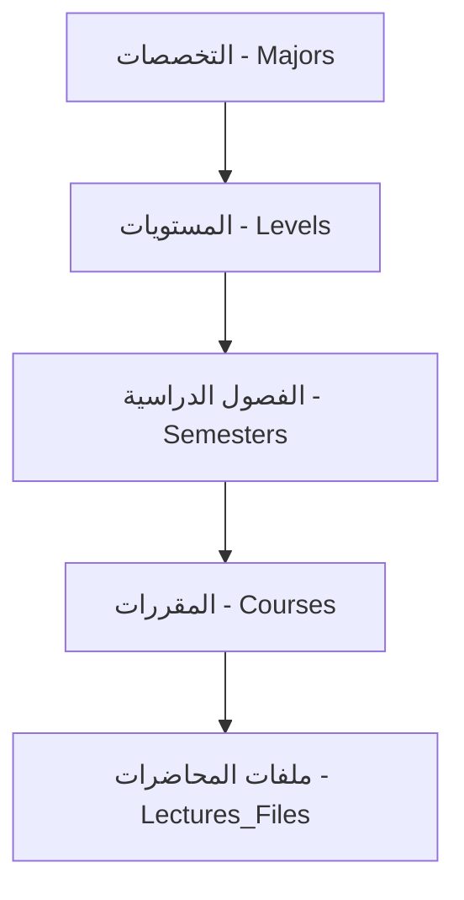

# 🌐 نظرة عامة على نظام إدارة المحتوى الأكاديمي الذكي (S-ACM)

**المؤلف:** Manus AI (كبير المهندسين التقنيين)
**التاريخ:** 16 يناير 2026

---

## 1. الهدف والفلسفة (Goal and Philosophy)

نظام S-ACM هو منظومة بيئية تعليمية ذكية تهدف إلى مركزة وإدارة المحتوى الأكاديمي. تم تصميم النظام ليكون **آمناً، تفاعلياً، وقابلاً للتوسع**، مع دمج وظائف الذكاء الاصطناعي لتحسين تجربة التعلم.

### 1.1. المبادئ الأساسية

| المبدأ | الوصف |
| :--- | :--- |
| **المركزية** | الأدمن هو نقطة التحكم الوحيدة لإنشاء المقررات وإسنادها. |
| **التخزين الهجين** | دعم تخزين الملفات محلياً وروابط المحتوى الخارجي (مثل YouTube) في نفس الجدول. |
| **الأرشفة الذكية** | الأرشفة تُستنتج برمجياً بناءً على حالة الفصل الدراسي (`is_current`)، مما يضمن وصول الطالب لمواده السابقة دون إرباك. |
| **الذكاء الاصطناعي** | استخدام Google Gemini API لتوليد الملخصات والأسئلة، مع تطبيق حدود استخدام صارمة (Rate Limiting). |

---

## 2. الهيكل المعماري (Architectural Structure)

يعتمد النظام على هيكل أكاديمي هرمي واضح:

### 2.1. هيكل قاعدة البيانات (Database Schema)

تم بناء قاعدة البيانات على PostgreSQL وتعتمد على العلاقات التالية:

| العلاقة | الجداول المرتبطة | الوصف |
| :--- | :--- | :--- |
| **Users** | `Roles`, `Majors`, `Levels` | المستخدم يرتبط بدور واحد، تخصص واحد، ومستوى واحد. |
| **M:M** | `Course_Majors` | المقرر الواحد يمكن أن يُدرَّس لعدة تخصصات (لتجنب تكرار المقررات العامة). |
| **1:M** | `Courses` → `Semesters` | المقرر يرتبط بفصل دراسي واحد ومستوى واحد. |
| **RBAC** | `Roles` → `Permissions` | نظام صلاحيات دقيق يحدد ما يمكن لكل دور فعله. |

---

## 3. تدفق المستخدمين والأدوار (User Flow and Roles)

### 3.1. تدفق المصادقة والتفعيل (Authentication & Activation)

1. **الإضافة المسبقة:** الأدمن يضيف بيانات المستخدمين (الرقم الأكاديمي، رقم البطاقة) بحالة `inactive`.
2. **التفعيل الذاتي:** المستخدم يحاول تسجيل الدخول، يُرفض، ثم يُطلب منه "إنشاء حساب" (عملية التفعيل).
3. **التحقق:** يدخل المستخدم رقم البطاقة والرقم الأكاديمي، يطابقها النظام، ثم يرسل رمز OTP للبريد الإلكتروني.
4. **الانتهاء:** المستخدم يعين كلمة المرور، وتتغير حالته إلى `active`.

### 3.2. الأدوار والصلاحيات

| الدور | الوظائف الرئيسية | الصلاحيات الخاصة |
| :--- | :--- | :--- |
| **Admin** | إدارة المستخدمين (استيراد/تصدير CSV)، إنشاء المقررات، إسناد المدرسين، الترقية الجماعية للطلاب. | التحكم الكامل في النظام. |
| **Instructor** | يرى مقرراته المسندة فقط، يرفع/يعدل/يحذف (Soft Delete) ملفاته، يرسل إشعارات. | يمكنه رؤية ملفات زملائه في نفس المقرر (للتنسيق). |
| **Student** | تصفح وتنزيل المواد الحالية والمؤرشفة، استخدام ميزات الذكاء الاصطناعي (تلخيص، أسئلة). | مقيد بحدود استخدام AI (10 طلبات/ساعة). |

---

## 4. الميزات المتقدمة (Advanced Features)

### 4.1. إدارة المحتوى

- **التخزين الهجين:** جدول `Lectures_Files` يدعم `local_file` و `external_link`.
- **تصنيفات الملفات:** `Lecture`, `Summary`, `Exam`, `Assignment`, `Reference`, `Other`.
- **التحكم في الظهور:** حقل `is_visible` يسمح للمدرس بإخفاء الملفات قبل النشر.

### 4.2. محرك الأرشفة والترقية

- **الأرشفة:** الطالب يرى مواد مستواه الحالي في التبويب الرئيسي، ومواد المستويات السابقة في تبويب "الأرشيف" (استناداً إلى `semester.is_current` و `level_number`).
- **الترقية:** زر "ترقية الطلاب" في لوحة الأدمن يقوم برفع `level_id` لجميع الطلاب إلى المستوى التالي (N → N+1) باستخدام حقل `level_number` في جدول `Levels`.

### 4.3. عارض الملفات والذكاء الاصطناعي

- **العرض:** عارض احترافي يدعم PDF.js و Video.js، مع ميزات الوضع الليلي/النهاري والتحكم في الخط.
- **التحويل:** جميع مخرجات AI تُخزن كـ **Markdown** وتُصدَّر بصيغ متعددة (PDF, DOCX, MD, TXT).
- **حدود AI:** تطبيق `Rate Limiting` بـ 10 طلبات/ساعة/مستخدم.

---

## 5. البيئة التقنية (Tech Stack)

| المكون | التقنية المعتمدة | القيود البيئية |
| :--- | :--- | :--- |
| **Backend** | Django 5.x (MVT Pattern) | نظام التشغيل: Windows (PowerShell/CMD) |
| **Frontend** | Bootstrap 5 + HTMX | إدارة البيئة: `venv` فقط (ممنوع Docker) |
| **Database** | PostgreSQL | |
| **AI** | Google Gemini API | |

---

## 6. خارطة الطريق (Roadmap - Current Focus)

التركيز الحالي هو على **المرحلة 4.1: بناء الأساس الكامل لقاعدة البيانات**، والتي تشمل كتابة نماذج Django للجداول التالية:

- `Users`
- `Roles`
- `Permissions`
- `Role_Permissions`
- `Majors`
- `Levels`
- `Semesters`
- `Course_Majors`
- `Courses`
- `Instructor_Courses`
- `Lectures_Files`
- `Verification_Codes`
- `Password_Reset_Tokens`
- `Notifications`
- `Notification_Recipients`
- `AI_Summaries`
- `AI_Questions`
- `User_Activity`

**المهمة التالية:** البدء في كتابة نماذج Django لهذه الجداول.
